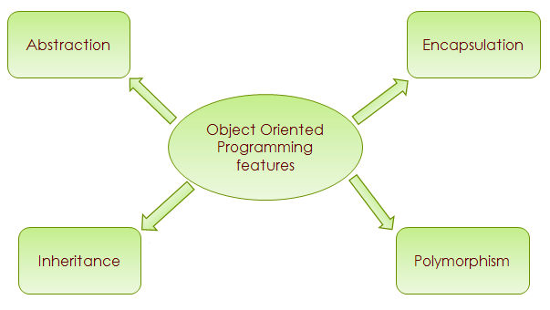

#  [KOTLIN] BUỔI 3: OOP 

***
## I. 4 tính chất OOP
Trong lập trình hướng đối tượng (OOP) bằng Kotlin, bốn tính chất quan trọng là 



- **Đóng gói (Encapsulation)**
- **Kế thừa (Inheritance)**
- **Đa hình (Polymorphism)**
- **Trừu tượng (Abstraction).**


### 1.Encapsulation (Đóng gói)

- Đóng gói là việc ẩn giấu các chi tiết triển khai bên trong của một đối tượng và chỉ cung cấp một giao diện công khai để tương tác với đối tượng đó. Điều này giúp ngăn chặn việc truy cập và thay đổi trực tiếp các thuộc tính của đối tượng từ bên ngoài, chỉ cho phép thay đổi thông qua các phương thức công khai.

**Cách thực hiện Đóng gói trong Kotlin**
- Khai báo thuộc tính với mức truy cập private:
    - Thuộc tính được khai báo là private sẽ không thể truy cập từ bên ngoài lớp.
- Cung cấp các phương thức công khai (public) để truy cập và thay đổi giá trị của các thuộc tính này:
    - Các phương thức này được gọi là getter và setter.

```
fun main() {
    val person=Person()
    // Truy cập và thay đổi giá trị thông qua các phương thức getter và setter

    println("Tên: ${person.getName()}")    // Tên: Hieu
    println("Tuổi: ${person.getAge()}")    // Tuổi: 20

    // Thay đổi giá trị của name và age
    person.setName("Trung")
    person.setAge(18)

    // Truy cập giá trị đã được thay đổi
    println("Tên: ${person.getName()}")    // Tên: Trung
    println("Tuổi: ${person.getAge()}")    // Tuổi: 18

    person.setAge(-5)
    println(person.getAge())
}
```

**Lợi ích của Đóng gói (Encapsulation)**
- **Bảo vệ dữ liệu:** Các thuộc tính private không thể bị truy cập và thay đổi trực tiếp từ bên ngoài lớp, giúp bảo vệ dữ liệu khỏi các thay đổi không mong muốn.

- **Dễ bảo trì:** Bằng cách sử dụng các phương thức getter và setter, bạn có thể thay đổi cách thức xử lý dữ liệu mà không ảnh hưởng đến mã nguồn sử dụng lớp này.

- **Kiểm soát truy cập:** Có thể thêm logic kiểm tra trong các phương thức setter để đảm bảo rằng chỉ các giá trị hợp lệ mới được thiết lập.

### 2. Inheritance (Kế thừa)

**Kế thừa (Inheritance)** là một khái niệm quan trọng trong lập trình hướng đối tượng (OOP), cho phép một lớp (class) kế thừa các thuộc tính và phương thức từ một lớp khác. Trong Kotlin, bạn có thể sử dụng từ khóa open để chỉ định rằng một lớp có thể được kế thừa, và từ khóa override để ghi đè các phương thức của lớp cha.

**Cú pháp Kế thừa trong Kotlin:**

Khai báo lớp cha: Để cho phép một lớp có thể được kế thừa, bạn phải đánh dấu lớp đó bằng từ khóa **open**.

```
open class Animal {
    open fun sound() {
        println("Animal makes a sound")
    }
}

```

Khai báo lớp con: Lớp con kế thừa từ lớp cha bằng cách sử dụng dấu ":" và từ khóa super để gọi các phương thức của lớp cha.

```
class Dog : Animal() {
    override fun sound() {
        println("go go")
    }
}
````

#### 2.1:Overriding methods (Ghi đè phương thức)

Kotlin yêu cầu các modifier rõ ràng cho các thành phần có thể ghi đè và overrides:

```
// Lớp cơ sở Shape
open class Shape {
    open fun draw() {
        println("Drawing a shape")
    }

    open fun fill() {
        println("Filling the shape")
    }
}

// Lớp con Circle kế thừa từ Shape
class Circle : Shape() {
    override fun draw() {
        println("Drawing a circle")
    }
    override fun fill(){
        println("Filling a circle")
    }
}

fun main() {
    // Tạo một đối tượng của lớp Shape
    val shape = Shape()
    shape.draw() // Output: Drawing a shape
    shape.fill() // Output: Filling the shape

    // Tạo một đối tượng của lớp Circle
    val circle = Circle()
    circle.draw() // Output: Drawing a circle
    circle.fill() // Output: Filling a circle
}

```

Một thành viên được đánh dấu override tự nó là **open**, vì vậy nó có thể được ghi đè trong các lớp con. Nếu bạn muốn cấm việc ghi đè lại, sử dụng từ khóa **final**:

```
open class Rectangle() : Shape() {
    final override fun draw() { /*...*/ }
}
```

#### 2.2: Overriding properties (Ghi đè thuộc tính)

Cơ chế ghi đè hoạt động trên các thuộc tính tương tự như nó hoạt động trên các phương thức. Các thuộc tính được khai báo trên một lớp cha và sau đó được khai báo lại trên một lớp con phải được đánh dấu với ***override***, và chúng phải có kiểu tương thích. Mỗi thuộc tính khai báo có thể được ghi đè bằng một thuộc tính với một giá trị khởi tạo hoặc bằng một thuộc tính với phương thức ***get***:

```
open class Shape {
    open val vertexCount: Int = 0
}

class Rectangle : Shape() {
    override val vertexCount = 4
}

```

Bạn cũng có thể ghi đè một thuộc tính val bằng một thuộc tính var, nhưng không phải ngược lại. Điều này được phép vì một thuộc tính val về cơ bản khai báo một phương thức get, và ghi đè nó như một thuộc tính var sẽ khai báo thêm một phương thức set trong lớp con.

Lưu ý rằng bạn có thể sử dụng từ khóa override như một phần của khai báo thuộc tính trong constructor chính:

```
interface Shape {
    val vertexCount: Int
}

class Rectangle(override val vertexCount: Int = 4) : Shape // Luôn có 4 đỉnh

class Polygon : Shape {
    override var vertexCount: Int = 0  // Có thể được đặt lại thành bất kỳ số nào sau này
}

```

#### 2.3: Derived class initialization order(Thứ tự khởi tạo lớp kế thừa)

Trong Kotlin, quá trình khởi tạo lớp kế thừa tuân theo thứ tự cụ thể, đó là:

- Đánh giá các đối số cho constructor của lớp cơ sở.
- Khởi tạo lớp cơ sở.
- Khởi tạo lớp kế thừa.

```
open class Base(val name: String) {
    init {
        println("Initializing a base class")
    }

    open val size: Int =
        name.length.also { println("Initializing size in the base class: $it") }
}

class Derived(
    name: String,
    val lastName: String,
) : Base(name.replaceFirstChar { it.uppercase() }.also { println("Argument for the base class: $it") }) {
    init {
        println("Initializing a derived class")
    }

    override val size: Int =
        (super.size + lastName.length).also { println("Initializing size in the derived class: $it") }
}

fun main() {
    val derived = Derived("john", "doe")
}
```
**Thứ Tự Thực Thi:**
- Đánh giá đối số cho constructor của Base:
- Khởi tạo lớp cơ sở Base:
- Khởi tạo lớp kế thừa Derived:

#### 2.4: Calling the superclass implementation(Gọi Triển Khai của Lớp Cha)
```
open class Rectangle {
    open fun draw() { println("Drawing a rectangle") }
    val borderColor: String get() = "black"
}

class FilledRectangle : Rectangle() {
    override fun draw() {
        super.draw() // Gọi phương thức draw() của lớp cha
        println("Filling the rectangle")
    }

    val fillColor: String
        get() = super.borderColor // Truy cập thuộc tính borderColor của lớp cha
}

fun main() {
    val filledRectangle = FilledRectangle()
    filledRectangle.draw()
    println("Border color: ${filledRectangle.borderColor}")
    println("Fill color: ${filledRectangle.fillColor}")
}
```

```
Drawing a rectangle
Filling the rectangle
Border color: black
Fill color: black
```
#### 2.5: Calling the superclass implementation

Bạn cũng có thể sử dụng super để truy cập lớp cha bên ngoài từ một lớp trong Kotlin.


```
class FilledRectangle : Rectangle() {
    override fun draw() {
        val filler = Filler()
        filler.drawAndFill()
    }

    inner class Filler {
        fun drawAndFill() {
            super@FilledRectangle.draw() // Gọi phương thức draw() của Rectangle bên ngoài
            println("Filling the rectangle")
        }
    }
}

fun main() {
    val filledRectangle = FilledRectangle()
    filledRectangle.draw()
}
```

#### 2.6: Overriding rules(Quy Tắc Ghi Đè)

Quy tắc ghi đè trong Kotlin quy định cách mà một lớp con có thể ghi đè lại các thành viên (phương thức và thuộc tính) của lớp cha mà nó kế thừa. Điều này đặc biệt quan trọng khi lớp con kế thừa từ nhiều lớp cha hoặc từ lớp cha và các giao diện có cùng thành viên.

```
open class Animal {
    open fun makeSound() {
        println("Animal makes a sound")
    }
}

interface CanFly {
    fun fly() {
        println("Flying")
    }
}

class Bird : Animal(), CanFly {
    override fun makeSound() {
        println("Bird chirps")
    }

    override fun fly() {
        println("Bird is flying")
    }
}
fun main() {
    val bird = Bird()

    bird.makeSound() // Bird chirps
    bird.fly() // Bird is flying
}
```

**Quy Tắc Ghi Đè Với Nhiều Lớp Cha**

Nếu một lớp kế thừa từ nhiều lớp cha có cùng phương thức, bạn cần sử dụng từ khóa **super** kèm theo tên lớp cha để xác định phương thức nào được gọi.

```
open class Shape {
    open fun draw() {
        println("Drawing shape")
    }
}

interface Fillable {
    fun fill() {
        println("Filling shape")
    }
}

class Circle : Shape(), Fillable {
    override fun draw() {
        super<Shape>.draw() // Gọi phương thức draw() của Shape
        println("Drawing circle")
    }

    override fun fill() {
        super<Fillable>.fill() // Gọi phương thức fill() của Fillable
        println("Filling circle")
    }
}

fun main() {
    val circle = Circle()

    circle.draw()
    circle.fill()
}
```

```
Drawing shape
Drawing circle
Filling shape
Filling circle
```

### 3.Polymorphism (Đa hình)

**Polymorphism** trong Kotlin cho phép một phương thức có thể được triển khai bằng nhiều cách khác nhau, tùy thuộc vào đối tượng cụ thể được gọi đến. Đây là một tính chất quan trọng của Lập trình hướng đối tượng, cho phép thực hiện cùng một hành động bằng nhiều cách khác nhau.

**Compile-time Polymorphis**

Trong Compile-time Polymorphism, các hàm có cùng tên nhưng khác nhau về số lượng tham số hoặc kiểu trả về. Trình biên dịch sẽ giải quyết xem hàm nào được gọi dựa trên các tham số truyền vào.

```
fun main(args: Array<String>) {
    println(doubleOf(4))
    println(doubleOf(4.3))
    println(doubleOf(4.323))
}
 
fun doubleOf(a: Int): Int {
    return 2 * a
}
 
fun doubleOf(a: Float): Float {
    return 2 * a
}
 
fun doubleOf(a: Double): Double {
    return 2.00 * a
}
```

```
8
8.6
8.646
```

*Ở đây, hàm doubleOf được định nghĩa ba lần với cùng tên nhưng khác kiểu dữ liệu đầu vào và kiểu dữ liệu trả về. Tại thời điểm biên dịch, Kotlin sẽ phân biệt và chọn hàm thích hợp dựa trên kiểu dữ liệu của tham số truyền vào.*

**Runtime Polymorphism**

Trong Runtime Polymorphism, trình biên dịch giải quyết lời gọi đến các phương thức đã được ghi đè (override) tại thời điểm chạy. Điều này cho phép lớp con có thể thay đổi hoặc mở rộng hành vi của các phương thức được kế thừa từ lớp cha.

```
fun main(args: Array<String>) {
    var a = Sup()
    a.method1()
    a.method2()
   
    var b = Sum()
    b.method1()
    b.method2()
}
 
open class Sup {
    open fun method1() {
        println("Printing method 1 from inside Sup")
    }
    
    fun method2() {
        println("Printing method 2 from inside Sup")
    }
}
 
class Sum : Sup() {
    override fun method1() {
        println("Printing method 1 from inside Sum")
    }
}
```
```
Printing method 1 from inside Sup
Printing method 2 from inside Sup
Printing method 1 from inside Sum
Printing method 2 from inside Sup
```

*Ở đây, lớp Sum kế thừa từ lớp **Sup** và ghi đè phương thức **method1()**. Tại thời điểm chạy, hàm **method1()** được gọi đối với đối tượng **Sum**, sẽ thực thi phương thức đã được ghi đè trong **Sum**, không phải phương thức mặc định của **Sup**.*

### 4. Abstraction

Trong Kotlin, **Abstraction (trừu tượng hóa)** là khả năng ẩn đi chi tiết cài đặt bên trong của một đối tượng và chỉ hiển thị các tính năng cần thiết hoặc giao diện công khai mà người dùng có thể sử dụng. Abstraction là một trong những nguyên lý quan trọng trong Lập trình hướng đối tượng (OOP), giúp tăng tính tái sử dụng và giảm sự phức tạp của mã.

**Interface và Abstract Class:** Kotlin cung cấp cả interface và abstract class để định nghĩa các phương thức trừu tượng.

**Interface trong Kotlin** là một khuôn mẫu chứa các phương thức abstract và mặc định, mà các lớp có thể triển khai. Để lưu trạng thái, không quan tâm có hoạt động như thế nào

**Abstract Class trong Kotlin** là một lớp mà không thể khởi tạo và có thể có các phương thức abstract và thực thể, được kế thừa và override bởi các lớp con. Để lưu lại hoạt động

#### 4.1: Interface trong Kotlin


**Interface** trong Kotlin có thể chứa khai báo của các phương thức trừu tượng và cũng có thể có triển khai các phương thức. Điểm khác biệt so với lớp trừu tượng là interface không thể lưu trữ trạng thái (state). Chúng có thể có các thuộc tính, nhưng các thuộc tính này phải là trừu tượng hoặc cung cấp triển khai cho các accessor.

**Khai báo Interface**

Để định nghĩa một interface trong Kotlin, sử dụng từ khóa interface:

```
interface MyInterface {
    fun bar()
    fun foo() {
        // Thân hàm tùy chọn
    }
}

```

**Triển khai Interface**

Một lớp hoặc đối tượng có thể triển khai một hoặc nhiều interface:


```
class Child : MyInterface {
    override fun bar() {
        // Thân hàm
    }
}

```

**Thuộc tính trong Interfaces**

Bạn có thể khai báo các thuộc tính trong interface. Một thuộc tính được khai báo trong interface có thể là trừu tượng hoặc cung cấp triển khai cho các accessor:

```
interface MyInterface {
    val prop: Int // Trừu tượng

    val propertyWithImplementation: String
        get() = "foo"

    fun foo() {
        print(prop)
    }
}

class Child : MyInterface {
    override val prop: Int = 29
}
```

**Kế thừa giữa các Interfaces**

Một interface có thể kế thừa từ các interface khác, điều này có nghĩa là nó có thể cung cấp triển khai cho các thành viên của các interface kế thừa và khai báo các hàm và thuộc tính mới:

```
interface Named {
    val name: String
}

interface Person : Named {
    val firstName: String
    val lastName: String

    override val name: String get() = "$firstName $lastName"
}

data class Employee(
    override val firstName: String,
    override val lastName: String,
    val position: String
) : Person
```

**Xử lý xung đột ghi đè**

Khi bạn khai báo nhiều loại trong danh sách supertype của một interface, bạn có thể kế thừa nhiều hơn một triển khai của cùng một phương thức:

```
interface A {
    fun foo() { print("A") }
    fun bar()
}

interface B {
    fun foo() { print("B") }
    fun bar() { print("bar") }
}

class C : A {
    override fun bar() { print("bar") }
}

class D : A, B {
    override fun foo() {
        super<A>.foo()
        super<B>.foo()
    }

    override fun bar() {
        super<B>.bar()
    }
}
```

Trong ví dụ trên:

- Cả hai interface A và B đều khai báo các hàm foo() và bar().
- Cả hai đều triển khai foo(), nhưng chỉ B triển khai bar().
- Nếu bạn triển khai một lớp C từ A, bạn cần phải ghi đè bar() và cung cấp một triển khai.
- Tuy nhiên, nếu bạn triển khai lớp D từ cả A và B, bạn cần phải triển khai tất cả các phương thức mà bạn đã kế thừa từ nhiều interface, và bạn cần phải chỉ rõ cách D sẽ triển khai chúng.

#### 4.2: Abstract Class trong Kotlin

**Khai báo Abstract Class:** Để khai báo một abstract class trong Kotlin, sử dụng từ khóa abstract trước từ khóa class. Một abstract class có thể chứa các phương thức abstract và các phương thức thực thể.

**Phương thức trong Abstract Class:**

- Một abstract class có thể có các phương thức abstract (không có thân hàm).
- Các phương thức trong abstract class có thể là public, protected hoặc internal.
- Các phương thức thực thể (non-abstract methods) trong abstract class không cần phải được override bởi các lớp con nếu chúng không được đánh dấu là open.

**Sử dụng Abstract Class:**

- Một lớp con (subclass) phải kế thừa (inherit) từ abstract class bằng từ khóa : và triển khai (override) tất cả các phương thức abstract của abstract class đó.
- Một abstract class có thể có các thuộc tính và các constructor.
- Các constructor của abstract class có thể được gọi từ các lớp con thông qua super().

```
abstract class Shape {
    abstract fun draw()   // Phương thức abstract
    
    fun fill() {          // Phương thức thực thể
        println("Filling the shape")
    }
}

class Circle : Shape() {
    override fun draw() {
        println("Drawing a circle")
    }
}

fun main() {
    val circle = Circle()
    circle.draw()
    circle.fill()
}
```

Trong ví dụ này, Shape là một abstract class có một phương thức abstract draw() và một phương thức thực thể fill(). Lớp Circle kế thừa từ Shape và override phương thức draw().

## II.Backing field

Trong Kotlin, trường dữ liệu (backing field) là một phần của thuộc tính dùng để lưu giữ giá trị của thuộc tính đó trong bộ nhớ. Trong Kotlin, bạn không thể khai báo trực tiếp các trường (fields) như trong các ngôn ngữ khác như Java; thay vào đó, Kotlin tự động cung cấp backing field khi cần thiết. Bạn có thể tham chiếu đến backing field này trong các accessor (getter và setter) bằng từ khóa **field**.

**Tự động tạo backing field:** Khi bạn khai báo một thuộc tính với getter hoặc setter, Kotlin sẽ tự động tạo một backing field để lưu trữ giá trị của thuộc tính đó. Bạn không cần phải tự tạo backing field một cách tường minh như trong Java.

```
class Example {
    var name: String = "John" // Kotlin tự động tạo backing field cho thuộc tính 'name'
}
```

**Truy cập backing field:** Để truy cập trực tiếp đến backing field của một thuộc tính, bạn có thể sử dụng từ khóa field. Điều này thường được sử dụng trong trường hợp cần tùy chỉnh logic của getter hoặc setter mà vẫn muốn truy cập giá trị backing field.

```
class Example {
    var counter = 0 // Kotlin tự động tạo backing field cho thuộc tính 'counter'

    var currentValue: Int
        get() = field // Truy cập backing field của 'currentValue'
        set(value) {
            field = value // Gán giá trị cho backing field của 'currentValue'
        }
}
```
**Sử dụng backing field trong setter**

```
var counter = 0
    set(value) {
        if (value >= 0)
            field = value // Sử dụng field để tham chiếu đến backing field
    }

fun main() {
    val example = Example()
    example.counter = 10
    println(example.counter) // Output: 10
}
```
Trong ví dụ trên, counter là một thuộc tính có backing field được Kotlin tự động tạo. Trong setter của counter, chúng ta kiểm tra nếu value lớn hơn hoặc bằng 0 thì gán value cho backing field field.

**Sử dụng backing property**
Nếu bạn cần thực hiện một logic phức tạp hơn hoặc không phù hợp với cách mà backing field được tạo mặc định, bạn có thể sử dụng backing property.

```
class Example {
    private var _table: Map<String, Int>? = null

    val table: Map<String, Int>
        get() {
            if (_table == null) {
                _table = HashMap()
            }
            return _table ?: throw AssertionError("Set to null by another thread")
        }
}

fun main() {
    val example = Example()
    val table = example.table // Truy cập vào thuộc tính table, sẽ gọi getter và khởi tạo _table nếu cần
    println(table) // Output: {}
}
```

Trong ví dụ này, table là một backing property. table sử dụng _table làm backing field để lưu trữ một đối tượng Map<String, Int>. Getter của table kiểm tra và khởi tạo _table nếu nó chưa được khởi tạo trước đó.

- **Backing field**: Được Kotlin tự động tạo để lưu trữ giá trị của thuộc tính.
- **Field identifier (field)**: Chỉ có thể được sử dụng trong các accessor của thuộc tính để tham chiếu đến backing field.
- **Backing property**: Được sử dụng khi cần thực hiện logic tùy chỉnh hoặc không phù hợp với cách mà backing field được tự động tạo.