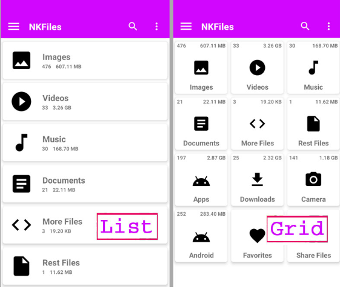
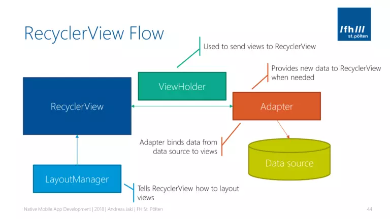
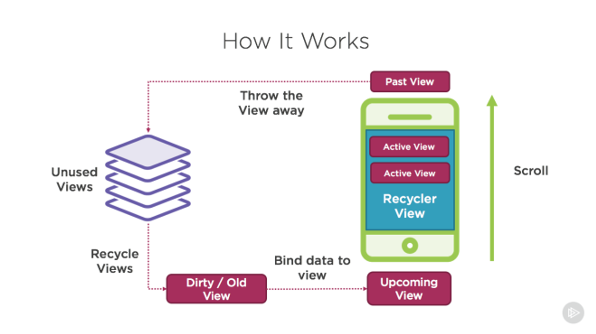
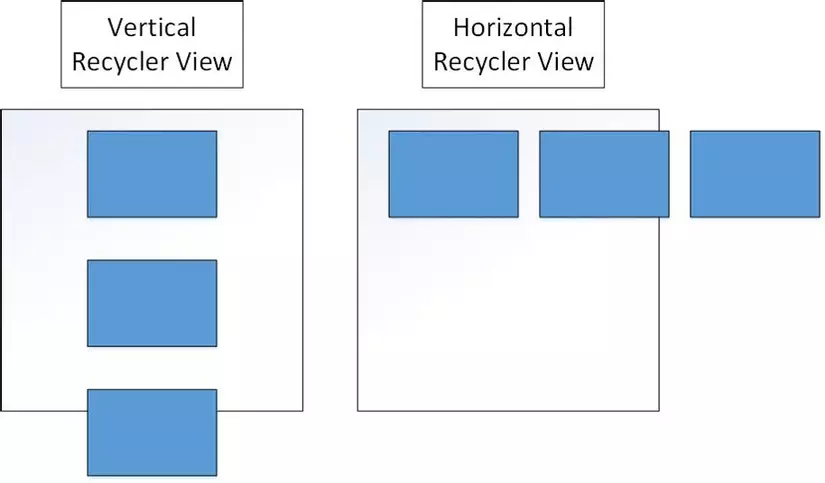
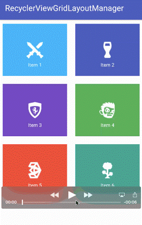
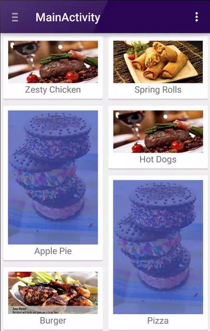

#  [ANDROID] BUỔI 10: Recycler View

***

## I. Tổng quan về RecyclerView trong Android

>*Tài liệu tham khảo*:  [RecyclerView](https://viblo.asia/p/su-dung-recyclerview-trong-android-RQqKLNe6l7z)



`RecyclerView` dùng để xây dựng UI gần giống với hoạt động của ListView, GridView. Nó biểu diễn danh sách với nhiều cách trình bày khác nhau, theo chiều đứng, chiều ngang.

- Khi sử dụng `Recycler View`, ta cần làm việc với các công việc sau:
    - `RecyclerView.Adapter`: Để xử lý tập dữ liệu và gắn nó với view.
    - `LayoutManager`: Giúp cố định vị trí của item.
    - `ItemAnimator`: Giúp tạo các xử lý chung cho các item như thêm mới, xoá đi.



-   `RecyclerView`: Đây là thành phần hiển thị danh sách hoặc lưới các phần tử. Nó là thành phần chính điều khiển việc hiển thị các phần tử từ dữ liệu.

-   `ViewHolder`: Được sử dụng để gửi các view tới RecyclerView. ViewHolder giữ các view của từng phần tử dữ liệu, giúp tăng hiệu suất bằng cách tái sử dụng view thay vì tạo mới cho mỗi phần tử.

-   `Adapter`: Bộ điều hợp (Adapter) cung cấp dữ liệu mới cho RecyclerView khi cần thiết. Nó là cầu nối giữa dữ liệu và các view. Adapter liên kết dữ liệu từ nguồn dữ liệu tới các view được hiển thị trong RecyclerView.

-   `Data Source`: Nguồn dữ liệu, nơi lưu trữ dữ liệu để hiển thị trong RecyclerView. Adapter lấy dữ liệu từ đây và liên kết nó với các view.

-   `LayoutManager`: Quản lý cách bố trí các view trong RecyclerView. Nó nói cho RecyclerView biết cách sắp xếp các view.


**Luồng hoạt động**


-   Khi người dùng scroll, các view hiển thị trước đó (Past View) sẽ được đưa vào danh sách các view không sử dụng (Unused Views).
-   Các view không sử dụng sẽ được tái chế (Recycle Views) để giảm việc tạo mới view, giúp tăng hiệu suất.
-   Các view cũ sẽ được Adapter liên kết với dữ liệu mới (Bind data to view), trở thành các view sắp xuất hiện (Upcoming View).
-   Các view sắp xuất hiện sẽ được hiển thị trên màn hình khi người dùng tiếp tục scroll.

## II. Các thành phần của  RecyclerView

### 1. LayoutManagers

Một `RecyclerView` cần có một layout manager và một adapter để được khởi tạo. Layout manager sẽ xác định các item bên trong RecyclerView được hiển thị như thế nào và khi nào phải tái sử dụng lại các item view ( những item đã bị trượt khỏi màn hình)

-   **LinearLayoutManager** : hiển thị các item trong danh sách có thể cuộn theo chiều dọc (horizontal) hoặc chiều ngang ( Vertical).



-   **GridLayoutManager** : hiển thị các item trong danh sách theo dạng lưới .



`StaggeredGridLayoutManager` : hiển thị các item trong danh sách theo dạng lưới so le nhau. Để tạo ra một custom layout manager, thì phải kế thừa RecyclerView.LayoutManager class.



### 2. RecyclerView.Adapter

`RecyclerView` sở hữu 1 loại adapter mới. Tuy cũng có cách tiếp cận giống loại bình thường nhưng có 1 vài điểm khác như là yêu cầu ViewHolder. Và ta phải override lại 3 method:

- `getItemCount()`: Số lượng item trong danh sách.

- `onCreateViewHolder()`: Được gọi khi RecyclerView quyết định cần tạo 1 ViewHolder và lưu trong bộ nhớ, kết quả trả về là bố cục xml.

- `bindViewHolder()`: Mỗi khi ViewHolder trước được dùng lại, RecyclerView sẽ bảo Adapter cập nhật dữ liệu của nó và ta override method này để tuỳ chỉnh nó.

### 3.ItemAnimator

- `ItemAnimator` sẽ tạo các hoạt ảnh cho sự thay đổi của ViewGroup như thêm/xoá/chọn mà được thông báo tới adapter. `DefaltItemAnimator` có thể được sử dụng cho các hoạt ảnh cơ bản và nó cũng khá ổn.

## III. Cách sử dụng RecyclerView

**Để sử dụng RecyclerView sẽ có 7 bước chính sau đây:**

-   Thêm RecyclerView support library vào gradle build file

-   Định nghĩa ra model class để sử dụng data source
-   Thêm RecyclerView vào trong activity mà bạn muốn hiển thị
-   Tạo một tệp XML để xác định một item được biểu diễn như nào
-   Tạo ra RecyclerView.Adapter và ViewHolder để gán dữ liệu cho các item
-   Kết nối adapter với data source để đưa vào RecyclerView Mình sẽ trình bày chi tiết ở phần dưới ..

**Bước 1: Thêm RecyclerView Support Library vào build.gradle**

Mở tệp build.gradle (Module: app) và thêm thư viện RecyclerView vào phần dependencies:

```
dependencies {
    implementation ("androidx.recyclerview:recyclerview:1.2.1")
}
```

**Bước 2: Định nghĩa model class**

Tạo một lớp model để đại diện cho dữ liệu mà bạn sẽ hiển thị. Ví dụ, chúng ta sẽ tạo một lớp Person:

```kotlin
data class Person(val name: String, val age: Int)
```

**Bước 3: Thêm RecyclerView vào Activity**

Mở tệp XML của Activity mà bạn muốn hiển thị RecyclerView và thêm nó vào.  Ví dụ, `activity_main.xml`:

```xml
<?xml version="1.0" encoding="utf-8"?>
<androidx.constraintlayout.widget.ConstraintLayout xmlns:android="http://schemas.android.com/apk/res/android"
    xmlns:app="http://schemas.android.com/apk/res-auto"
    xmlns:tools="http://schemas.android.com/tools"
    android:layout_width="match_parent"
    android:layout_height="match_parent"
    tools:context=".MainActivity">


    <androidx.recyclerview.widget.RecyclerView
        android:id="@+id/recyclerView"
        android:layout_width="0dp"
        android:layout_height="0dp"
        app:layout_constraintTop_toTopOf="parent"
        app:layout_constraintBottom_toBottomOf="parent"
        app:layout_constraintStart_toStartOf="parent"
        app:layout_constraintEnd_toEndOf="parent"
        android:padding="16dp"/>


</androidx.constraintlayout.widget.ConstraintLayout>
```

**Bước 4: Tạo tệp XML để xác định một item**

Tạo một tệp XML trong thư mục res/layout để xác định cách hiển thị một item trong `RecyclerView`. Ví dụ, `item_person.xml`:

```xml
<?xml version="1.0" encoding="utf-8"?>
<androidx.constraintlayout.widget.ConstraintLayout xmlns:android="http://schemas.android.com/apk/res/android"
    xmlns:app="http://schemas.android.com/apk/res-auto"
    android:layout_width="match_parent"
    android:layout_height="wrap_content"
    android:padding="8dp">

    <TextView
        android:id="@+id/nameTextView"
        android:layout_width="0dp"
        android:layout_height="wrap_content"
        android:textSize="16sp"
        app:layout_constraintEnd_toEndOf="parent"
        app:layout_constraintStart_toStartOf="parent"
        app:layout_constraintTop_toTopOf="parent" />

    <TextView
        android:id="@+id/ageTextView"
        android:layout_width="0dp"
        android:layout_height="wrap_content"
        android:textSize="14sp"
        app:layout_constraintEnd_toEndOf="parent"
        app:layout_constraintStart_toStartOf="parent"
        app:layout_constraintTop_toBottomOf="@id/nameTextView" />

</androidx.constraintlayout.widget.ConstraintLayout>
```
**Bước 5: Tạo RecyclerView.Adapter và ViewHolder**

Tạo một lớp `PersonAdapter` để gán dữ liệu cho các item. Adapter sẽ quản lý cách dữ liệu được hiển thị trong `RecyclerView`.

```kotlin
package com.example.myapplication

import android.view.LayoutInflater
import android.view.ViewGroup
import androidx.recyclerview.widget.RecyclerView
import com.example.myapplication.databinding.ItemPersonBinding

class PersonAdapter(private val personList: List<Person>) : RecyclerView.Adapter<PersonAdapter.PersonViewHolder>() {

    class PersonViewHolder(val binding: ItemPersonBinding) : RecyclerView.ViewHolder(binding.root)

    override fun onCreateViewHolder(parent: ViewGroup, viewType: Int): PersonViewHolder {
        val binding = ItemPersonBinding.inflate(LayoutInflater.from(parent.context), parent, false)
        return PersonViewHolder(binding)
    }

    override fun onBindViewHolder(holder: PersonViewHolder, position: Int) {
        val person = personList[position]
        holder.binding.nameTextView.text = person.name
        holder.binding.ageTextView.text = person.age.toString()
    }

    override fun getItemCount(): Int {
        return personList.size
    }
}

```

**Bước 6: Kết nối Adapter với Data Source**

Trong Activity của bạn (ví dụ: `MainActivity`), khởi tạo `RecyclerView`, thiết lập L`ayoutManager`, và kết nối `Adapter` với `RecyclerView`.

```kotlin
package com.example.myapplication

import android.os.Bundle
import androidx.appcompat.app.AppCompatActivity
import android.util.Log
import androidx.recyclerview.widget.LinearLayoutManager
import androidx.recyclerview.widget.RecyclerView

class MainActivity : AppCompatActivity() {

    override fun onCreate(savedInstanceState: Bundle?) {
        super.onCreate(savedInstanceState)
        setContentView(R.layout.activity_main)

        val recyclerView: RecyclerView = findViewById(R.id.recyclerView)
        recyclerView.layoutManager = LinearLayoutManager(this)

        // Data source
        val personList = listOf(
            Person("John Doe", 25),
            Person("Jane Smith", 30),
            Person("Jane Smith", 30),
            Person("Jane Smith", 30),
            Person("Jane Smith", 30),
            Person("Jane Smith", 30),
            Person("Jane Smith", 30),
            Person("Jane Smith", 30),
            Person("Jane Smith", 30),
            Person("Jane Smith", 30),
            Person("Jane Smith", 30),
            Person("Jane Smith", 30),
            Person("Jane Smith", 30),
            Person("Jane Smith", 30),
            Person("Jane Smith", 30),
            Person("Jane Smith", 30),
            Person("Jane Smith", 30),
            Person("Jane Smith", 30),
            Person("Jane Smith", 30),
            Person("Sam Wilson", 22)

        )

        // Adapter
        val adapter = PersonAdapter(personList)
        recyclerView.adapter = adapter
    }
}

```


## IV. Notifying the Adapter

- Không như ListView, không có cách nào để thêm hoặc xoá các items trực tiếp nhờ Adapter của RV. Ta cần phải thay đổi nguồn data trực tiếp và thông báo cho adapter về bất cứ thay đổi nào. Đồng thời, khi thêm hay xoá các phần tử, luôn thay đổi list đang hiển thị. Cụ thể hơn, tái khởi tạo 1 list các class Item như dưới sẽ không ảnh hưởng tới Adapter, vì nó chứa bộ nhớ liên kết với list cũ:

```kotlin
val itemList2 = ArrayList<Item>()
```

- Thay vào đó, ta cần trực tiếp thay đổi list cũ:

```kotlin
val itemList2 = ArrayList<Item>()
itemList.addAll(itemList2)
```

- Có nhiều cách thức để sử dụng khi notify Adapter về những kiểu thay đổi khác nhau:

| Method | Description |
| --- | --- |
| notifyItemChanged(int pos) | Notify rằng item tại vị trí pos đã thay đổi |
| notifyItemInserted(int pos) | Notify rằng item hiện thị tại vị trí pos đã được chèn mới |
| notifyItemRemoved(int pos) | Notify rằng item trước đó đặt tại vị trí pos đã bị xoá khỏi tập dữ liệu |
| notifyDataSetChanged() | Notify rằng tập dữ liệu đã thay đổi, chỉ dùng như 1 biện pháp cuối cùng |
- Ta có thể dùng chúng ở cả Activity và Fragment:

```kotlin
// Add a new item
itemList.add(0, Item("Ưu đãi sẵn trong ví", "Xem mục Ưu đãi ngay!", R.drawable.ad))
// Notify the adapter that an item was inserted at position 0
adapter.notifyItemInserted(0)
```

- Đồng thời, ta cũng phải chủ động update list hiện hữu, đảm bảo việc lấy số lượng các item trước khi tạo bất cứ thay đổi nào. Ví dụ, 1 hàm getItemCount() nên được gọi tới để lưu lại index đầu tiên bị thay đổi:

```kotlin

// record this value before making any changes to the existing list
val curSize = adapter.getItemCount()

// replace this line with wherever you get new records
val newItems = ArrayList<Item>()

// update the existing list
contacts.addAll(newItems)
// curSize should represent the first element that got added
// newItems.size() represents the itemCount
adapter.notifyItemRangeInserted(curSize, newItems.size)

```

### IV: Ưu điểm của việc sử dụng RecyclerView

### Ưu điểm của việc sử dụng RecyclerView

`RecyclerView` là một trong những thành phần mạnh mẽ và linh hoạt nhất của Android để hiển thị danh sách hoặc lưới dữ liệu. Dưới đây là một số ưu điểm của `RecyclerView`:

#### Tính linh hoạt cao:
- `RecyclerView` hỗ trợ nhiều loại bố cục khác nhau như danh sách (List), lưới (Grid), hoặc thậm chí là một bố cục tùy chỉnh.
- Bạn có thể dễ dàng thay đổi cách dữ liệu được hiển thị mà không cần thay đổi quá nhiều mã.

#### Hiệu năng tốt hơn:
- `RecyclerView` quản lý hiệu quả bộ nhớ bằng cách tái sử dụng các View cũ thay vì tạo mới chúng khi chúng đi ra khỏi màn hình. Điều này giúp giảm tải bộ nhớ và tăng hiệu suất ứng dụng.

#### Tách biệt rõ ràng giữa View và Logic:
- Với `RecyclerView`, bạn có một `Adapter` để quản lý dữ liệu và một `LayoutManager` để quản lý cách hiển thị dữ liệu. Điều này giúp mã nguồn dễ bảo trì và mở rộng.

#### Hỗ trợ Animation và Item Decoration:
- `RecyclerView` hỗ trợ dễ dàng thêm các hiệu ứng chuyển động (animation) và trang trí item (item decoration) như phân chia dòng hoặc tạo khoảng cách giữa các item.

#### Khả năng mở rộng:
- `RecyclerView` được thiết kế với tính linh hoạt cao, cho phép bạn thêm hoặc tùy chỉnh các thành phần như `ItemTouchHelper` để hỗ trợ các hành động vuốt hoặc kéo thả.


## V. Tính tái sử dụng của RecyclerView

Một trong những ưu điểm nổi bật của `RecyclerView` là khả năng tái sử dụng các View. 

Khi bạn sử dụng `RecyclerView` để hiển thị danh sách dài hoặc lưới dữ liệu, nó không tạo mới View cho mỗi item trong danh sách. Thay vào đó, `RecyclerView` ***tái sử dụng*** các View cũ đã ra khỏi màn hình, gắn lại dữ liệu mới và hiển thị chúng. Điều này giúp tiết kiệm tài nguyên và cải thiện hiệu năng của ứng dụng.

### Cách RecyclerView tái sử dụng View:

**ViewHolder**

-   `RecyclerView` sử dụng một lớp `ViewHolder` để giữ tham chiếu đến các View con trong item. Khi một item không còn hiển thị trên màn hình, ViewHolder của item đó sẽ được đặt lại dữ liệu mới và tái sử dụng cho một item khác.

```kotlin
class MyViewHolder(itemView: View) : RecyclerView.ViewHolder(itemView) {
    val textView: TextView = itemView.findViewById(R.id.textView)
}
```

**Recycler Pool:**

-   `RecyclerView` duy trì một pool các View đã được tạo và chỉ tái sử dụng chúng khi cần. Điều này giảm thiểu việc tạo mới View không cần thiết, giúp cải thiện hiệu năng của ứng dụng, đặc biệt là khi danh sách rất dài.

-   Khi một item ra khỏi màn hình, nó không bị hủy hoàn toàn mà chỉ được đặt lại vào pool để tái sử dụng cho item mới khi cần.

**Adapter**

-   `Adapter` của RecyclerView chịu trách nhiệm `gán dữ liệu mới` cho các View đã được tái sử dụng. Khi RecyclerView cần hiển thị một item mới, nó sẽ yêu cầu Adapter cung cấp dữ liệu tương ứng để gán vào View.

```kotlin
override fun onBindViewHolder(holder: MyViewHolder, position: Int) {
    val currentItem = dataList[position]
    holder.textView.text = currentItem.name
}
```

## VI. Adapter và ListAdapter trong Android

### 1. Adapter

`Adapter` là một lớp ***cầu nối*** giữa `dữ liệu` và các `View` hiển thị dữ liệu đó trong RecyclerView, ListView, GridView, v.v. Adapter chịu trách nhiệm:

-   **Cung cấp dữ liệu:** Adapter lấy dữ liệu từ một nguồn (như danh sách, mảng, cơ sở dữ liệu, v.v.).

-   **Tạo ra các View:** Adapter tạo ra các View đại diện cho từng phần tử dữ liệu.

-   **Gắn dữ liệu vào View:** Adapter gắn dữ liệu vào các View này để hiển thị cho người dùng.

### 2. ListAdapter

`ListAdapter` là một ***lớp con*** của `Adapter`, được thiết kế đặc biệt để làm việc với RecyclerView. Nó cung cấp các tính năng bổ sung như:

-   **Tự động tính toán sự khác biệt (DiffUtil)**: ListAdapter sử dụng DiffUtil để tự động tính toán sự khác biệt giữa danh sách cũ và mới, giúp cập nhật RecyclerView một cách hiệu quả hơn mà không cần phải thông báo toàn bộ danh sách bị thay đổi.


### 3. So sánh Adapter và ListAdapter

-   `Adapter`: Đơn giản, dễ dùng, nhưng phải tự quản lý việc cập nhật dữ liệu.

-   `ListAdapter`: Phức tạp hơn nhưng mạnh mẽ hơn, giúp tối ưu hiệu suất và đơn giản hóa việc quản lý cập nhật dữ liệu trong RecyclerView bằng cách sử dụng DiffUtil.


**Khi nào nên dùng ListAdapter?**

-   Khi bạn muốn cập nhật danh sách dữ liệu mà không cần phải viết nhiều mã để tính toán sự thay đổi.

-   Khi danh sách của bạn có thể thay đổi thường xuyên và bạn muốn tối ưu hóa hiệu suất của RecyclerView.

## VII. RecyclerView Multiple View Type

`RecyclerView` với `Multiple View Type` là một kỹ thuật cho phép bạn hiển thị nhiều loại dữ liệu khác nhau trong cùng một danh sách, mỗi loại dữ liệu có bố cục riêng. Ví dụ, bạn có thể có một danh sách hiển thị các loại mục khác nhau như `tiêu đề`, `hình ảnh`, và `văn bản` với các bố cục riêng biệt.

***Dưới đây là các bước cơ bản để triển khai RecyclerView với Multiple View Type:***

### 1. Định nghĩa các lớp dữ liệu (Data Model Classes)

Đầu tiên, bạn cần tạo các lớp dữ liệu cho từng loại view mà bạn muốn hiển thị. Mỗi lớp dữ liệu nên kế thừa từ một lớp cơ sở chung, dùng để xác định loại view.

```kotlin
sealed class ListItem {
    data class HeaderItem(val text: String) : ListItem()
    data class TextItem(val text: String) : ListItem()
    data class ImageItem(val imageUrl: String) : ListItem()
}
```

### 2. Tạo các ViewHolder cho từng loại view

Tiếp theo, tạo các lớp ViewHolder riêng biệt cho từng loại view mà bạn muốn hiển thị trong RecyclerView. Mỗi ViewHolder chịu trách nhiệm giữ các tham chiếu đến các view cụ thể trong một item của danh sách.

```kotlin
// ViewHolder cho từng loại view
class HeaderViewHolder(itemView: View) : RecyclerView.ViewHolder(itemView) {
    fun bind(item: ListItem.HeaderItem) {
        val textView = itemView.findViewById<TextView>(R.id.text_view)
        textView.text = item.text
    }
}

class TextViewHolder(itemView: View) : RecyclerView.ViewHolder(itemView) {
    fun bind(item: ListItem.TextItem) {
        val textView = itemView.findViewById<TextView>(R.id.text_view)
        textView.text = item.text
    }
}

class ImageViewHolder(itemView: View) : RecyclerView.ViewHolder(itemView) {
    fun bind(item: ListItem.ImageItem) {
        val imageView = itemView.findViewById<ImageView>(R.id.imageView)
        GlideApp.with(imageView)
            .load(item.imageUrl)
            .into(imageView)
    }
}
```

### 3. Tạo adapter cho RecyclerView

Tạo một lớp adapter mở rộng từ `RecyclerView.Adapter` và override các phương thức như `onCreateViewHolder`, `onBindViewHolder`, `getItemCount`, và `getItemViewType`.

```kotlin
class MyAdapter(
    private val items: List<ListItem>
) : RecyclerView.Adapter<RecyclerView.ViewHolder>() {

    override fun getItemViewType(position: Int): Int {
        return when (items[position]) {
            is ListItem.HeaderItem -> 0
            is ListItem.TextItem -> 1
            is ListItem.ImageItem -> 2
        }
    }

    override fun onCreateViewHolder(parent: ViewGroup, viewType: Int): RecyclerView.ViewHolder {
        return when (viewType) {
            0 -> HeaderViewHolder(
                LayoutInflater.from(parent.context)
                    .inflate(R.layout.header_item_layout, parent, false)
            )
            1 -> TextViewHolder(
                LayoutInflater.from(parent.context)
                    .inflate(R.layout.text_item_layout, parent, false)
            )
            2 -> ImageViewHolder(
                LayoutInflater.from(parent.context)
                    .inflate(R.layout.image_item_layout, parent, false)
            )
            else -> throw IllegalArgumentException("Invalid view type")
        }
    }

    override fun onBindViewHolder(holder: RecyclerView.ViewHolder, position: Int) {
        when (val item = items[position]) {
            is ListItem.HeaderItem -> (holder as HeaderViewHolder).bind(item)
            is ListItem.TextItem -> (holder as TextViewHolder).bind(item)
            is ListItem.ImageItem -> (holder as ImageViewHolder).bind(item)
        }
    }

    override fun getItemCount() = items.size
}
```

### 4. Tạo các file layout tùy chỉnh

Tạo các file layout XML cho từng loại view mà bạn muốn hiển thị trong RecyclerView.

**header_item_layout.xml**

```xml
<LinearLayout xmlns:android="http://schemas.android.com/apk/res/android"
    android:layout_width="match_parent"
    android:layout_height="wrap_content"
    android:orientation="horizontal"
    android:padding="10dp">

    <TextView
        android:id="@+id/text_view"
        android:layout_width="wrap_content"
        android:layout_height="wrap_content"
        android:textSize="20sp"
        android:textStyle="bold" />
</LinearLayout>
```

**text_item_layout.xml**

```xml
<LinearLayout xmlns:android="http://schemas.android.com/apk/res/android"
    android:layout_width="match_parent"
    android:layout_height="wrap_content"
    android:orientation="horizontal"
    android:padding="10dp">

    <TextView
        android:id="@+id/text_view"
        android:layout_width="wrap_content"
        android:layout_height="wrap_content"
        android:textSize="16sp" />
</LinearLayout>
```

**image_item_layout.xml**

```
<LinearLayout xmlns:android="http://schemas.android.com/apk/res/android"
    android:layout_width="match_parent"
    android:layout_height="wrap_content"
    android:orientation="horizontal"
    android:padding="10dp">

    <ImageView
        android:id="@+id/imageView"
        android:layout_width="wrap_content"
        android:layout_height="wrap_content"
        android:layout_gravity="center" />
</LinearLayout>
```

## 5. Thiết lập adapter cho RecyclerView

Cuối cùng, tạo một instance của adapter trong Activity hoặc Fragment và gán nó cho RecyclerView.

```kotlin
fun setupRecyclerView() {
    val recyclerView = findViewById<RecyclerView>(R.id.my_recycler_view)
    val list = listOf(
        ListItem.HeaderItem("Header 1"),
        ListItem.TextItem("Text Item 1"),
        ListItem.ImageItem("https://loremflickr.com/320/240"),
        ListItem.HeaderItem("Header 2"),
        ListItem.TextItem("Text Item 2"),
        ListItem.ImageItem("https://loremflickr.com/320/240")
    )
    
    val adapter = MyAdapter(list)
    recyclerView.layoutManager = LinearLayoutManager(this)
    recyclerView.adapter = adapter
}
```


