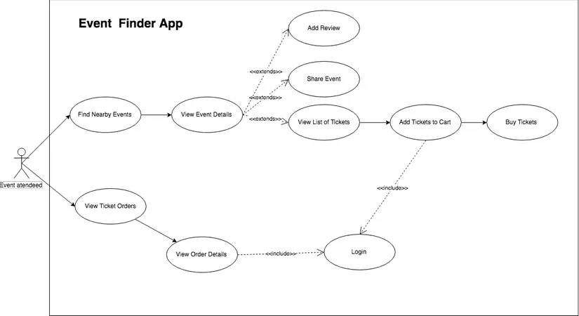
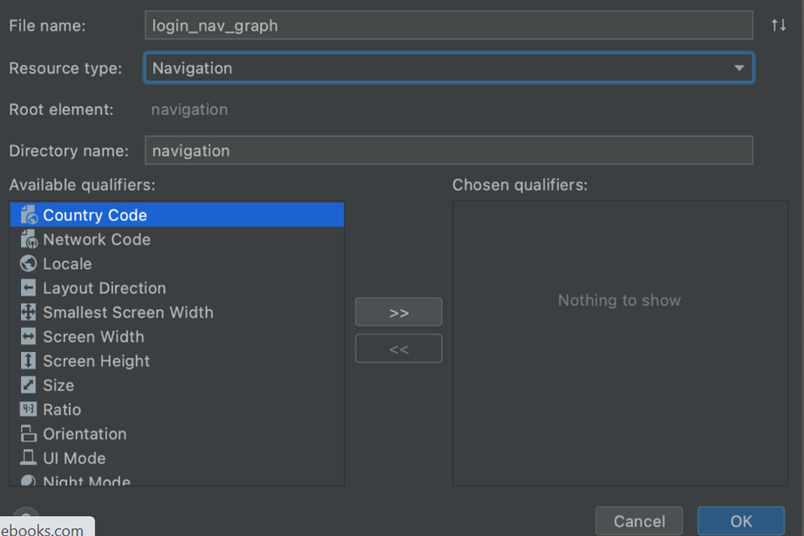
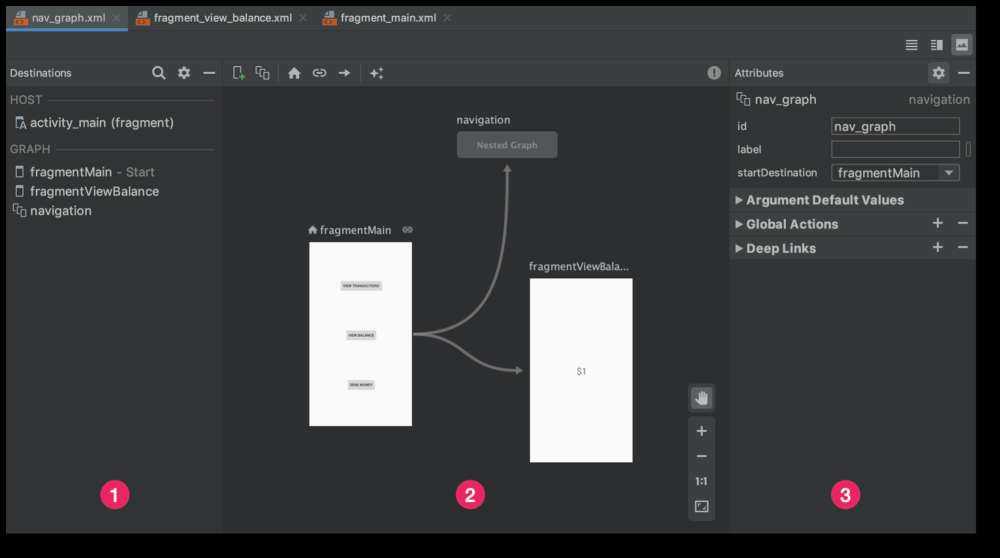
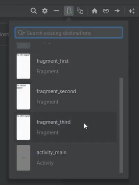
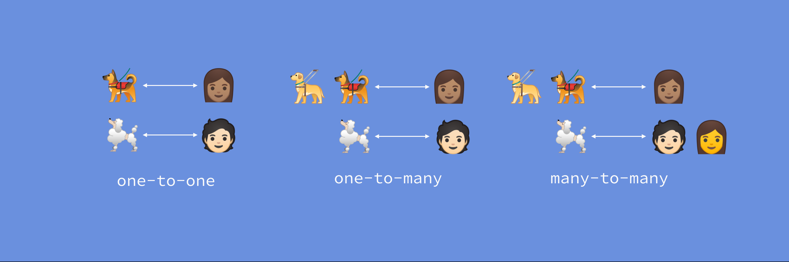
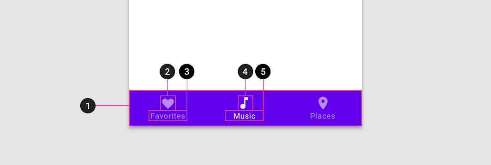
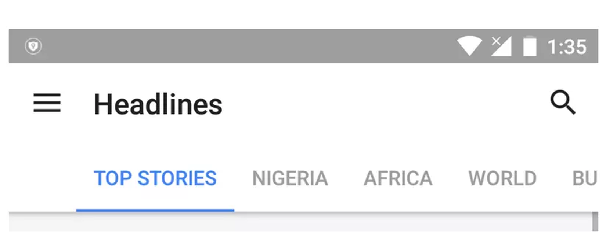
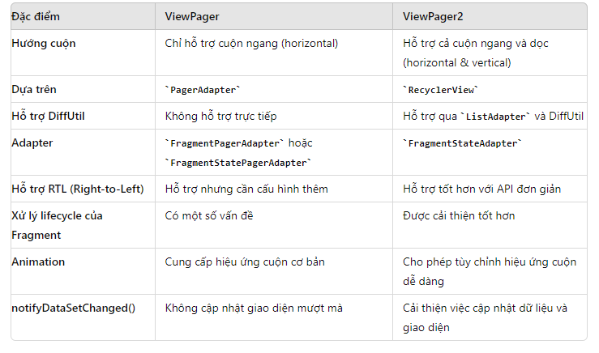

#  [ANDROID] BUỔI 11: Navigation

***

>*Tài liệu tham khảo*:  [Navigation Component](https://viblo.asia/p/co-ban-ve-android-navigation-component-WAyK8dYkKxX)

>*Tài liệu tham khảo*:  [Navigation Component_vid](https://www.youtube.com/watch?v=CK6p31f1j3w)

## I. AndroidX Navigation

>`AndroidX Navigation` là một thành phần trong bộ Android Jetpack, được thiết kế để giúp việc điều hướng trong ứng dụng Android trở nên dễ dàng và hiệu quả hơn. Thư viện này cung cấp một cách thức nhất quán để điều hướng giữa các thành phần trong ứng dụng như Fragment, Activity và các thành phần khác, đồng thời quản lý back stack, truyền dữ liệu giữa các màn hình, và nhiều tính năng hữu ích khác.

### 1. Tổng quan về AndroidX Navigation

`AndroidX Navigation` giúp quản lý các luồng điều hướng phức tạp trong ứng dụng một cách đơn giản hơn. Thay vì phải viết code phức tạp để xử lý các trường hợp điều hướng khác nhau, Navigation cung cấp một cách tiếp cận tập trung và dễ bảo trì hơn.

### 2. Các thành phần chính

**NavGraph:** Là sơ đồ điều hướng, định nghĩa các điểm đến (destinations) và các hành động điều hướng (actions) giữa chúng.

**NavHostFragment:** Là một container đặc biệt dùng để chứa và quản lý các fragment mà ứng dụng sẽ điều hướng tới. Đây là nơi các fragment xuất hiện khi điều hướng.

**NavController:** Được sử dụng để quản lý điều hướng giữa các điểm đến trong NavHostFragment. Nó cho phép bạn thực hiện điều hướng và quản lý back stack.

**NavDestination:** Là các điểm đến cụ thể trong NavGraph. Mỗi destination đại diện cho một màn hình hoặc một nơi trong ứng dụng mà người dùng có thể đến.

**Safe Args:** Là một plugin giúp truyền dữ liệu giữa các fragment hoặc activity một cách an toàn, tránh các lỗi thường gặp khi sử dụng Bundle trực tiếp.

### 3. Cách thức hoạt động

`AndroidX Navigation` hoạt động dựa trên việc cấu hình NavGraph, trong đó bạn xác định tất cả các màn hình (destinations) trong ứng dụng của mình và cách chúng liên kết với nhau. Mỗi destination được định nghĩa trong NavGraph có thể là một Fragment, Activity hoặc một loại điểm đến khác.

## II. nav_graph

***Khái niệm NavGraph***

-   `NavGraph` là một sơ đồ điều hướng của ứng dụng Android, nơi bạn định nghĩa tất cả các điểm đến (một nhóm các Navigation destination) (như Fragment, Activity, Dialog, v.v.) và các đường dẫn điều hướng giữa chúng.

-   Nó giúp bạn trực quan hóa và quản lý cách người dùng sẽ di chuyển qua các màn hình trong ứng dụng của bạn.




***Navigation Destination***

Navigation Destination có thể là một màn hình hoặc là một vài view trong ứng dụng của bạn. Trong Usecase Diagram trên thì ứng với mỗi use case tương ứng sẽ là một Navigation Destination

***Navigation Action***

Một Navigation action là một đường dẫn kết nối một destination với một destination khác. Một action sẽ cho biết destination nào nó đang kết nối và loại thông tin sẽ xảy ra giữa chúng

***Navigation Host***

Navigation host Một container trống hiển thị một destination và action trong navigation graph Nó thực hiện điều hướng các destination khác nhau

### III. Navigation component   


### 1. Tổng quan về Navigation

Navigation (điều hướng) là hành động cho phép người dùng điều hướng qua, vào, và quay lại từ những phần nội dung, màn hình khác nhau bên trong app.

### 2. thành phần chính của Navigation

- `Navigation Graph`: Là 1 file XML chứa tất cả các nội dung khu vực độc lập, nằm trong app gọi là destinations (điểm đến). Có thể có nhiều lối đi khả thi mà user có thể chọn khi dùng app.

- `NavHost`: Là 1 file XML dạng container rỗng sẽ hiển thị destination khi người dùng thực thi thao tác điều hướng. Nó về cơ bản sẽ chứa NavHostFragment, thứ hiển thị đa đích đến từ Navigation Graph.

- `NavController`: Là 1 đối tượng để điều khiển sự điều hướng của đích đến cùng với NavHost. Nó điều khiển sự swap của các nội dung đích đến (destination content) khi người dùng điều hướng tới xuyên suốt app.

**Lợi ích của Navigation component**

- Xử lý sự chuyển tiếp các fragment.
- Xử lý hoạt động chuyển tiếp và quay lại, cơ bản như xử lý Backstack.
- Cung cấp hoạt ảnh và chuyển ảnh cơ bản khi thay đổi giữa các content của NavHost.
- Dễ dàng xử lý và triển khai deep linking.
- Dễ dàng xử lý và triển khai Navigation UI pattern như Navigation Drawer hay Bottom Naviagation View, etc.
- An toàn tham số (Safe Args), 1 plugin Gradle cung cấp các kiểu dữ liệu an toàn chuyển đổi giữa các đích đến.
- Navigation Component cũng hỗ trợ ViewModel. Có thể kết nối view model tới navigation graph để chia sẻ UI giữa các đích đến.

### 3. Tạo 1 navigation graph


- **Khai báo thư viện**
    
    ```kotlin
    dependencies {
      val nav_version = "2.5.3"
    
      implementation("androidx.navigation:navigation-fragment-ktx:$nav_version")
      implementation("androidx.navigation:navigation-ui-ktx:$nav_version")
    }
    ```
    
- **Xây dựng Navigation Graph**

    - **Tạo mới một resource Navigation Graph:**
        - Trong cửa sổ ***Project*** của Android Studio, click chuột phải vào thư mục ***res > New > Android Resource File***.

        - Sau đó, một cửa sổ khai báo hiện ra, hãy định nghĩa một cái tên cho resource ***Navigation Graph*** này. Ví dụ là ***login_nav_graph*** . Ở mục ***Resource type*** trong cửa sổ này, tìm và chọn ***Navigation.*** Sau đó hãy để mọi thứ khác như mặc định rồi nhấn ***OK***.
        
       
        
    
- **Làm quen với Navigation Editor**
    - Kích đúp lên file ***xml*** để mở
    
   


      

    - ***Navigation Editor*** trên đây có đánh số, chia nó làm 3 phần riêng biệt giúp chúng ta dễ dàng thao tác hơn.
        1. **`Destination panel`**: là một thanh chứa đựng các ***destination***. Các ***destination*** bên trong Destination panel được chia ra thành hai nhóm, ***HOST*** và ***GRAPH***. Giao diện của mỗi nhóm này sẽ hơi khác với Android Studio, nhưng nó vẫn là một. 
        2. **`Graph Editor`**: Một nơi giúp vẽ ra sự tương quan giữa các thành phần bên trong ***Navigation Graph*** này. 
        3. **`Attributes`**: nơi chứa đựng các tham số định nghĩa cho từng thành phần được chọn bên trong Graph Editor. 
        
- **Thêm NavHost Vào Activity**
    - **Adding NavHostFragment via XML vào Main Activity**
        
        ```kotlin
        <?xml version="1.0" encoding="utf-8"?>
        <androidx.constraintlayout.widget.ConstraintLayout
            xmlns:android="http://schemas.android.com/apk/res/android"
            xmlns:app="http://schemas.android.com/apk/res-auto"
            xmlns:tools="http://schemas.android.com/tools"
            android:layout_width="match_parent"
            android:layout_height="match_parent"
            tools:context=".MainActivity">
        
            <androidx.appcompat.widget.Toolbar
                .../>
        
            <androidx.fragment.app.FragmentContainerView
                android:id="@+id/nav_host_fragment"
                android:name="androidx.navigation.fragment.NavHostFragment"
                android:layout_width="0dp"
                android:layout_height="0dp"
                app:layout_constraintLeft_toLeftOf="parent"
                app:layout_constraintRight_toRightOf="parent"
                app:layout_constraintTop_toTopOf="parent"
                app:layout_constraintBottom_toBottomOf="parent"
        
                app:defaultNavHost="true"
                app:navGraph="@navigation/nav_graph" />
        
            <com.google.android.material.bottomnavigation.BottomNavigationView
                .../>
        
        </androidx.constraintlayout.widget.ConstraintLayout>
        ```
        
        - Lưu ý các thuộc tính:
            - Thuộc tính `android:name` chứa tên lớp của hoạt động triển khai `NavHost`.
            - Thuộc tính `app:navGraph` liên kết `NavHostFragment` với một `Navigation graph`.
            - Thuộc tính `app:defaultNavHost="true"` đảm bảo rằng `NavHostFragment` sẽ chặn nút `Quay lại` của hệ thống. Lưu ý rằng chỉ có thể đặt một `NavHost` là mặc định. Nếu có nhiều máy chủ trong cùng một bố cục (ví dụ: bố cục hai ngăn), hãy nhớ chỉ định một `NavHost` mặc định duy nhất.
    - **Adding NavHostFragment via Layout Editor**
        - Tìm trên thanh ***Palette***, vào nhóm ***Containers***, sẽ thấy một thành phần UI có tên là ***NavHostFragment***. ***NavHostFragment*** chính là *“nơi chứa chấp”* ***Navigation Graph*** mà chúng ta muốn tìm.
        - Khi tìm thấy ***NavHostFragment*** rồi thì tiến hành kéo thả thành phần này vào trong màn hình thiết kế.
        - Ngay khi vừa kéo thả thành phần này vào giao diện thiết kế, sẽ thấy một cửa sổ lập tức hiện ra, hỏi rằng ***NavHost*** này sẽ chứa ***Navigation Graph*** nào. Chọn  `Navigation graph` tương ứng và nhấn ***OK.***

          
        
- **Thêm Destination Vào Navigation Graph**
    - Nếu quay lại tab ***Design*** của ***Navigation Editor*** đang hiển thị ***login_nav_graph***. Bạn sẽ thấy thông tin trong ***Destination panel*** thể hiện rằng ***activity_main*** chính là ***Host*** (là nơi chứa) ***login_nav_graph*** này.
    - Tạo `new destination` bằng Navigation Editor:
        - Trong Navigation Editor (Trình chỉnh sửa điều hướng), hãy nhấp vào biểu tượng **Đích đến mới** , sau đó nhấp vào **Create new destination** (Tạo đích đến mới).
        - Tạo fragment trong hộp thoại **New Android Component.**
        
    
        
- **Các thuộc tính của 1 Destionation**
    - Nhấp để chọn một destination, và hãy lưu ý các thuộc tính sau trong bảng **Attributes** (Thuộc tính):
        - Trường **Type** (Loại) cho biết `destination` được triển khai dưới dạng `Fragment`, `Activity` hay `custom class` khác trong mã nguồn.
        - Trường **Label** (Nhãn) chứa tên của `destination` mà người dùng có thể đọc được. Trường này có thể hiển thị trên giao diện người dùng – ví dụ: nếu bạn kết nối [`NavGraph`](https://developer.android.com/reference/androidx/navigation/NavGraph?hl=vi) với một `Toolbar` bằng [`setupWithNavController()`](https://developer.android.com/reference/androidx/navigation/ui/NavigationUI?hl=vi#setupWithNavController(androidx.appcompat.widget.Toolbar,%20androidx.navigation.NavController)). Do đó, bạn nên sử dụng chuỗi tài nguyên cho giá trị này.
        - Trường **ID** (Mã) chứa mã của `destination` dùng để tham chiếu đến `destination`trong mã.
        - Trình đơn thả xuống **Class** (Lớp) hiển thị tên của lớp đã liên kết với `destination`. Có thể nhấp vào trình đơn thả xuống này để thay đổi lớp đã liên kết thành một loại đích đến khác.
    - Nhấp vào thẻ **Text** (Văn bản) để hiển thị thành phần hiển thị XML của biểu đồ điều hướng. XML chứa các thuộc tính `id`, `name`, `label` và `layout` giống nhau cho `destination`, như hiển thị dưới đây:
        
        ```kotlin
        <?xml version="1.0" encoding="utf-8"?>
        <navigation xmlns:app="http://schemas.android.com/apk/res-auto"
            xmlns:tools="http://schemas.android.com/tools"
            xmlns:android="http://schemas.android.com/apk/res/android"
            app:startDestination="@id/blankFragment">
            <fragment
                android:id="@+id/blankFragment"
                android:name="com.example.cashdog.cashdog.BlankFragment"
                android:label="@string/label_blank"
                tools:layout="@layout/fragment_blank" />
        </navigation>
        ```
        
- **Chỉ định một màn hình làm starting destination**
    - [`*The start destination*`](https://developer.android.com/guide/navigation/navigation-principles?hl=vi) là screen đầu tiên người dùng nhìn thấy khi mở ứng dụng, và màn hình cuối cùng người dùng nhìn thấy khi đóng app (khi người dùng nhấn lần lượt các nút back).. Navigation Editor sử dụng icon ngôi nhà để xác định `starting destination`.
    - Khi đã có tất cả các đích đến, có thể chọn một đích đến bắt đầu theo cách sau đây:
    1. Trong thẻ **Design** (Thiết kế), hãy nhấp để `highlight a destination`.
    2. Nhấp vào nút **Assign start destination** (Chỉ định đích đến bắt đầu) (icon home). Hoặc có thể nhấp chuột phải vào đích đến và nhấp vào **Set as Start Destination** (Đặt làm đích đến bắt đầu).
    
        
- **Dùng NavController Để Di Chuyển Đến Destination**
    - Có nhiều cách để di chuyển từ một ***destination*** này đến ***destination*** khác bên trong ***NavHost*** sử dụng ***NavController***.
    - Ví dụ bắt đầu xây dựng việc click vào button ***View Profile*** ở ***HomeFragment*** sẽ mở ra ***ProfileFragment*** qua từng cách.
    
    ```kotlin
    class HomeFragment : Fragment() {
        override fun onCreateView(
            inflater: LayoutInflater, container: ViewGroup?,
            savedInstanceState: Bundle?
        ): View? {
            // Inflate the layout for this fragment
            return inflater.inflate(R.layout.fragment_home, container, false)
        }
    
        override fun onViewCreated(view: View, savedInstanceState: Bundle?) {
            super.onViewCreated(view, savedInstanceState)
    
            view.findViewById<Button>(R.id.btnViewProfile)?.setOnClickListener { 
                // Will use NavController here
            }
        }
    }
    ```
    
    - ***Cách 1 -*** ***Di Chuyển Trực Tiếp Trên Navigation Graph***
        - ***NavController*** có một phương thức ***navigate()*** cho phép truyền vào một ***id*** của ***destination*** để di chuyển. Dùng như sau:
        
        ```kotlin
        view.findViewById<Button>(R.id.btnViewProfile)?.setOnClickListener {
            findNavController().navigate(R.id.profileFragment)
        }
        ```
        
    - ***Cách 2 – Di Chuyển Bằng Action***
        
        - XML code
            
            ```kotlin
            <?xml version="1.0" encoding="utf-8"?>
            <navigation xmlns:android="http://schemas.android.com/apk/res/android"
                xmlns:app="http://schemas.android.com/apk/res-auto"
                xmlns:tools="http://schemas.android.com/tools"
                android:id="@+id/login_nav_graph"
                app:startDestination="@id/homeFragment">
                <fragment
                    android:id="@+id/profileFragment"
                    android:name="com.yellowcode.navigationsample.ProfileFragment"
                    android:label="fragment_profile"
                    tools:layout="@layout/fragment_profile" />
                <fragment
                    android:id="@+id/homeFragment"
                    android:name="com.yellowcode.navigationsample.HomeFragment"
                    android:label="fragment_home"
                    tools:layout="@layout/fragment_home" >
                    <action
                        android:id="@+id/action_homeFragment_to_profileFragment"
                        app:destination="@id/profileFragment" />
                </fragment>
                <fragment
                    ... />
            </navigation>
            ```
            
## III. Bottom Navigation

>*Tài liệu tham khảo*:  [BottomNavigationView](https://www.youtube.com/watch?v=Cvs-H-r35uI&list=PLRoAKls-7kksIt8rkahuC6erNcQy45NYk&index=4)

`Bottom Navigation`, còn được gọi là "Bottom Navigation Bar", là một thành phần giao diện người dùng thường được sử dụng trong các ứng dụng di động để cung cấp điều hướng giữa các mục chính hoặc chế độ khác nhau. Nó thường được đặt ở phía dưới cùng của màn hình và bao gồm một số ít các biểu tượng hoặc văn bản tượng trưng cho các phần quan trọng trong ứng dụng.



-   1. Container
-   2. Inactive icon
-   3. Inactive text label
-   4. Active icon
-   5. Active text label


## IV. TabLayout 

>*Tài liệu tham khảo*:  [TabLayout](https://viblo.asia/p/tao-material-design-tab-trong-ung-dung-android-XL6lAP6NZek
)

### 1. TabLayout

💡 `TabLayout` là một thành phần giao diện người dùng thường được sử dụng trong các ứng dụng di động để tạo ra giao diện chứa nhiều tab (thẻ), mỗi tab tương ứng với một phần nội dung khác nhau. `TabLayout` thường kết hợp với `ViewPager` để cho phép người dùng dễ dàng chuyển đổi giữa các phần khác nhau của ứng dụng.

- Trong `TabLayout`, khi một tab được chọn, một trang khác (hoặc fragment) sẽ được hiển thị tới người dùng.
- Thành phần `TabLayout` có thể có các tab được hiển thị theo một trong hai cách: `cố định` và `cuộn`. Nếu các tab được cố định, tất cả các tab sẽ được hiển thị trên màn hình cùng một lúc.


- Trong các tab ở chế độ cuộn, nếu số lượng các tab trở nên quá rộng cho màn hình, người dùng có thể vuốt sang trái hoặc phải để xem nhiều tab hơn.



- Thông tin được hiển thị trên một tab có thể là text, icon, hoặc kết hợp giữa cả text và icon.


### 2. sử dụng TabLayout 

**Thêm TabLayout và ViewPager**

-   Import thự viện support trong build.gradle :

```
dependencies {
    implementation 'com.android.support:design:26.1.0'
    implementation 'com.android.support:support-v4:26.1.0'
}
```
**Tạo PagerAdapter**: Chúng ta cần phải tạo ra một lớp SampleAdapter.kt kế thừa từ FragmentPagerAdapter. Lớp này có trách nhiệm quản lý các Fragment khác nhau sẽ được hiển thị trên các tab.

**Khởi tạo các thành phần**: Tiếp theo, chúng ta sẽ khởi tạo các thành phần TabLayout, ViewPager và SampleAdapter. Việc này được thực hiện bên trong onCreate () trong MainActivity.kt.

##  V. ViewPager2

>*Tài liệu tham khảo*:  [ViewPager2](https://viblo.asia/p/su-dung-viewpager2-trong-android-oOVlYkVVK8W
)

>**ViewPager2** là một phiên bản cải tiến của ViewPager trong Android, được giới thiệu để cung cấp trải nghiệm cuộn nội dung mượt mà hơn và tích hợp nhiều tính năng mới.

- **Cuộn nội dung mượt hơn:** `ViewPager2` được tối ưu hóa để cung cấp hiệu suất tốt hơn khi cuộn qua các trang nội dung. Nó sử dụng `RecyclerView` dưới phía dưới, giúp tận dụng các cải tiến và tối ưu hóa của RecyclerView.
- **Hỗ trợ RTL (Right-to-Left):** `ViewPager2` hỗ trợ chế độ `Right-to-Left` (quyền sang trái) một cách tự nhiên, giúp đáp ứng tốt hơn với các ngôn ngữ và văn hóa sử dụng bố cục từ phải sang trái.
- **Tích hợp với Data Binding:** `ViewPager2` có tích hợp tốt với `Data Binding`, giúp việc ánh xạ dữ liệu và tương tác với nội dung trở nên dễ dàng hơn.
- **Hỗ trợ Adapter mới:** `ViewPager2` sử dụng `Adapter` mới với tên là **`RecyclerView.Adapter`**, thay vì **`PagerAdapter`** trong phiên bản trước. Điều này giúp tạo ra một trải nghiệm tương tự việc làm việc với RecyclerView.
- **Hỗ trợ các kiểu layout khác nhau:** `ViewPager2` cho phép bạn dễ dàng chọn kiểu layout ngang (`horizontal`), dọc (`vertical`) hoặc ngang theo chiều từ phải sang trái (`RTL`).
- **Callback cho sự kiện cuộn:** `ViewPager2` cung cấp các `callback` cho các sự kiện liên quan đến cuộn như khi trang được chọn, khi trang bị chọn lại và khi có thay đổi trong cuộn.

