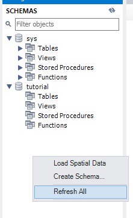

#  [ANDROID] BUỔI 12: CSDL-SQL

***

>*Tài liệu tham khảo*:  []()

## I. CSDL

>*Tài liệu tham khảo*:  [Database](https://topdev.vn/blog/phan-1-gioi-thieu-co-so-du-lieu-csdl-he-quan-tri-csdl/)

### 1. CSDL là gì?

>**Cơ sở dữ liệu (database)** là một tập hợp các dữ liệu rời rạc được tổ chức, lưu trữ và quản lý theo hệ thống để có thể dễ dàng truy xuất, chỉnh sửa và cập nhật

>Chúng thường được sử dụng để lưu trữ thông tin trong các hệ thống phần mềm và ứng dụng, từ dữ liệu cá nhân cho đến thông tin doanh nghiệp quan trọng

-   *VD: Trong cuộc sống bạn có thể thấy rất nhiều cơ sở dữ liệu đó, nếu bạn vào thư viện thì ở trên đó là một cơ sở dữ liệu, phân loại sách theo chủ đề: xã hội, tự nhiên, khoa học … đó cũng là một dạng cở sở dữ liệu đơn giản.*

**Mục đích ta sử dụng CSDL**: dễ quản lý và tìm kiếm, thống nhất việc lưu trữ thông tin. Có thể tìm kiếm một cách nhanh chóng khi cần thông tin nào đó và cũng có thể lôi các thông tin liên quan với thông tin đó ra luôn.

### 2. Đặc điểm của Cơ sở dữ liệu

Cơ sở dữ liệu (CSDL) có nhiều đặc điểm quan trọng giúp quản lý, tổ chức và xử lý dữ liệu một cách hiệu quả.

Đặc điểm chính:
-   Tính tổ chức và cấu trúc
-   Khả năng truy xuất và tìm kiếm
-   Tính nhất quán và toàn vẹn
-   Khả năng mở rộng
-   Bảo mật và quyền truy cập
-   Khả năng sao lưu và phục hồi
-   Quản lý giao dịch
-   Khả năng hỗ trợ đồng thời
-   Tính tương thích

### 3. Phân loại Database

#### 3.1: Phân loại theo loại dữ liệu

-   Cơ sở dữ liệu có cấu trúc (Structured Database): Dữ liệu được tổ chức theo cấu trúc cố định, thường là các bảng với hàng và cột. Ví dụ: Cơ sở dữ liệu quan hệ (RDBMS) như MySQL, PostgreSQL.

-   Cơ sở dữ liệu phi cấu trúc (Unstructured Database): Dữ liệu không có cấu trúc cố định, chẳng hạn như văn bản tự do, email, hình ảnh. Ví dụ: Dữ liệu trong các hệ thống lưu trữ đám mây.

-   Cơ sở dữ liệu bán cấu trúc (Semi-Structured Database): Dữ liệu có cấu trúc nhưng không hoàn toàn theo quy tắc cố định. Ví dụ: Dữ liệu JSON, XML.

#### 3.2: Phân loại theo mô hình tổ chức và lưu trữ

-   Cơ sở dữ liệu quan hệ (Relational Database): Dữ liệu được lưu trữ trong các bảng và có thể được liên kết với nhau thông qua các khóa. Ví dụ: MySQL, Oracle, SQL Server.

-   Cơ sở dữ liệu phân cấp (Hierarchical Database): Dữ liệu được tổ chức theo cấu trúc cây với các mối quan hệ cha-con. Ví dụ: IBM Information Management System (IMS).

-   Cơ sở dữ liệu mạng (Network Database): Dữ liệu được tổ chức theo mạng lưới với các mối quan hệ linh hoạt hơn giữa các bản ghi. Ví dụ: Integrated Data Store (IDS).

-   Cơ sở dữ liệu hướng đối tượng (Object-Oriented Database): Dữ liệu được lưu trữ dưới dạng các đối tượng, tương tự như lập trình hướng đối tượng. Ví dụ: ObjectDB, db4o.

-   Cơ sở dữ liệu NoSQL (Not Only SQL): Dữ liệu được lưu trữ theo nhiều mô hình khác nhau không phải là bảng. Ví dụ: MongoDB (dữ liệu tài liệu), Cassandra (dữ liệu cột), Redis (dữ liệu key-value).

#### 3.3: Phân loại theo mục đích sử dụng

-   Cơ sở dữ liệu hoạt động (Operational Database): Dùng để xử lý và lưu trữ dữ liệu giao dịch hàng ngày trong doanh nghiệp. Ví dụ: Các hệ thống ERP, CRM.

-   Cơ sở dữ liệu kho (Data Warehouse): Lưu trữ dữ liệu từ nhiều nguồn để phân tích và báo cáo. Ví dụ: Amazon Redshift, Google BigQuery.

-   Cơ sở dữ liệu ngữ nghĩa (Semantic Database): Lưu trữ dữ liệu với ý nghĩa ngữ nghĩa để hỗ trợ tìm kiếm và truy vấn thông minh. Ví dụ: Cơ sở dữ liệu RDF, OWL.

#### 3.4: Phân loại theo mô hình triển khai

-   Cơ sở dữ liệu tập trung (Centralized Database): Được lưu trữ và quản lý tại một địa điểm duy nhất. Ví dụ: Cơ sở dữ liệu trong các hệ thống máy chủ trung tâm.

-   Cơ sở dữ liệu phân tán (Distributed Database): Dữ liệu được lưu trữ và xử lý tại nhiều địa điểm khác nhau, kết nối qua mạng. Ví dụ: Google Cloud Spanner, Apache Cassandra.

-   Cơ sở dữ liệu tập trung có bản sao (Centralized with Replica Database): Kết hợp giữa cơ sở dữ liệu tập trung và phân tán, với một cơ sở dữ liệu chính và các bản sao ở các địa điểm khác. Ví dụ: Hệ thống sao lưu dữ liệu trong các dịch vụ đám mây.

### 4. Mô hình cơ sở dữ liệu

Cơ sở dữ liệu là phần quan trọng trong việc tổ chức và quản lý dữ liệu. Các mô hình cơ sở dữ liệu khác nhau cung cấp cách tiếp cận khác nhau để lưu trữ, truy xuất, và quản lý thông tin. Dưới đây là ba mô hình cơ sở dữ liệu phổ biến: phân cấp, quan hệ và mạng.


#### 4.1. Mô Hình Cơ Sở Dữ Liệu Phân Cấp (Hierarchical Database)

`Mô hình cơ sở dữ liệu phân cấp (Hierarchical Database)` tổ chức dữ liệu theo cấu trúc cây, nơi các bản ghi được sắp xếp theo mối quan hệ cha-con. Trong mô hình này, mỗi bản ghi có thể có nhiều bản ghi con, nhưng mỗi bản ghi con chỉ có một bản ghi cha. Đây là mô hình cơ sở dữ liệu đầu tiên, phổ biến trong những năm 1960 và 1970, thường được sử dụng để tổ chức dữ liệu như thông tin nhân viên trong một công ty, với các phòng ban là nút cha và nhân viên là nút con.


**Ưu điểm:**

-   Dễ dàng và trực quan trong việc mô hình hóa các mối quan hệ có cấu trúc rõ ràng.

-   Hiệu suất tốt với các truy vấn theo cấu trúc cây.

**Nhược điểm:**

-   Kém linh hoạt trong việc xử lý các mối quan hệ phức tạp hoặc nhiều cấp độ.

-   Khó khăn trong việc thực hiện các thao tác thay đổi cấu trúc dữ liệu.

#### 4.2 .Cơ Sở Dữ Liệu Quan Hệ (Relational Database)

`Mô hình cơ sở dữ liệu quan hệ (Relational Database)` tổ chức dữ liệu trong các bảng, mỗi bảng có hàng và cột. Các bảng liên kết với nhau qua khóa chính (primary key) và khóa ngoại (foreign key). Dữ liệu được lưu trữ với cấu trúc rõ ràng và các mối quan hệ giữa các bảng được quản lý thông qua các thuộc tính chung, như liên kết giữa bảng khách hàng và bảng đơn hàng.


**Ưu điểm:**

-   Tính linh hoạt cao trong việc quản lý và truy xuất dữ liệu nhờ vào các mối quan hệ giữa các bảng.
-   Dễ dàng thực hiện các truy vấn phức tạp bằng cách sử dụng ngôn ngữ truy vấn SQL (Structured Query Language).

**Nhược điểm:**

-   Có thể gặp khó khăn với hiệu suất khi làm việc với khối lượng dữ liệu rất lớn hoặc cấu trúc dữ liệu phức tạp.
-   Đòi hỏi phải quản lý cấu trúc dữ liệu và các mối quan hệ một cách chặt chẽ.

#### 4.3: Cơ Sở Dữ Liệu Mạng (Network Database)

`Mô hình cơ sở dữ liệu mạng (Network Database)` là một sự phát triển từ mô hình phân cấp, cung cấp sự linh hoạt hơn trong việc tổ chức dữ liệu. Dữ liệu trong mô hình mạng được lưu trữ dưới dạng mạng lưới, cho phép các bản ghi có nhiều mối quan hệ cha-con. Mô hình này sử dụng các liên kết để kết nối các bản ghi, cho phép một bản ghi liên kết với nhiều bản ghi khác, phù hợp với các ứng dụng xử lý mối quan hệ phức tạp giữa các phần tử dữ liệu.


**Ưu điểm:**

-   Linh hoạt trong việc xử lý các mối quan hệ phức tạp và đa chiều giữa các bản ghi.
-   Có thể cải thiện hiệu suất khi xử lý các truy vấn yêu cầu liên kết dữ liệu từ nhiều nguồn.

**Nhược điểm:**

-   Cấu trúc dữ liệu có thể trở nên phức tạp và khó quản lý, đặc biệt là khi mở rộng hệ thống.
-   Cần có sự hiểu biết sâu về mô hình mạng để thiết kế và duy trì cơ sở dữ liệu hiệu quả.

## II. Cơ sở dữ liệu quan hệ

>*Tài liệu tham khảo*:  [Cơ sở dữ liệu quan hệ](https://businesswiki.codx.vn/co-so-du-lieu-quan-he-la-gi/)


### 1. Cơ sở dữ liệu quan hệ là gì?

>***Cơ sở dữ liệu quan hệ** là một loại cơ sở dữ liệu lưu trữ cung cấp quyền truy cập vào các điểm dữ liệu có liên quan đến nhau. Cơ sở dữ liệu quan hệ dựa trên mô hình dữ liệu quan hệ, một cách trực quan, đơn giản để biểu diễn dữ liệu trong bảng.*

-   Trong cơ sở dữ liệu quan hệ, mỗi `hàng` trong bảng là một bản ghi với một ID duy nhất được gọi là `khóa`. Các `cột` của bảng chứa các `thuộc tính của dữ liệu` và mỗi bản ghi thường có một giá trị cho mỗi thuộc tính, giúp dễ dàng thiết lập mối quan hệ giữa các điểm dữ liệu.


### 2. Cơ sở dữ liệu quan hệ bao gồm những thành phần nào?

#### 2.1.Table: Bảng dữ liệu


#### 2.2 Relationship: Mối quan hệ


#### 2.3. Entity Relationship Diagram: Lượt đồ thể hiên mối quan hệ

**Entity Relationship Diagram (ERD)** là một cách giúp bạn hiểu nhanh hơn về cấu trúc và cơ sở dữ liệu, dễ dàng thao tác hơn

**Database Management System:** Hệ quản trị Cơ sở dữ liệu

**Database Management System(DBMS)** là phần mềm giúp quản lý và vận hành cơ sở dữ liệu như: MySQL, SQL Server, Oracle Database….


### 3. Ví dụ

**Ví dụ về cơ sở dữ liệu quan hệ trong thực tế:** 

Một doanh nghiệp nhỏ sử dụng hai bảng để xử lý đơn đặt hàng. 

-   Bảng thứ nhất chứa thông tin khách hàng, bao gồm tên, địa chỉ, thông tin thanh toán và liên hệ, với mỗi khách hàng được chỉ định một ID duy nhất (khóa chính). 
-   Bảng thứ hai chứa thông tin đơn hàng, bao gồm ID khách hàng, tên sản phẩm, số lượng, màu sắc, kích thước, nhưng không có thông tin khách hàng. 
-   Cột ID chung giữa hai bảng tạo mối quan hệ, cho phép kết hợp thông tin từ cả hai bảng để xử lý đơn hàng, xuất hóa đơn, và giao hàng chính xác.

## III. SQL là gì? Cài đặt MySQL

>*Tài liệu tham khảo*:  [SQL](hhttps://200lab.io/blog/sql-la-gi/)

### 1. SQL là gì?


`SQL, viết tắt của Structured Query Language` là một ngôn ngữ truy vấn có cấu trúc, phổ biến trong lĩnh vực lưu trữ, xử lý và truy xuất dữ liệu trong cơ sở dữ liệu quan hệ. SQL thường được sử dụng làm ngôn ngữ chuẩn cho các hệ quản trị cơ sở dữ liệu quan hệ.

`SQL` được phát minh vào năm 1960 nhưng mãi đến năm 1980 mới được ra mắt công chúng. Đây là ngôn ngữ cơ sở dữ liệu được sử dụng để tạo, xóa, tìm nạp và sửa đổi các hàng.


`SQL` đóng một vai trò quan trọng trong việc quản lý thông tin trong cơ sở dữ liệu quan hệ. Bằng cách sử dụng SQL, người dùng có khả năng thực hiện các thao tác như lưu trữ, cập nhật, xóa, tìm kiếm và truy xuất thông tin từ cơ sở dữ liệu. SQL cũng đóng vai trò quan trọng trong việc duy trì và tối ưu hiệu suất của cơ sở dữ liệu.

**Vì sao ngôn ngữ SQL lại phổ biến trong nhiều ngành nghề?**


### 2. MySQL là gì?

>*Tài liệu tham khảo*:  [MySQL](https://200lab.io/blog/mysql-la-gi/)

`MySQL` là một `hệ thống quản lý cơ sở dữ liệu mã nguồn mở (RDBMS - Relational Database Management System)`, chúng quản lý dữ liệu thông qua các cơ sở dữ liệu. Mỗi cơ sở dữ liệu có thể có nhiều bảng quan hệ chứa dữ liệu.

`MySQL` được phát triển bởi Oracle dựa trên ngôn ngữ truy vấn dữ liệu có cấu trúc (SQL). `MySQL` được xem là ngôn ngữ dễ sử dụng, bạn chỉ cần học một số lệnh cơ bản là có thể làm việc, tạo và tương tác với database.

**MySQL hoạt động như thế nào?**

***MySQL hoạt động dựa trên hai khái niệm chính: cơ sở dữ liệu quan hệ (relational database) và mô hình client-server.***

#### 2.1. Cơ sở dữ liệu quan hệ (relational database) trong MySQL

Trong cơ sở dữ liệu quan hệ, bạn sẽ lưu trữ dữ liệu trong table (bảng), các table thường liên quan đến nhau.

***Ví dụ:** Chúng ta có hai table trong công ty hàng không, một table cho phi công, một table thể hiện các chuyến bay. Trong trường hợp này, chúng ta có thể kết nối dữ liệu hai table thành một column như hình sau:*


`PilotID` sẽ là `primary key (khoá chính)` biểu diễn mối quan hệ giữa hai table.

#### 2.2. Mô hình client-server trong MySQL


`MySQL` là hệ thống quản lý (management system) được xây dựng theo mô hình `client-server`. Nói một cách dễ hiểu, `server` là nơi lưu trữ dữ liệu và `client` là công cụ mà bạn sẽ cần sử dụng để truy cập và truy xuất dữ liệu.

### 3. Sự khác nhau giữa MySQL và SQL


### 4, Ưu điểm của MySQL

-   Hiệu suất nhanh và ổn định.
-   Dễ sử dụng, quản lý và bảo trì thuận lợi.
-   Khả năng mở rộng linh hoạt và độ tin cậy cao.
-   Xử lý mượt mà cả truy vấn đơn giản lẫn phức tạp.
-   Hỗ trợ indexing và mã hóa dữ liệu, đảm bảo tính bảo mật và hiệu suất.
-   Tương thích đa nền tảng, mang lại sự linh hoạt cho người dùng.
-   Cộng đồng phát triển lớn, thường xuyên được cập nhật và cải tiến.
-   Phù hợp với nhiều lĩnh vực, từ E-Commerce, Data Warehousing đến quản lý đăng nhập.

## IV. Database && Table

>*Tài liệu tham khảo*:  [Database video](https://www.youtube.com/watch?v=DGXCp-iajEg&list=PLE1qPKuGSJaDkQQB5vK7t7-PRIVjtqeHB&index=5)

`Database` là một tập hợp có tổ chức các dữ liệu được lưu trữ và quản lý để phục vụ cho mục đích truy xuất, quản lý, và phân tích. Database có thể chứa nhiều loại dữ liệu khác nhau và được sử dụng trong nhiều ứng dụng khác nhau, từ các trang web, ứng dụng di động cho đến các hệ thống quản lý lớn.

`Table` là một cấu trúc trong database được sử dụng để tổ chức và lưu trữ dữ liệu dưới dạng các hàng và cột. Mỗi `hàng (row)` đại diện cho một bản ghi (record) trong bảng, và mỗi `cột (column)` đại diện cho một trường (field) chứa một loại dữ liệu cụ thể của các bản ghi đó.

*Ví dụ, trong một table "Students" có thể có các cột như "StudentID", "Name", "Age", "Grade", và mỗi hàng trong bảng sẽ chứa thông tin của một học sinh cụ thể.*


### 1. Tạo, xoá database

***Tạo 1 SQL***


- Gõ chữ thường hay hoa đều được, như nhau

- Cú pháp:

```
CREATE DATABASE `tên của database`
```

```
CREATE DATABASE ahihi
```

-   click vô đây (Nếu hiện tick thì thành công, đúng cú pháp. Còn dấu X là sai)


- chọn `Refresh All` để update lại hệ thống




***Xoá 1 SQL***

tương tự như trên, khác code

```
DROP DATABASE `tên của database`
```

```
DROP DATABASE ahihi
``` 

hoặc 


### 2. Cách tạo, sửa, xóa một cái bảng (TABLE) trong MySQL


#### 2.1 Cách tạo một cái bảng trong MySQL

>*Tài liệu tham khảo*:  [TABLE](https://webcoban.vn/mysql/cach-tao-sua-xoa-bang-table-trong-mysql)


- Để tạo một cái bảng thì chúng ta sử dụng lệnh CREATE TABLE với cú pháp như sau:

```
CREATE TABLE table_name(
	column1 DATA TYPE,
	column2 DATA TYPE,
	column3 DATA TYPE
);
```

- Trong đó:

    -   table_name là tên của cái bảng mà chúng ta muốn tạo.
    -   column1, column2, column3 lần lượt là tên của cột thứ nhất, cột thứ hai, cột thứ ba trên cái bảng.
    -   DATA TYPE là kiểu của dữ liệu được lưu trữ bên trong cột

    

// ví dụ:

```
CREATE TABLE SinhVien(
	MSSV INT,
	HoTen VARCHAR(255),
	NamSinh YEAR,
	GioiTinh VARCHAR(10)
);
```

#### 2.2 Cách chỉnh sửa bảng trong MySQL

- Thông thường thì việc chỉnh sửa bảng được chia làm năm trường hợp chính: sửa tên bảng, thêm một cột mới, xóa một cột, sửa tên cột, thay đổi kiểu dữ liệu của cột.

**Sửa tên bảng**

- Để sửa tên (đặt lại tên) cho một cái bảng thì chúng ta sử dụng lệnh RENAME TABLE với cú pháp như sau:

```
RENAME TABLE old_name TO new_name;
```

- Ví dụ, để đặt lại tên cho cái bảng SinhVien thành Student thì tôi sử dụng câu lệnh bên dưới.

```
RENAME TABLE SinhVien TO Student;
```

**Thêm một cột mới**

- Để thêm một cột mới vào bên trong cái bảng thì chúng ta sử dụng lệnh ADD COLUMN với cú pháp như sau:
```
ALTER TABLE table_name ADD COLUMN column_name DATA TYPE;
```
- Ví dụ, để thêm cột ThanhPho vào bên trong cái bảng SinhVien thì tôi sử dụng câu lệnh bên dưới.
```
ALTER TABLE SinhVien ADD COLUMN ThanhPho VARCHAR(100);
```

**Xóa một cột**

- Để xóa một cột nào đó ra khỏi bảng thì chúng ta sử dụng lệnh DROP COLUMN với cú pháp như sau:

```
ALTER TABLE table_name DROP COLUMN column_name;
```

- Ví dụ, để xóa cột ThanhPho ra khỏi bảng SinhVien thì tôi sử dụng câu lệnh bên dưới.

```
ALTER TABLE SinhVien DROP COLUMN ThanhPho;
```

**Sửa tên cột**

- Để sửa tên (đặt lại tên) cho cột thì chúng ta sử dụng lệnh CHANGE COLUMN với cú pháp như sau:

```
ALTER TABLE table_name CHANGE COLUMN old_column_name new_column_name DATA TYPE;
```

- Ví dụ, để đặt lại tên cho cột HoTen (trong bảng SinhVien) thành FullName thì tôi sử dụng câu lệnh bên dưới.

```
ALTER TABLE SinhVien CHANGE COLUMN HoTen FullName VARCHAR(255);
```

**Thay đổi kiểu dữ liệu của cột**

- Để thay đổi kiểu dữ liệu của một cột thì chúng ta sử dụng lệnh MODIFY COLUMN với cú pháp như sau:
```
ALTER TABLE table_name MODIFY COLUMN column_name DATA TYPE;
```
- Ví dụ, để đổi kiểu dữ liệu của cột GioiTinh (trong bảng SinhVien) thành TEXT thì tôi dùng câu lệnh bên dưới.
```
ALTER TABLE SinhVien MODIFY COLUMN GioiTinh TEXT;
```

#### 2.3 Cách xóa một cái bảng trong MySQL

- Để xóa một cái bảng thì chúng ta sử dụng lệnh DROP TABLE với cú pháp như sau:
```
DROP TABLE table_name;
```
- Ví dụ, để xóa cái bảng SinhVien thì tôi sử dụng câu lệnh bên dưới.
```
DROP TABLE SinhVien;
```


## V. INSERT, UPDATE, DELETE

### 1. INSERT INTO

**Cú pháp**

Có hai cách chính để sử dụng câu lệnh `INSERT INTO`:

***Cách 1: Chỉ định tên cột và giá trị tương ứng***

Bạn chỉ định cả tên các cột và các giá trị tương ứng mà bạn muốn thêm vào bảng.

```sql
INSERT INTO table_name (column1, column2, column3, ...)
VALUES (value1, value2, value3, ...);
```

*Ví dụ:*

```sql
INSERT INTO Customers (CustomerName, ContactName, Address, City, PostalCode, Country)
VALUES ('Cardinal', 'Tom B. Erichsen', 'Skagen 21', 'Stavanger', '4006', 'Norway');
```

Câu lệnh trên sẽ thêm một bản ghi mới vào bảng "Customers" với các giá trị tương ứng cho các cột đã chỉ định.

***Cách 2: Không chỉ định tên cột (đối với tất cả các cột)***

Nếu muốn thêm giá trị vào tất cả các cột trong bảng, bạn có thể bỏ qua phần tên cột. Tuy nhiên, thứ tự của các giá trị phải khớp với thứ tự của các cột trong bảng.

```sql
INSERT INTO table_name
VALUES (value1, value2, value3, ...);
```

*Ví dụ:*

```sql
INSERT INTO Customers
VALUES ('Cardinal', 'Tom B. Erichsen', 'Skagen 21', 'Stavanger', '4006', 'Norway');

```


**Chèn dữ liệu vào các cột cụ thể**

Bạn cũng có thể chỉ định chỉ một vài cột mà bạn muốn thêm dữ liệu, các cột khác sẽ được đặt giá trị mặc định (nếu có) hoặc NULL.

*Ví dụ:*

```sql
INSERT INTO Customers (CustomerName, City, Country)
VALUES ('Cardinal', 'Stavanger', 'Norway');
```

Trong ví dụ này, chỉ có các cột "CustomerName", "City", và "Country" nhận giá trị mới; các cột khác sẽ được đặt giá trị `NULL` hoặc giá trị mặc định.

**Chèn nhiều hàng trong một câu lệnh**

Bạn có thể chèn nhiều hàng dữ liệu vào bảng chỉ với một câu lệnh INSERT INTO.

*Ví dụ:*

```sql
INSERT INTO Customers (CustomerName, ContactName, Address, City, PostalCode, Country)
VALUES
('Cardinal', 'Tom B. Erichsen', 'Skagen 21', 'Stavanger', '4006', 'Norway'),
('Greasy Burger', 'Per Olsen', 'Gateveien 15', 'Sandnes', '4306', 'Norway'),
('Tasty Tee', 'Finn Egan', 'Streetroad 19B', 'Liverpool', 'L1 0AA', 'UK');
```

Câu lệnh trên sẽ thêm ba bản ghi mới vào bảng "Customers".

**Chèn dữ liệu từ một truy vấn khác (INSERT INTO ... SELECT)**

Bạn cũng có thể sử dụng câu lệnh INSERT INTO để chèn dữ liệu vào một bảng từ một truy vấn `SELECT`.

```
INSERT INTO CustomersBackup (CustomerName, ContactName, Address, City, PostalCode, Country)
SELECT CustomerName, ContactName, Address, City, PostalCode, Country FROM Customers;
```
Câu lệnh này sẽ sao chép tất cả các bản ghi từ bảng "Customers" sang bảng "CustomersBackup".

### 2. UPDATE   

Lệnh `UPDATE` trong SQL được sử dụng để chỉnh sửa các bản ghi hiện có trong một bảng.

**Cú pháp của lệnh UPDATE:**

```sql
UPDATE table_name
SET column1 = value1, column2 = value2, ...
WHERE condition;
```

***Lưu ý:** Hãy cẩn thận khi cập nhật các bản ghi trong một bảng! Câu lệnh WHERE trong câu lệnh UPDATE xác định bản ghi nào sẽ được cập nhật. Nếu bạn bỏ qua câu lệnh WHERE, tất cả các bản ghi trong bảng sẽ bị cập nhật!*


Ví dụ:

Giả sử bạn có bảng Customers với các bản ghi như sau:

```css
CustomerID   CustomerName                      ContactName       Address                        City         PostalCode   Country
1            Alfreds Futterkiste               Maria Anders      Obere Str. 57                  Berlin       12209        Germany
2            Ana Trujillo Emparedados y helados Ana Trujillo      Avda. de la Constitución 2222  México D.F. 05021        Mexico
3            Antonio Moreno Taquería           Antonio Moreno    Mataderos 2312                 México D.F. 05023        Mexico
4            Around the Horn                   Thomas Hardy      120 Hanover Sq.               London        WA1 1DP      UK
5            Berglunds snabbköp                Christina Berglund Berguvsvägen 8                Luleå        S-958 22     Sweden
```
Để cập nhật thông tin của khách hàng có CustomerID = 1 với người liên hệ mới và thành phố mới, bạn sử dụng câu lệnh sau:

``sql
UPDATE Customers
SET ContactName = 'Alfred Schmidt', City = 'Frankfurt'
WHERE CustomerID = 1;
```

Sau khi thực hiện câu lệnh này, bảng Customers sẽ trông như sau:

```css
CustomerID   CustomerName                      ContactName       Address                        City         PostalCode   Country
1            Alfreds Futterkiste               Alfred Schmidt    Obere Str. 57                  Frankfurt    12209        Germany
2            Ana Trujillo Emparedados y helados Ana Trujillo      Avda. de la Constitución 2222  México D.F. 05021        Mexico
3            Antonio Moreno Taquería           Antonio Moreno    Mataderos 2312                 México D.F. 05023        Mexico
4            Around the Horn                   Thomas Hardy      120 Hanover Sq.               London        WA1 1DP      UK
5            Berglunds snabbköp                Christina Berglund Berguvsvägen 8                Luleå        S-958 22     Sweden
```

Cập nhật nhiều bản ghi:

Nếu bạn muốn cập nhật tất cả các bản ghi có Country là "Mexico", bạn có thể sử dụng câu lệnh sau:

```sql
UPDATE Customers
SET ContactName = 'Juan'
WHERE Country = 'Mexico';
```
Sau khi thực hiện, tất cả các bản ghi có Country là "Mexico" sẽ được cập nhật với ContactName là "Juan":

```css
CustomerID   CustomerName                      ContactName       Address                        City         PostalCode   Country
1            Alfreds Futterkiste               Alfred Schmidt    Obere Str. 57                  Frankfurt    12209        Germany
2            Ana Trujillo Emparedados y helados Juan             Avda. de la Constitución 2222  México D.F. 05021        Mexico
3            Antonio Moreno Taquería           Juan             Mataderos 2312                 México D.F. 05023        Mexico
4            Around the Horn                   Thomas Hardy      120 Hanover Sq.               London        WA1 1DP      UK
5            Berglunds snabbköp                Christina Berglund Berguvsvägen 8                Luleå        S-958 22     Sweden
```

**Cảnh báo khi sử dụng lệnh UPDATE:**

Nếu bạn bỏ qua câu lệnh WHERE, tất cả các bản ghi trong bảng sẽ bị cập nhật. Ví dụ:

```sql
UPDATE Customers
SET ContactName = 'Juan';
```

Câu lệnh này sẽ đặt `ContactName` thành "Juan" cho tất cả các bản ghi trong bảng Customers.

### 3. DELETE 

Lệnh `DELETE` trong SQL được sử dụng để xóa các bản ghi hiện có trong một bảng.

**Cú pháp của lệnh DELETE:**

```sql
DELETE FROM table_name WHERE condition;
```

Lưu ý: Hãy cẩn thận khi xóa các bản ghi trong một bảng! Câu lệnh WHERE trong câu lệnh DELETE xác định bản ghi nào sẽ bị xóa. Nếu bạn bỏ qua câu lệnh WHERE, tất cả các bản ghi trong bảng sẽ bị xóa!

*Ví dụ:*

Giả sử bạn có bảng Customers với các bản ghi như sau:

```css
CustomerID   CustomerName                      ContactName       Address                        City         PostalCode   Country
1            Alfreds Futterkiste               Maria Anders      Obere Str. 57                  Berlin       12209        Germany
2            Ana Trujillo Emparedados y helados Ana Trujillo      Avda. de la Constitución 2222  México D.F. 05021        Mexico
3            Antonio Moreno Taquería           Antonio Moreno    Mataderos 2312                 México D.F. 05023        Mexico
4            Around the Horn                   Thomas Hardy      120 Hanover Sq.               London        WA1 1DP      UK
5            Berglunds snabbköp                Christina Berglund Berguvsvägen 8                Luleå        S-958 22     Sweden
```

Để xóa khách hàng có tên là "Alfreds Futterkiste" khỏi bảng `Customers`, bạn sử dụng câu lệnh sau:

```sql
DELETE FROM Customers WHERE CustomerName = 'Alfreds Futterkiste';
```

Sau khi thực hiện câu lệnh này, bảng `Customers` sẽ trông như sau:

```css
CustomerID   CustomerName                      ContactName       Address                        City         PostalCode   Country
2            Ana Trujillo Emparedados y helados Ana Trujillo      Avda. de la Constitución 2222  México D.F. 05021        Mexico
3            Antonio Moreno Taquería           Antonio Moreno    Mataderos 2312                 México D.F. 05023        Mexico
4            Around the Horn                   Thomas Hardy      120 Hanover Sq.               London        WA1 1DP      UK
5            Berglunds snabbköp                Christina Berglund Berguvsvägen 8                Luleå        S-958 22     Sweden
```

Xóa tất cả các bản ghi:

Nếu bạn muốn xóa tất cả các bản ghi trong bảng mà không xóa bảng, bạn có thể sử dụng câu lệnh sau:

```sql
DELETE FROM table_name;
```

Ví dụ, để xóa tất cả các bản ghi trong bảng Customers, bạn sử dụng:

```sql
DELETE FROM Customers;
```

**Xóa bảng hoàn toàn:**

Nếu bạn muốn xóa hoàn toàn bảng khỏi cơ sở dữ liệu, bạn sử dụng lệnh DROP TABLE:

```sql
DROP TABLE table_name;
```

Ví dụ, để xóa hoàn toàn bảng Customers, bạn sử dụng:

```sql
DROP TABLE Customers;
```

Lưu ý rằng việc sử dụng lệnh DELETE mà không có điều kiện WHERE sẽ xóa tất cả các bản ghi trong bảng, vì vậy hãy sử dụng câu lệnh này cẩn thận.


## VI. SELECT(WHERE, LIMIT, ORDER BY)

>*Tài liệu tham khảo*:  [SELECT](https://hoclaptrinh.io/mysql-can-ban/cac-cau-lenh-co-ban-trong-mysql/cau-lenh-select-trong-sql)

### 1. Lệnh SELECT trong SQL

Câu lệnh SELECT trong SQL là một trong những câu lệnh quan trọng nhất trong SQL. Nó cho phép truy vấn và lấy dữ liệu từ database.

**Cú pháp cơ bản của câu lệnh SELECT trong SQL**

```sql
SELECT column1, column2, ...
FROM table_name;
```

Trong đó:

-   **column1, column2,** ... là các cột dữ liệu mà bạn muốn lấy từ bảng.
-   **table_name** là tên của bảng dữ liệu mà bạn muốn truy vấn.

*Ví dụ*

Giả sử bạn có bảng dữ liệu `employees` với các cột `id`, `name`, `age` và `salary`. Bạn muốn lấy ra tất cả thông tin của các nhân viên trong bảng này, bạn có thể sử dụng câu lệnh **SELECT** như sau:

```sql
SELECT * FROM employees;
```

### 2. Lệnh SELECT có WHERE

Lệnh `SELECT` có `WHER`E trong SQL là một câu lệnh truy vấn dữ liệu được sử dụng để lựa chọn các bản ghi từ một bảng cụ thể, dựa trên một hoặc nhiều điều kiện nhất định. 

Đây là một trong những lệnh quan trọng nhất trong SQL. Nó cho phép bạn lựa chọn dữ liệu một cách chính xác và hiệu quả, giúp cho việc truy vấn dữ liệu trở nên dễ dàng hơn

**Cú pháp của lệnh SELECT có WHERE trong SQL**

```sql
SELECT column1, column2, ...
FROM table_name
WHERE condition;
```

Trong đó, column1, column2,... là các cột bạn muốn lấy dữ liệu, table_name là tên bảng chứa dữ liệu và condition là điều kiện để lựa chọn các bản ghi.

**Các toán tử quan hệ thông dụng trong câu lệnh WHERE**

Các toán tử quan hệ chính là các toán tử thể hiện mối quan hệ giữa vế trái và vế phải.


*Ví dụ*

Lấy tất cả các bản ghi trong bảng `customers` có địa chỉ ở thành phố `Hanoi`.

```sql
SELECT *
FROM customers
WHERE city = 'Hanoi';
```

### 3. Lệnh SELECT có ORDER_BY

Lệnh **SELECT** có **ORDER BY** là một câu lệnh truy vấn dữ liệu được sử dụng để sắp xếp các bản ghi trong bảng dữ liệu theo thứ tự tăng dần hoặc giảm dần của giá trị trong một cột cụ thể.

**Cú pháp của lệnh SELECT có ORDER_BY trong SQL**

```sql
SELECT column1, column2, ...
FROM table_name
ORDER BY column_name ASC|DESC;
```

Trong đó, column1, column2,... là các cột muốn lấy dữ liệu, table_name là tên bảng chứa dữ liệu và column_name là tên cột mà bạn muốn sắp xếp dữ liệu theo thứ tự tăng dần (ASC) hoặc giảm dần (DESC).

*Ví dụ*

Lấy các bản ghi trong bảng `customers` và sắp xếp theo thứ tự giảm dần của tuổi khách hàng.

```sql
SELECT name, email, age
FROM customers
ORDER BY age DESC;
```

Lệnh SELECT có ORDER BY giúp cho việc sắp xếp dữ liệu trong bảng trở nên dễ dàng hơn. Bằng cách sử dụng câu lệnh ORDER BY, bạn có thể sắp xếp các bản ghi theo thứ tự tăng dần hoặc giảm dần của giá trị trong một cột cụ thể. Câu lệnh này cũng cho phép bạn sắp xếp dữ liệu theo nhiều cột khác nhau, cho phép bạn thực hiện các truy vấn phức tạp hơn.

### 4. Lệnh SELECT có LIMIT

Lệnh SELECT có LIMIT trong MySQL là một câu lệnh truy vấn dữ liệu được sử dụng để giới hạn số lượng bản ghi trả về từ một truy vấn. Lệnh này được sử dụng để giảm thiểu thời gian truy vấn và tối ưu hóa hiệu suất của hệ thống.

**Cú pháp của lệnh SELECT có LIMIT trong MySQL**

```sql
SELECT column1, column2, ...
FROM table_name
LIMIT number_of_rows OFFSET offset_value;
```

Trong đó, column1, column2,... là các cột bạn muốn lấy dữ liệu, table_name là tên bảng chứa dữ liệu, number_of_rows là số lượng bản ghi muốn trả về và offset_value là số lượng bản ghi muốn bỏ qua trước khi trả về kết quả.

*Ví dụ*

Lấy 10 bản ghi đầu tiên trong bảng `customers`

```sql
SELECT *
FROM customers
LIMIT 10;
```

Hoặc có thể kết hợp với câu lệnh `OFFSET` để lấy 5 bản ghi tiếp theo trong bảng `customers`, bỏ qua 10 bản ghi đầu tiên.

```sql
SELECT *
FROM customers
LIMIT 5 OFFSET 10;
```

Lệnh SELECT có LIMIT giúp giới hạn số lượng bản ghi trả về từ một truy vấn, giảm thiểu thời gian truy vấn và tối ưu hóa hiệu suất của hệ thống. Bằng cách sử dụng câu lệnh LIMIT, bạn có thể giới hạn số lượng bản ghi được trả về, đảm bảo rằng kết quả trả về là nhỏ và dễ đọc hơn.

## VII. GROUP BY và HAVING trong SQL

### 1. GROUP BY

**Mục đích:** `GROUP BY` được sử dụng để nhóm các hàng có cùng một giá trị trong một hoặc nhiều cột. Sau khi nhóm, bạn có thể thực hiện các phép tính tổng hợp như `COUNT`, `SUM`, `AVG`, `MAX`, `MIN` trên các nhóm này.

**Cú pháp:**

```sql
SELECT column_name(s), aggregate_function(column_name)
FROM table_name
WHERE condition
GROUP BY column_name(s);
```

*Ví dụ: Đếm số lượng đơn hàng từ mỗi khách hàng.*

```sql
SELECT customer_id, COUNT(order_id) AS number_of_orders
FROM orders
GROUP BY customer_id;
```

### 2. Các loại JOIN trong SQL

**INNER JOIN:**

**Mục đích:** Kết hợp các hàng từ hai bảng dựa trên điều kiện nhất định, chỉ trả về các hàng mà có dữ liệu phù hợp ở cả hai bảng.

**Cú pháp:**

```sql
SELECT columns
FROM table1
INNER JOIN table2 ON table1.common_column = table2.common_column;
```

*Ví dụ: Lấy thông tin đơn hàng và tên khách hàng cho các đơn hàng có khách hàng tương ứng.*

```sql
SELECT orders.order_id, customers.customer_name
FROM orders
INNER JOIN customers ON orders.customer_id = customers.customer_id;
```

**LEFT JOIN (or LEFT OUTER JOIN):**

**Mục đích:** Trả về tất cả các hàng từ bảng bên trái và các hàng tương ứng từ bảng bên phải. Nếu không có hàng tương ứng trong bảng bên phải, thì kết quả sẽ chứa `NULL`.

**Cú pháp:**

```sql
SELECT columns
FROM table1
LEFT JOIN table2 ON table1.common_column = table2.common_column;
```

*Ví dụ: Lấy tất cả thông tin đơn hàng cùng với tên khách hàng, kể cả khi đơn hàng không có khách hàng tương ứng.*

```sql
SELECT orders.order_id, customers.customer_name
FROM orders
LEFT JOIN customers ON orders.customer_id = customers.customer_id;
```

**RIGHT JOIN (or RIGHT OUTER JOIN):**

**Mục đích:** Tương tự như LEFT JOIN, nhưng trả về tất cả các hàng từ bảng bên phải và các hàng tương ứng từ bảng bên trái.

**Cú pháp:**

```sql
SELECT columns
FROM table1
RIGHT JOIN table2 ON table1.common_column = table2.common_column;
```

*Ví dụ: Lấy tất cả thông tin khách hàng cùng với các đơn hàng tương ứng, kể cả khi khách hàng không có đơn hàng nào.*

```sql
SELECT customers.customer_name, orders.order_id
FROM customers
RIGHT JOIN orders ON customers.customer_id = orders.customer_id;
```

**FULL JOIN (or FULL OUTER JOIN):**

**Mục đích:** Trả về tất cả các hàng khi có sự khớp giữa bảng bên trái và bên phải. Nếu không có sự khớp, kết quả sẽ chứa NULL ở phía bảng không có hàng tương ứng.

**Cú pháp:**

```sql
SELECT columns
FROM table1
FULL OUTER JOIN table2 ON table1.common_column = table2.common_column;
```

*Ví dụ: Lấy tất cả thông tin đơn hàng và tên khách hàng, kể cả khi đơn hàng hoặc khách hàng không có đối tác tương ứng.*

```sql
SELECT orders.order_id, customers.customer_name
FROM orders
FULL OUTER JOIN customers ON orders.customer_id = customers.customer_id;
```

