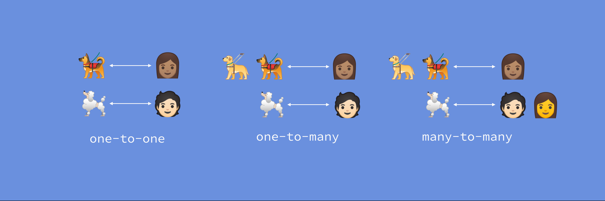

#  [ANDROID] BUỔI 12: Room database

***

>*Tài liệu tham khảo*:  []()

## I. So sánh giữa SQLite và MySQL

>*Tài liệu tham khảo*:  [So sánh SQLite , MySQL](https://blog.galaxycloud.vn/so-sanh-sqlite-mysql-postgresql.41592.anew)

### 1. Kiến trúc
- **SQLite**: Là một RDBMS (Hệ quản trị cơ sở dữ liệu quan hệ) dựa trên file, không cần server. Các quá trình đọc/ghi dữ liệu thực hiện trực tiếp trên file database.
- **MySQL**: Là một RDBMS server-client, yêu cầu một server riêng biệt để quản lý các kết nối từ client.

### 2 Kiểu dữ liệu

#### SQLite

**Kiểu dữ liệu:**

- **null**: Giá trị NULL.
- **integer**: Số nguyên, lưu trữ 1-8 byte.
- **real**: Số thực, lưu trữ dưới dạng dấu phẩy động 8 byte.
- **text**: Chuỗi văn bản mã hóa UTF-8/UTF-16.
- **blob**: Khối dữ liệu bất kỳ, lưu trữ như đầu vào.

#### MySQL

**Kiểu dữ liệu:**

- **Số**: tinyint, smallint, int, bigint, float, double, boolean.
- **Ngày giờ**: date, datetime, timestamp, time, year.
- **Chuỗi**: char, varchar, blob, text, enum, set.

### 3. Tính năng
- **SQLite**:
  - **Không có quản lý user**: Không hỗ trợ quản lý user hay quyền truy cập cụ thể. Bảo mật dựa trên quyền file của hệ điều hành.
  - **Tính di động**: Database được lưu trong một file duy nhất, dễ dàng chia sẻ và di chuyển.
  - **Giao dịch tuân theo ACID**: Đảm bảo tính nhất quán, độ tin cậy cao.
- **MySQL**:
  - **Quản lý user**: Hỗ trợ quản lý user với các quyền truy cập đa dạng và chi tiết.
  - **Replication và phân tán**: Hỗ trợ sao chép database, cho phép mở rộng và backup dễ dàng.
  - **Bảo mật mạnh mẽ**: Cài đặt bảo mật đa dạng, giúp bảo vệ dữ liệu khỏi các lỗi ứng dụng.

### 4. Hiệu suất
- **SQLite**:
  - **Nhỏ gọn**: Thư viện nhẹ, dễ tích hợp vào ứng dụng, không yêu cầu cấu hình phức tạp.
  - **Concurrency hạn chế**: Chỉ một chương trình có thể ghi dữ liệu tại một thời điểm, hạn chế khả năng ghi đồng thời.
- **MySQL**:
  - **Tốc độ cao**: Tối ưu cho các tác vụ đọc, tốc độ cao trong xử lý các truy vấn lớn.
  - **Hỗ trợ đồng thời tốt hơn**: Quản lý nhiều user đồng thời, phù hợp với các ứng dụng lớn.

### 5. Sử dụng
- **SQLite**:
  - **Ứng dụng nhỏ**: Phù hợp với các ứng dụng nhỏ, cần database nhẹ, không yêu cầu quản lý phức tạp.
  - **Embedded systems**: Thường dùng trong các ứng dụng nhúng, mobile apps, hoặc desktop apps.
- **MySQL**:
  - **Trang web, ứng dụng web**: Phù hợp cho các ứng dụng lớn, yêu cầu quản lý dữ liệu phức tạp và hiệu suất cao.
  - **Cơ sở dữ liệu lớn**: Dùng trong các hệ thống cần quản lý dữ liệu lớn, với các yêu cầu backup, replication.

### 6. Độ tin cậy và bảo mật
- **SQLite**:
  - **Bảo mật phụ thuộc vào file system**: Không có các tính năng bảo mật tích hợp, bảo mật dựa vào quyền file hệ điều hành.
  - **Dễ dàng bị tấn công nếu không bảo vệ tốt**: Nếu file database bị tấn công, toàn bộ dữ liệu có thể bị lộ.
- **MySQL**:
  - **Bảo mật mạnh mẽ**: Hỗ trợ SSL, quản lý user và quyền truy cập, mã hóa dữ liệu.
  - **Quản lý lỗi và backup tốt**: Hỗ trợ backup định kỳ, quản lý lỗi tốt, giúp bảo vệ dữ liệu trong trường hợp có sự cố.

### 7. Ưu điểm và nhược điểm

#### SQLite:

**Ưu điểm**:
- **Nhẹ và dễ dàng triển khai**: SQLite không yêu cầu cài đặt server, chỉ cần một file là có thể sử dụng.
- **Tính di động cao**: Database là một file duy nhất, dễ dàng chia sẻ và sao lưu.
- **Tương thích tốt**: Chạy trên hầu hết các nền tảng, từ desktop, mobile đến embedded systems.

**Nhược điểm**:

- **Concurrency hạn chế**: Khả năng xử lý đồng thời kém, không phù hợp với các ứng dụng cần nhiều kết nối ghi đồng thời.
- **Tính năng hạn chế**: Thiếu một số tính năng của các RDBMS server-client như MySQL.

#### MySQL:

**Ưu điểm**:
- **Quản lý người dùng và quyền truy cập mạnh mẽ**: Hỗ trợ quản lý user, quyền truy cập chi tiết.
- **Hiệu suất cao**: Tối ưu cho các ứng dụng lớn, với khả năng xử lý truy vấn nhanh chóng.
- **Hỗ trợ bảo mật và backup tốt**: Cung cấp các tính năng bảo mật, backup, replication đa dạng.

**Nhược điểm**:
- **Cài đặt phức tạp**: Yêu cầu cài đặt và cấu hình server, phức tạp hơn SQLite.
- **Khả năng di động kém**: Không dễ dàng chuyển database giữa các hệ thống như SQLite

## II. Room database

>*Tài liệu tham khảo*:  [Room Database](https://viblo.asia/p/thay-the-database-cua-ung-dung-bang-room-database-RQqKLvarl7z)

### 1. Room database là gì?

`Room Database` là một thư viện của Android Jetpack được xây dựng trên SQLite, cung cấp một lớp trừu tượng giúp đơn giản hóa việc làm việc với cơ sở dữ liệu trong Android.

 Thay vì phải viết trực tiếp các câu lệnh SQL như khi sử dụng SQLite, `Room` cho phép bạn thao tác cơ sở dữ liệu thông qua các phương thức trong Java/Kotlin, từ đó làm tăng tính dễ đọc và bảo trì của mã nguồn.

**Các thành phần chính của Room:**
-   Entity
-   DAO (Data Access Object)
-   Database

**Cấu tạo của Room Database**


**UI Controller (Activity/Fragment):**

-   Đây là lớp điều khiển giao diện người dùng (UI) như `Activity` hoặc `Fragment`.
-   `UI Controller` chịu trách nhiệm tương tác với người dùng và hiển thị dữ liệu.
-   Thông thường, `UI Controller` sẽ lấy dữ liệu từ `ViewModel` và hiển thị nó lên màn hình

**ViewModel:**

-   `ViewModel` chịu trách nhiệm lưu trữ và quản lý dữ liệu liên quan đến giao diện trong suốt vòng đời của `Activity` hoặc `Fragment`.
-   `ViewModel` cung cấp dữ liệu cho UI thông qua `LiveData`, đảm bảo rằng giao diện người dùng được cập nhật tự động khi dữ liệu thay đổi.

**LiveData:**

-   Là một lớp có thể quan sát được (observable), được sử dụng để giữ dữ liệu và thông báo cho UI mỗi khi dữ liệu thay đổi.

-   Khi dữ liệu trong LiveData thay đổi, UI Controller (Activity/Fragment) sẽ tự động cập nhật giao diện.

**Repository:**
-   `Repository` hoạt động như một lớp trung gian giữa ViewModel và các nguồn dữ liệu (ở đây là Room Database).
-   `Repository` quản lý việc lấy dữ liệu từ các nguồn khác nhau (Room, mạng, cache, v.v.) và cung cấp cho `ViewModel`.
-   Nó giúp tách biệt logic truy xuất dữ liệu khỏi các thành phần giao diện.

**RoomDatabase:**

-   Đây là lớp quản lý cơ sở dữ liệu SQLite. Nó cung cấp các `DAO` để truy xuất và thao tác dữ liệu.

-   `RoomDatabase` bao gồm các lớp `Entity` (đại diện cho bảng trong SQLite) và `DAO` (Data Access Object, nơi chứa các phương thức để truy vấn và thao tác dữ liệu).

**DAO (Data Access Object):**

-   **DAO** là một phần của `RoomDatabase`, chịu trách nhiệm cung cấp các phương thức truy vấn và thao tác dữ liệu cụ thể trong cơ sở dữ liệu.

-   Các truy vấn và thao tác này thường được định nghĩa dưới dạng các phương thức của một interface trong Kotlin.

**Entity:**

-   `Entity` đại diện cho một bảng trong cơ sở dữ liệu SQLite.
-   Mỗi `Entity` là một lớp dữ liệu trong Kotlin, với các trường tương ứng với các cột trong bảng SQLite.

**Quy trình hoạt động:**

-   **Lấy dữ liệu:** `UI Controller` sẽ yêu cầu `ViewModel` lấy dữ liệu. `ViewModel` sau đó sẽ gọi Repository để truy xuất dữ liệu từ `Room Database` thông qua `DAO`. Dữ liệu được trả về dưới dạng `LiveData`.

-   **Cập nhật giao diện:** Khi dữ liệu trong `LiveData` thay đổi, `UI Controller` sẽ tự động cập nhật giao diện để phản ánh thay đổi này.

-   **Thao tác với dữ liệu:** Khi người dùng thực hiện thao tác thay đổi dữ liệu (như thêm, sửa, xóa), `UI Controller` sẽ yêu cầu `ViewModel` cập nhật dữ liệu. `ViewModel` sẽ gửi yêu cầu này xuống `Repository`, và từ đó cập nhật dữ liệu trong `Room Database`.

### 2.  Cách tạo Room Database trong Android

#### 2.1: Thêm Dependency vào file build.gradle

```gradle
 // Room Dependencies
    implementation("androidx.room:room-runtime:$room_version")
    kapt("androidx.room:room-compiler:$room_version")
    implementation("androidx.room:room-ktx:$room_version")
    implementation("androidx.room:room-rxjava2:$room_version")
    implementation("androidx.room:room-rxjava3:$room_version")
    implementation("androidx.room:room-guava:$room_version")
    testImplementation("androidx.room:room-testing:$room_version")
    implementation("androidx.room:room-paging:$room_version")
```

#### 2.2: Tạo Entity (Bảng trong CSDL)

`Entity` đại diện cho một bảng trong cơ sở dữ liệu. Mỗi trường trong lớp này sẽ đại diện cho một cột trong bảng.

```kotlin
@Entity(tableName = "user_table")
data class User (
    @PrimaryKey(autoGenerate = true)
    var id: Int = 0,
    var name: String,
    val hotline: String
) : Parcelable
```

#### 3. Tạo DAO (Data Access Object):

`DAO` là nơi chứa các phương thức để truy xuất dữ liệu từ cơ sở dữ liệu.

```kotlin
@Dao
interface UserDao {
    @Insert(onConflict = OnConflictStrategy.IGNORE)
    suspend fun addUser(user: User)

    @Query("DELETE FROM user_table WHERE id = :id")
    suspend fun deleteUser(id:Int)

    @Query("SELECT * FROM user_table ORDER BY id ASC")
    fun readAllData(): LiveData<List<User>>
}
```

#### 4. Tạo Database:

Tạo lớp cơ sở dữ liệu kế thừa từ `RoomDatabase` và định nghĩa các `DAO` bên trong nó.

```kotlin
package com.proptit.roomdatabase.data

import android.content.Context
import androidx.room.Database
import androidx.room.Room
import androidx.room.RoomDatabase

@Database(entities = [User::class], version = 1, exportSchema = false)
abstract class UserDatabase : RoomDatabase() {
    abstract fun userDao(): UserDao

    companion object {
        @Volatile
        private var INSTANCE: UserDatabase? = null

        fun getDatabase(context: Context): UserDatabase {
            return INSTANCE ?: synchronized(this) {
                val instance = Room.databaseBuilder(
                    context.applicationContext,
                    UserDatabase::class.java,
                    "user_database"
                ).build()
                INSTANCE = instance
                instance
            }
        }
    }
}
```

#### 5. Khởi tạo Repository:

`Repository` hoạt động như một lớp trung gian giữa `ViewModel` và các nguồn dữ liệu (ở đây là `Room Database`).

```kotlin
package com.proptit.roomdatabase.data

import androidx.lifecycle.LiveData

class UserRepository(private val userDao: UserDao) {
    val readAllData: LiveData<List<User>> = userDao.readAllData()

    suspend fun addUser(user: User) {
        userDao.addUser(user)
    }
    suspend fun deleteUser(id: Int) {
        userDao.deleteUser(id)
    }
}
```

#### 6.ViewModel:

ViewModel chịu trách nhiệm lưu trữ và quản lý dữ liệu liên quan đến giao diện trong suốt vòng đời của Activity hoặc Fragment.

```kotlin
class UserViewModel(application: Application) : AndroidViewModel(application) {

    val readAllData: LiveData<List<User>>
    private val repository: UserRepository


    init {
        val userDao = UserDatabase.getDatabase(application).userDao()
        repository = UserRepository(userDao)
        readAllData = repository.readAllData
    }

    fun addUser(user: User) {
        viewModelScope.launch(Dispatchers.IO) {
            repository.addUser(user)
        }
    }
    fun deleteUser(id: Int) {
        viewModelScope.launch(Dispatchers.IO) {  // Sử dụng Dispatchers.IO cho tác vụ I/O
            repository.deleteUser(id)
        }
    }
}
```

## IV. Relationship trong Room và cách sử dụng?

>*Tài liệu tham khảo*:  [Relationship](https://viblo.asia/p/cac-moi-quan-he-co-so-du-lieu-cua-room-trong-android-1VgZvPLr5Aw)



*Một phần quan trọng của việc thiết kế cơ sở dữ liệu là chia dữ liệu thành các bảng có liên quan và kéo dữ liệu lại với nhau theo những cách có ý nghĩa.*

### 1. Quan hệ một-một


Một ví dụ dễ hiểu trong trường hợp này như sau : một người có thể sở hữu một con chó và một con chó chỉ có một người chủ. Đây là mối quan hệ một-một.

Để thể hiện mối quan hệ này trong cơ sở dữ liệu, chúng ta tạo 2 bảng : `Dog` và `Owner`, trong đó bảng `Dog` có tham chiếu tới `owner id`, bảng Owner có tham chiếu tới dog id.

Trong Room, chúng ta tạo 2 model như sau :

```
@Entity
data class Dog(
    @PrimaryKey val dogId: Long,
    val dogOwnerId: Long,
    val name: String,
    val cuteness: Int,
    val barkVolume: Int,
    val breed: String
)
@Entity
data class Owner(@PrimaryKey val ownerId: Long, val name: String)
```

Để hiển thị tất cả các con chó và chủ của chúng trên màn hình, chúng ta tạo một lớp DogAndOwner như sau :

```
data class DogAndOwner(
    val owner: Owner,
    val dog: Dog
)
```

Để truy vấn sử dụng SQLite, chúng ta cần làm 2 việc :

-   Chạy 2 truy vấn : một là lấy tất cả các người chủ, hai là - lấy tất cả các con chó dựa trên owner ids.

-   Xử lý object mapping.

```
SELECT * FROM Owner
SELECT * FROM Dog
    WHERE dogOwnerId IN (ownerId1, ownerId2, …)
```

Để truy vấn List<DogAndOwner> sử dụng Room, chúng ta ko cần thực hiện 2 việc trên, thay vào đó, chúng ta chỉ cần sử dụng annotation @Relation

*Trong ví dụ này, khi Dog có thông tin của owner, chúng ta thêm annotation @Relation vào biến Dog, chỉ định rằng cột **ownerId** tương ứng với **dogOwnerId**:

```
data class DogAndOwner(
    @Embedded val owner: Owner,
    @Relation(
         parentColumn = "ownerId",
         entityColumn = "dogOwnerId"
    )
    val dog: Dog
)
```

Lớp truy vấn DAO sẽ như sau :

```
@Transaction
@Query("SELECT * FROM Owner")
fun getDogsAndOwners(): List<DogAndOwner>
```

### 2. Quan hệ một-nhiều


Trở lại ví dụ đã được nhắc đến, lúc này chúng ta có mỗi quan hệ một-nhiều giữa Dog và Owner. Các model của cơ sở dữ liệu chúng ta định nghĩa trước đó không thay đổi.

Lúc này, để hiển thị danh sách các người chủ với những con chó, chúng ta cần tạo một lớp mới như sau :

```
data class OwnerWithDogs(
    val owner: Owner,
    val dogs: List<Dog>
)
```

Để tránh chạy 2 truy vấn riêng biệt, chúng ta có thể định nghĩa một mối quan hệ một-nhiều giữa Dog và Owner, bằng annotation @Relation của List<Dog> :

```
data class OwnerWithDogs(
     @Embedded val owner: Owner,
     @Relation(
          parentColumn = "ownerId",
          entityColumn = "dogOwnerId"
     )
     val dogs: List<Dog>
)
```

Lớp DAO sẽ như sau :

```
@Transaction
@Query("SELECT * FROM Owner")
fun getDogsAndOwners(): List<OwnerWithDogs>
```

### 3. Quan hệ nhiều-nhiều


em xét trường hợp một người chủ có thể sở hữu nhiều con chó, và một con chó có thể có nhiều người chủ. Để thể hiện mối quan hệ này, bảng Dog và bảng Owner chúng ta định nghĩa trước đó là ko đủ.

Một con chó có thể có nhiều người chủ, chúng ta cần có nhiều dog id, tương ứng với các owner id khác nhau. Vì dogId là khóa chính trong bảng Dog, chúng ta ko thể insert nhiều dogs với cùng một id.

Để giải quyết vấn đề này, chúng ta cần tạo một bảng kết hợp ( còn được gọi là bảng tham chiếu chéo) giữ các cặp (dogId, ownId):

```
@Entity(primaryKeys = ["dogId", "ownerId"])
data class DogOwnerCrossRef(
    val dogId: Long,
    val ownerId: Long
)
```

Nếu chúng ta muốn lấy tất cả các owners và dogs : List<OwnerWithDogs>, chỉ sử dụng SQLite truy vấn, chúng ta cần viết 2 truy vấn : một lấy tất cả các owners và một join vào 2 bảng Dog và DogOwnerCrossRef :

```
SELECT * FROM Owner
    
SELECT
     Dog.dogId AS dogId,
     Dog.dogOwnerId AS dogOwnerId,
     Dog.name AS name,
     _junction.ownerId
FROM
     DogOwnerCrossRef AS _junction
INNER JOIN Dog ON (_junction.dogId = Dog.dogId)
WHERE _junction.ownerId IN (ownerId1, ownerId2, …)
```

Để thực hiện việc này trong Room, chúng ta cần update lớp OwnerWithDogs và nói cho Room rằng để lấy dữ liệu Dog, nó cần sử dụng bảng liên kết DogOwnerCrossRef :

```
data class OwnerWithDogs(
    @Embedded val owner: Owner,
    @Relation(
         parentColumn = "ownerId",
         entityColumn = "dogId",
         associateBy = Junction(DogOwnerCrossRef::class)
    )
    val dogs: List<Dog>
)
```

Trong lớp DAO, chúng ta cần select từ Owners và trả về đúng class :

```
@Transaction
@Query("SELECT * FROM Owner")
fun getOwnersWithDogs(): List<OwnerWithDogs>
```
