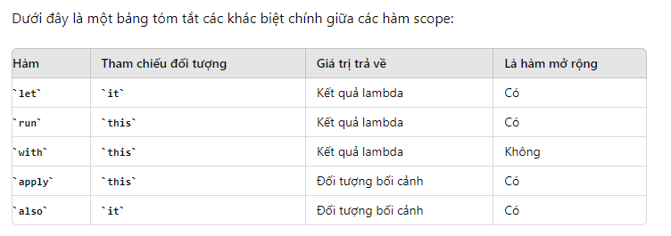

#  [KOTLIN] BUỔI 4: Generic, Extension function && Scope function 

***

- [I. Generic](#i-generic)
    - [1. Generic là gì?](#1-generic-là-gì)
    - [2. Quy ước trong Generic](#2-quy-ước-trong-generic)
    - [3. Dùng khi nào? Tại sao phải dùng generic?](#3-dùng-khi-nào-tại-sao-phải-dùng-generic)
    - [4. Từ khoá in và out](#4-từ-khoá-in-và-out)

## I. Generic

### 1. Generic là gì?

> “`Generic`” được hiểu là “tham số hoá kiểu dữ kiệu”. Việc tham số hoá kiểu dữ liệu giúp lập trình viên dễ dàng bắt lỗi các kiểu dữ liệu không hợp lệ.

>"`Generic`" là một tính năng mạnh mẽ cho phép chúng ta định nghĩa các lớp, phương thức và thuộc tính có thể truy cập bằng các kiểu dữ liệu khác nhau trong khi vẫn đảm bảo an toàn kiểu dữ liệu tại thời điểm biên dịch. 

**Với Collection**

```
ArrayList<T> list
```
*<T> ở đây chính là `generic`. Với việc khởi tạo như này, `T` có thể nhận các kiểu dữ liệu như `String`,`Int`,... mà các hoạt động của class không bị thay đổi* 

**Generic Class**

Một class generic là lớp có thể làm việc với bất kỳ kiểu dữ liệu nào, được chỉ định thông qua tham số kiểu. Điều này cho phép chúng ta tạo ra các lớp có thể tái sử dụng và linh hoạt hơn.


```
class Person<T>(t:T){
    var value =t
}
fun main() {
    val name=Person("Hieu")
    val age=Person("20")

    println(name.value)
    println(age.value)
}
```
```
Hieu
20
```
-   `Person` là một lớp generic với tham số kiểu `T`.
-   Khi tạo đối tượng `Person`, thì chỉ định kiểu dữ liệu cho 'T' (Int,String)

**Generic Function**

Một hàm generic là hàm có thể hoạt động với nhiều kiểu dữ liệu khác nhau, được xác định bởi tham số kiểu. Điều này giúp hàm có thể tái sử dụng với nhiều loại dữ liệu khác nhau mà không cần viết lại mã.

```
fun <T> printArray(array: Array<T>)
{
    for(element in array)
        print("$element ")
    println()
}
fun main() {
    val intArray= arrayOf(1,2,3)
    val stringArray= arrayOf("H","T","H")

    printArray(intArray)
    printArray(stringArray)
}
```

```
1 2 3 
H T H 
```
-   `printArray` là một hàm generic với tham số kiểu `T`.

### 2. Quy ước trong Generic

Tên tham số kiểu là các chữ cái viết hoa, đơn lẻ. Việc này nhằm giúp ta phân biệt giữa một biến kiểu và một lớp thông thường hay tên giao diện, giúp dễ review code hơn

- `T`: Type (Kiểu dữ liệu bất kỳ thuộc Wrapper class: String, Integer, Long, Float, …)
- `E`: Element (phần tử – được sử dụng phổ biến trong Collection Framework)
- `K`: Key (khóa)
- `V`: Value (giá trị)
- `N`: Number (kiểu số: Integer, Double, Float, …)

### 3. Dùng khi nào? Tại sao phải dùng generic?

Generics trong Kotlin thường được sử dụng trong các trường hợp sau:

-   **Tránh ép kiểu:** Không cần phải ép kiểu đối tượng.
-   **An toàn kiểu dữ liệu:**  Generics chỉ cho phép một kiểu đối tượng tại một thời điểm.
-   **An toàn tại thời điểm biên dịch:** Mã sử dụng generics được kiểm tra tại thời điểm biên dịch đối với kiểu tham số hóa để tránh lỗi tại thời điểm chạy.

### 4. Từ khoá in và out

(e chưa hiểu phần này lắm:(()))

Khi chúng ta muốn gán generic type cho bất kỳ super-type của nó, thì chúng ta cần sử dụng từ khóa `out`


Khi chúng ta muốn gán generic type cho bất kỳ sub-type của nó, thì chúng ta cần sử dụng từ khóa `in`.


>**Invariant:** Đây là trường hợp mặc định. Kiểu dữ liệu generic của lớp con không thể thay thế được kiểu dữ liệu generic của lớp cha. 

>**Covariant:** Được đánh dấu bằng từ khóa `out`. Trong trường hợp này, kiểu dữ liệu generic của lớp con có thể thay thế được kiểu dữ liệu generic của lớp cha. 

>**Contravariant:** Được đánh dấu bằng từ khóa `in`. Trong trường hợp này, kiểu dữ liệu generic của lớp con là một lớp cha của kiểu dữ liệu generic của lớp cha. 

**Từ khoá out (covariant):**

Được sử dụng khi bạn chỉ muốn lớp generic đó chỉ xuất dữ liệu (output), tức là chỉ đọc dữ liệu từ generic này mà không thể thay đổi nó.

```
open class Father(val name: String)
class Son(name: String) : Father(name)

class Person<out T>(val value: T) {
    fun get(): T {
        return value
    }
}

fun main() {
    val son = Person(Son("Hieu"))
    val father: Person<Father> = son
    println(father.get().name)
}
```
```
Hieu
```

-   Lớp `Father` là lớp cha, và `Son` là lớp con của `Father`.
-   Lớp `Person<out T>` được đánh dấu bằng từ khoá `out`, biểu thị rằng nó là covariant.
-   Khi bạn gọi phương thức `get()` trên biến `person`, nó trả về đối tượng `Son` (vì `Person<out T>` cho phép bạn truy xuất đến lớp con Son từ biến `Person<Father>`).


**Từ khoá in (contravariance):**

Bạn có thể gán một lớp generic cha cho một biến lớp generic con. Từ khoá `in` thường được sử dụng khi bạn muốn chỉ ra rằng lớp generic đó chỉ truy cập dữ liệu (input) mà không phải xuất dữ liệu (output).

```
open class Animal(val name: String)
class Cat(name: String) : Animal(name)

interface Consumer<in T> {
    fun consume(item: T)
}

fun main() {
    val animalConsumer = object : Consumer<Animal> {
        override fun consume(item: Animal) {
            println("Consuming ${item.name}")
        }
    }

    val cat: Cat = Cat("Kitty")
    val catConsumer: Consumer<Cat> = animalConsumer
    catConsumer.consume(cat) // In ra: Consuming Kitty
}
```
## II. Extension function

### 1. Generic là gì?

**Extension functions** trong Kotlin cho phép bạn thêm các hàm vào các lớp hiện có mà không cần phải thay đổi mã nguồn của chúng. Điều này rất hữu ích khi bạn muốn mở rộng chức năng của một lớp nào đó mà không thể hoặc không muốn kế thừa hoặc sửa đổi lớp đó.

### 2. Cách sử dụng Extension Functions

**Khai báo một Extension Function:**
-   `Extension functions` trong Kotlin cho phép bạn mở rộng chức năng của các lớp mà không cần kế thừa hoặc sửa đổi mã nguồn của chúng. Bạn có thể khai báo extension function bên ngoài lớp và sử dụng chúng như các phương thức bình thường của lớp đó. Chúng mang lại sự linh hoạt và tiện lợi khi làm việc với các lớp hiện có.

-   Ví dụ, chúng ta thêm một hàm removeFirstAndLastChar vào class String. Hàm này sẽ trả về chuỗi với ký tự đầu và ký tự cuối bị loại bỏ.
```
fun String.removeFirstAndLastChar(): String {
    // Kiểm tra độ dài của chuỗi
    if (this.length <= 1) {
        // Nếu chuỗi có 1 ký tự hoặc ít hơn, trả về chuỗi rỗng
        return ""
    }
    // Trả về chuỗi với ký tự đầu và ký tự cuối bị loại bỏ
    return this.substring(1, this.length - 1)
}

```

-  `String` là lớp mà chúng ta muốn mở rộng.
-  `removeFirstAndLastChar` là tên của extension function.
-  `this` đại diện cho instance(đối tượng cụ thể của 1 lớp) của `String` mà hàm này được gọi tới.
 
**Sử dụng Extension Function**

- Sau khi khai báo *extension function*, bạn có thể sử dụng nó như một hàm bình thường của lớp `String`.

```
fun String.removeFirstAndLastChar(): String {
    // Kiểm tra độ dài của chuỗi
    if (this.length <= 1) {
        // Nếu chuỗi có 1 ký tự hoặc ít hơn, trả về chuỗi rỗng
        return ""
    }
    // Trả về chuỗi với ký tự đầu và ký tự cuối bị loại bỏ
    return this.substring(1, this.length - 1)
}

fun main()
{
    val str1="hello"
    val str2="go go"

    // Sử dụng extension function
    println(str1.removeFirstAndLastChar()) //ello
    println(str2.removeFirstAndLastChar()) //o g
}
```
### 3. Tại sao phải dùng generic?

Sử dụng extension functions trong Kotlin mang lại nhiều lợi ích, giúp cải thiện hiệu suất, tính dễ đọc và khả năng bảo trì mã nguồn

- Mở rộng chức năng mà không thay đổi mã nguồn gốc
- Cải thiện khả năng đọc và sự gọn gàng của mã nguồn
- Dễ sửa và mở rộng
- Tăng tính tái sử dụng

### 4. Extensions are resolved statically (Extension được xử lý tĩnh)

Khi định nghĩa một extension function trong Kotlin, không thực sự chèn các phương thức mới vào lớp mà đang mở rộng. Thay vào đó, ta chỉ tạo ra các hàm mới có thể được gọi bằng cú pháp dot-notation (dấu chấm) trên các biến của loại đó.

Các extension functions được giải quyết một cách tĩnh (statically resolved). Điều này có nghĩa là hàm mở rộng nào sẽ được gọi được xác định tại thời điểm biên dịch, dựa trên kiểu của đối tượng receiver (đối tượng mà hàm được gọi trên đó).

```
open class Shape
class Rectangle : Shape()

fun Shape.getName() = "Shape"
fun Rectangle.getName() = "Rectangle"

fun printClassName(s: Shape) {
    println(s.getName())
}

fun main() {
    printClassName(Rectangle()) // Output: Shape
}
```
-   `Shape` có một extension function `getName` trả về "Shape".
-   `Rectangle` có một extension function `getName` trả về "Rectangle".

Khi gọi `printClassName(Rectangle())`, mặc dù đối tượng được truyền vào là `Rectangle`, hàm `Shape.getName` vẫn được gọi vì kiểu của tham số `s` là `Shape` tại thời điểm biên dịch.

**Khi lớp có phương thức thành viên và extension function cùng tên**

Nếu một lớp có một phương thức thành viên và cũng có một extension function cùng tên và cùng tham số, phương thức thành viên sẽ luôn được ưu tiên gọi trước.

```
class Example {
    fun printFunctionType() { println("Class method") }
}

fun Example.printFunctionType() { println("Extension function") }

fun main() {
    Example().printFunctionType() // Output: Class method
}
```

Trong ví dụ này, mặc dù có một extension function `printFunctionType`, phương thức thành viên `printFunctionType` của lớp `Example` vẫn được gọi.

Tuy nhiên, nếu extension function có cùng tên nhưng khác chữ ký (signature) với phương thức thành viên, cả hai vẫn có thể tồn tại đồng thời.

```
class Example {
    fun printFunctionType() { println("Class method") }
}

fun Example.printFunctionType(i: Int) { println("Extension function #$i") }

fun main() {
    Example().printFunctionType(1) // Output: Extension function #1
}
```

### 5. Nullable Receiver

Extension functions có thể được định nghĩa với kiểu của lớp là nullable. Trong trường hợp này, khi kiểm tra null được thêm vào bên trong extension function và trả về giá trị thích hợp.

*Ví dụ về Nullable Receiver*
```
// Một lớp mẫu để hiển thị tên
class AB(val name: String) {
    override fun toString(): String {
        return "Name is $name"
    }
}

fun main() {
    // Định nghĩa một extension function với receiver có thể null
    fun AB?.output() {
        if (this == null) {
            println("Null")
        } else {
            println(this.toString())
        }
    }

    val x = AB("Charchit")
    
    // Gọi extension function trên một instance
    x.output() // Output: Name is Charchit
    
    // Gọi extension function trên null
    null.output() // Output: Null
}
```

-   Lớp `AB` có thuộc tính `name` và override phương thức `toString`.
-   Extension function `output` được định nghĩa cho `AB?` (nullable).
-   Khi gọi `output` trên một instance của AB, nó sẽ in ra tên.
-   Khi gọi `output` trên `null`, nó sẽ in ra "Null".

## II. Scope function:

**Scope function** là các hàm trong thư viện chuẩn của Kotlin được thiết kế để thực thi một khối mã trong bối cảnh của một đối tượng. Khi bạn gọi một **Scope function** trên một đối tượng với một biểu thức lambda, nó tạo ra một phạm vi tạm thời. Trong phạm vi này, bạn có thể truy cập đối tượng mà không cần phải sử dụng tên của nó. Có năm **Scope function** chính: `let`, `run`, `with`, `apply`, và `also`.




### 1. let
**Let scope function** nhận object như đầu vào và trả về kết quả của khối lệnh được thực thi trong phạm vi của đối tượng. Object được ánh xạ vào khối lệnh bằng từ khoá it:
-   Tham chiếu đối tượng: `it`
-   Giá trị trả về: Kết quả của lambda
-   Sử dụng: Khi bạn cần thực hiện một số hành động trên đối tượng và sử dụng giá trị của lambda. Thường dùng với đối tượng không null.
```
fun main() {
    val str: String? = "Hello"
    str?.let {
        println("String length: ${it.length}") //String length: 5
    }
}

```
### 2. Run
**Run scope function** giống với Let, nhưng với 1 số điểm khác biệt là nó tham chiếu tới context object qua từ khoá `this` thay vì `it`.

-   Tham chiếu đối tượng: `this`
-   Giá trị trả về: Kết quả của lambda
-   Sử dụng: Khi bạn cần khởi tạo đối tượng và tính toán kết quả trả về.

```
fun main() {
    val str: String? = "Hello"
    str?.run {
        println("String length: ${this.length}") //String length: 5
    }
}
```

### 3. With

**With scope function** trong Kotlin cũng tương đồng với Let và Run, trừ 1 số điểm khác biệt ấy là with sẽ truyền object làm tham số vào trong nó thay vì được gọi đến sau object với dấu “.”. Object được tham chiếu tới bằng từ khoá it.

```
fun main() {
    val str = "Hello"
    val length = with(str) {
        length
    }
    println("String length: $length") //String length: 5
}
```

### 4. Apply
 scope function là một extension function dùng để tuỳ chỉnh hoặc khởi tạo một object. Nó nhận object làm input và thực thi khối lệnh, khối lệnh sau đó sẽ thay đổi giá trị của các thuộc tính object. Apply trả về bản thân đối tượng.

(sử dụng để cấu hình đối tượng, trả về chính đối tượng đó.)

```
fun main() {
    val person = Person("Alice").apply {
        age = 30
        city = "New York"
    }

    println(person) // Kết quả: Person(name=Alice, age=30, city=New York)
}

data class Person(val name: String) {
    var age: Int = 0
    var city: String = ""
}

```

### 5. Also

Also scope function cũng tương tự như Let, nhưng mà nó sẽ trả về kết quả là bản thân đối tượng. Từ khoá ở đây là it.

```
fun main() {
    val str = "Hoang Hieu"

    // Sử dụng also để in ra chuỗi gốc, không thay đổi chuỗi
    val uppercasedStr = str.also {
        println("Original string inside also: ${it}") // In ra chuỗi gốc
    }.uppercase() // Chuyển đổi chuỗi sang chữ hoa và gán cho uppercasedStr

    println(uppercasedStr) // In ra chuỗi đã chuyển đổi thành chữ hoa
}
```

```
Original string inside also: Hoang Hieu
HOANG HIEU
```

### 6. this và it

Trong Kotlin, `this` và `it` được sử dụng trong các scope function để tham chiếu đến đối tượng đang được gọi scope function đó. Sự khác biệt giữa chúng chủ yếu là cách chúng tham chiếu đến đối tượng và cách chúng được sử dụng trong các loại scope function khác nhau.

`this:` Tham chiếu đến đối tượng hiện tại trong ngữ cảnh của scope function. Được sử dụng trong các scope function như `run`, `apply`, và `with`.

`it:` Là tham chiếu ngầm định đến đối tượng hiện tại trong các scope function như `let` và `also` `it` là tham số của lambda, và bạn có thể đặt tên cho tham số này nếu muốn.


