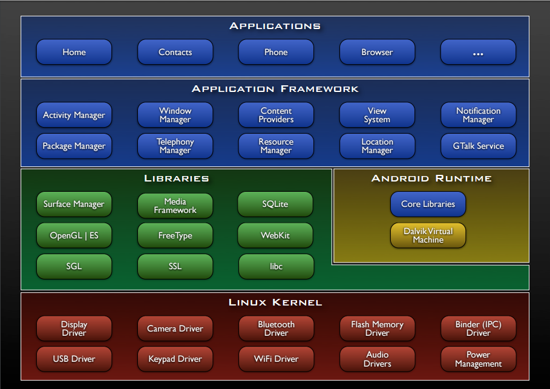
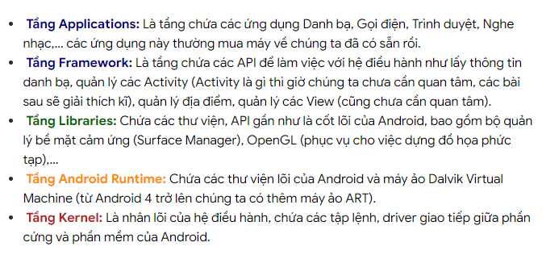
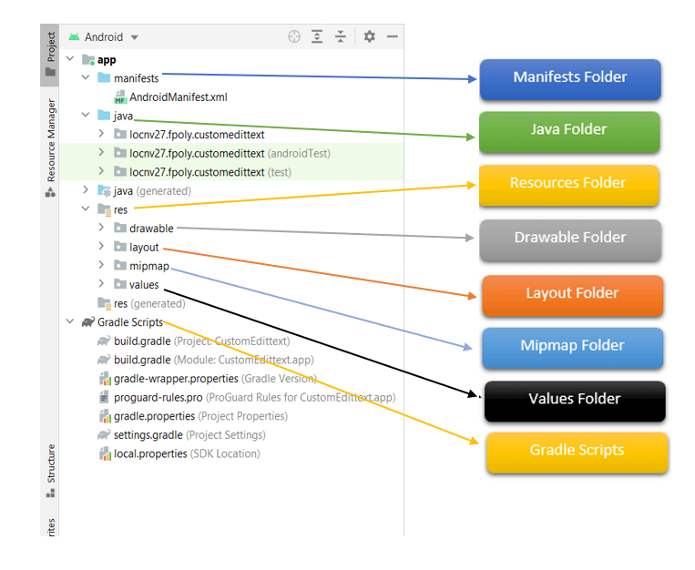
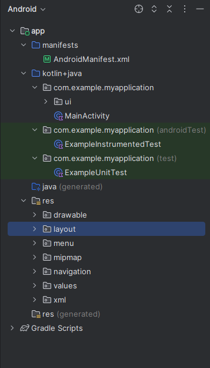

#  [ANDROID] BUỔI 5: Android Overview && Basic Layout

***
## I. Android Overview:

### 1. Giới thiệu về hệ điều hành android và IDE android studio

#### 1.1: Hệ điều hành android

**Android** là một hệ điều hành di động dựa trên nhân Linux, được phát triển bởi công ty Android Inc. và sau này được Google mua lại vào năm 2005. Android được thiết kế chủ yếu cho các thiết bị di động như điện thoại thông minh và máy tính bảng, nhưng sau này được mở rộng sang các thiết bị khác như TV (Android TV), đồng hồ thông minh (Wear OS), và xe hơi (Android Auto).


-    Về kiến trúc của hệ điều hành Android, chúng ta có thể xem qua sơ đồ sau:





Trong quá trình làm việc, chúng ta sẽ gần như chỉ làm việc với tầng xanh lam (Applications và Application Framework) và xanh lá (Libraries).

**Một số đặc điểm nổi bật của Android:**

-   **Mã nguồn mở:** Android là một dự án mã nguồn mở do Google quản lý, cho phép các nhà phát triển và nhà sản xuất thiết bị tự do tùy chỉnh và phân phối.

-   **Kho ứng dụng phong phú:** Google Play Store cung cấp hàng triệu ứng dụng và trò chơi, từ các ứng dụng cơ bản đến các trò chơi đồ họa cao cấp.

-   **Tích hợp sâu với dịch vụ của Google:** Android được tích hợp chặt chẽ với các dịch vụ của Google như Gmail, Google Maps, Google Drive, và nhiều dịch vụ khác.

-   **Đa nhiệm:** Android hỗ trợ đa nhiệm, cho phép người dùng chuyển đổi giữa các ứng dụng một cách mượt mà.

-   **Tùy biến giao diện:** Người dùng có thể tùy biến giao diện, từ hình nền đến các widget và launcher.

#### 1.2: Giới thiệu về IDE Android Studio

**Android Studio** là môi trường phát triển tích hợp (IDE) chính thức cho phát triển ứng dụng Android, được Google giới thiệu lần đầu tiên vào tháng 5 năm 2013 tại hội nghị Google I/O.

**Một số tính năng nổi bật của Android Studio:**
-   **Hỗ trợ phát triển ứng dụng nhanh:** Android Studio cung cấp các công cụ giúp giảm thời gian phát triển ứng dụng như Instant Run, cho phép thay đổi code và xem kết quả ngay lập tức mà không cần khởi động lại ứng dụng.

-   **Trình giả lập Android:** Cho phép kiểm tra và gỡ lỗi ứng dụng trên nhiều cấu hình thiết bị và phiên bản hệ điều hành Android khác nhau mà không cần thiết bị vật lý.

-   **Hỗ trợ nhiều ngôn ngữ lập trình:** Android Studio hỗ trợ nhiều ngôn ngữ lập trình, bao gồm Java, Kotlin (ngôn ngữ chính thức), và C++.

-   **Trình soạn thảo mã thông minh:** Cung cấp các tính năng như gợi ý mã, kiểm tra lỗi cú pháp, và tự động hoàn thành mã.

-   **Hệ thống build dựa trên Gradle:** Hệ thống build mạnh mẽ giúp quản lý các phụ thuộc và tạo ra các bản build khác nhau cho các mục đích khác nhau (debug, release).

-   **Layout Editor:** Cho phép kéo thả các thành phần giao diện để thiết kế giao diện người dùng một cách trực quan.

-   **Android Profiler:** Công cụ mạnh mẽ giúp theo dõi hiệu suất ứng dụng, bao gồm CPU, bộ nhớ, và hoạt động mạng.

### 2. Android folder project structure


Cấu trúc folder trong Android Project giúp tổ chức và quản lý tài nguyên và mã nguồn của ứng dụng một cách hiệu quả. Các thư mục được đặt tên theo tiêu chuẩn của Android Studio, giúp cho việc phát triển ứng dụng trở nên dễ dàng hơn và nhìn tổng thể dự án cũng rõ ràng hơn.

Khi tạo một ứng dụng bằng Android Studio thì bạn sẽ nhận được cấu trúc thư mục project sẽ giống như hình dưới đây.



Project của ứng dụng Android sẽ chứa nhiều loại app modules, source code files và resource files khác nhau

**Cấu trúc Thư mục Dự án Android**



-   Thư mục `manifest`

    -   **AndroidManifest.xml**: Đây là tệp khai báo chính của ứng dụng. Nó chứa thông tin về các hoạt động (activities), dịch vụ (services), nhà cung cấp nội dung (content providers), và các thành phần khác của ứng dụng. Nó cũng khai báo các quyền mà ứng dụng yêu cầu.

-   Thư mục `java/kotlin`

    -   **src/main/java:** Chứa mã nguồn Java hoặc Kotlin của ứng dụng. Thư mục này có thể bao gồm các thư mục con tổ chức theo cấu trúc gói (package) của bạn.
    -   **src/androidTest/java:** Chứa các tệp mã nguồn cho các bài kiểm tra (tests) Android Instrumented. Những bài kiểm tra này chạy trên thiết bị hoặc trình giả lập.
    -   **src/test/java:** Chứa các tệp mã nguồn cho các bài kiểm tra (tests) đơn vị (unit tests) chạy trên JVM.

-   Thư mục `res`

     -   **drawable:** Chứa các tệp hình ảnh (bitmap), vector, và các tài nguyên đồ họa khác.
    -   **layout:** Chứa các tệp XML định nghĩa giao diện người dùng (UI) cho các activities hoặc fragments.
    -   **mipmap:** Chứa các biểu tượng ứng dụng với nhiều kích thước khác nhau. Thư mục này thường được sử dụng cho các biểu tượng ứng dụng (app icons).
     -   **values:** Chứa các tệp XML khai báo các tài nguyên chung như chuỗi (strings), màu sắc (colors), kiểu dáng (styles), và kích thước (dimensions).

-   Thư mục Gradle `Scripts`

    -   **build.gradle (Project Level)**: Tệp này chứa cấu hình build chung cho toàn bộ dự án, bao gồm các kho lưu trữ (repositories) và các plugin build.
    -   **build.gradle (Module Level)**: Tệp này chứa cấu hình build cho từng module cụ thể, bao gồm các phụ thuộc (dependencies), cấu hình build types, và các cấu hình khác liên quan đến module đó.
    -   **settings.gradle**: Tệp này định nghĩa các module nào được bao gồm trong dự án.
    -   **gradle.properties**: Tệp này chứa các thuộc tính cấu hình cho Gradle.
     -   **local.properties**: Tệp này chứa các thuộc tính cụ thể cho máy tính của bạn, chẳng hạn như đường dẫn SDK Android.

**Chi tiết về các Thư mục và Tệp Chính**

-   **AndroidManifest.xml**
     -  Khai báo ứng dụng và các thành phần của nó (activities, services, receivers, providers).
     -  Khai báo các quyền ứng dụng cần.
     -  Xác định các theme, launcher activities, và metadata của ứng dụng.

-   **src/main/java**
     -  Chứa mã nguồn của ứng dụng, được tổ chức theo các gói (packages).
     -  Bao gồm các lớp (classes) chính như activities, fragments, view models, và các lớp khác.

-   **src/androidTest/java**
     -  Chứa các bài kiểm tra Android Instrumented, được sử dụng để kiểm tra các thành phần UI và hành vi ứng dụng trên thiết bị thật hoặc trình giả lập.

-   **src/test/java**
     -  Chứa các bài kiểm tra đơn vị, chạy trên JVM và kiểm tra logic của ứng dụng một cách độc lập.

-   **res/drawable**
     -  Chứa các hình ảnh và tài nguyên đồ họa sử dụng trong ứng dụng.

-   **res/layout**
     -  Chứa các tệp XML định nghĩa bố cục giao diện người dùng.

-   **res/mipmap**
     -  Chứa các biểu tượng ứng dụng với nhiều kích thước khác nhau.

-   **res/values**
     -  Chứa các tài nguyên XML như chuỗi, màu sắc, kích thước, và kiểu dáng.

-   **build.gradle (Project Level)**
     -  Tệp này chứa cấu hình build chung cho toàn bộ dự án, bao gồm các kho lưu trữ (repositories) và các plugin build.

-   **build.gradle (Module Level)**
     -  Tệp này chứa cấu hình build cho từng module cụ thể, bao gồm các phụ thuộc (dependencies), cấu hình build types, và các cấu hình khác liên quan đến module đó.

-   **settings.gradle**
     -  Tệp này định nghĩa các module nào được bao gồm trong dự án.

-   **gradle.properties**
     -  Tệp này chứa các thuộc tính cấu hình cho Gradle.

-   **local.properties**
     -  Tệp này chứa các thuộc tính cụ thể cho máy tính của bạn, chẳng hạn như đường dẫn SDK Android.
### 3. Giới thiệu về xml.

XML (Extensible Markup Language) là một ngôn ngữ đánh dấu được thiết kế để lưu trữ và truyền tải dữ liệu. XML có thể mở rộng và có cấu trúc rõ ràng, giúp việc trao đổi dữ liệu giữa các hệ thống trở nên dễ dàng và hiệu quả. Dưới đây là một giới thiệu chi tiết về XML:

**Đặc điểm chính của XML:**

-   `Có cấu trúc:` XML sử dụng các thẻ (tags) để xác định các phần tử dữ liệu. Mỗi thẻ có thể chứa dữ liệu và các thuộc tính.
-   `Có thể mở rộng:` Người dùng có thể tạo các thẻ tùy chỉnh để phù hợp với nhu cầu của mình.
-   `Định dạng văn bản:` XML là định dạng văn bản, giúp dễ dàng đọc và chỉnh sửa bởi con người và máy tính.
-   `Tính di động:` XML có thể được sử dụng trên nhiều nền tảng và ngôn ngữ lập trình khác nhau.

**Cấu trúc của một tài liệu XML:**

Một tài liệu XML điển hình bao gồm các phần tử được bao bọc trong các thẻ. Mỗi phần tử có thể chứa dữ liệu hoặc các phần tử con.

*Ví dụ về một tài liệu XML đơn giản:*

```
<?xml version="1.0" encoding="UTF-8"?>
<bookstore>
    <book>
        <title>XML Developer's Guide</title>
        <author>John Doe</author>
        <price>44.95</price>
    </book>
    <book>
        <title>Learning XML</title>
        <author>Jane Doe</author>
        <price>39.95</price>
    </book>
</bookstore>
```

**Thành phần chính của XML:**

-   **Khai báo XML (XML Declaration):** Đây là dòng đầu tiên của tài liệu XML, khai báo phiên bản XML và bộ mã hóa ký tự được sử dụng.

```
<?xml version="1.0" encoding="UTF-8"?>
```

-  **Phần tử gốc (Root Element):** Mỗi tài liệu XML phải có một phần tử gốc bao bọc toàn bộ nội dung.

```
<bookstore> ... </bookstore>
```

-  **Thẻ mở và thẻ đóng (Start and End Tags):** Mỗi phần tử trong XML được bao bọc bởi một thẻ mở và một thẻ đóng.

```
<title>XML Developer's Guide</title>
```

-   **Thuộc tính (Attributes):** Các thuộc tính cung cấp thông tin bổ sung cho các phần tử. Chúng được đặt bên trong thẻ mở.

```
<book category="web"> ... </book>
```

**Lợi ích của việc sử dụng XML:**

-   **Trao đổi dữ liệu:** XML là định dạng tiêu chuẩn để trao đổi dữ liệu giữa các hệ thống khác nhau.
-   **Tính linh hoạt:** Có thể sử dụng XML để biểu diễn bất kỳ loại dữ liệu nào.
-   **Tích hợp tốt:** XML được hỗ trợ rộng rãi bởi các ngôn ngữ lập trình và công cụ phần mềm.

**Ứng dụng của XML:**

-   **Web services:** XML thường được sử dụng trong các dịch vụ web để trao đổi dữ liệu giữa các ứng dụng.
-   **Cấu hình ứng dụng:** Nhiều ứng dụng sử dụng XML để lưu trữ các tệp cấu hình.
-   **Tài liệu và xuất bản:** XML được sử dụng để lưu trữ và quản lý nội dung tài liệu, chẳng hạn như sách điện tử và tài liệu học thuật.

### 4. Các tool cơ bản có trong android studio (debugger, log cat, layout inspector,...).

-   `Debugger`:

    -   `Chức năng:` Debugger cho phép bạn theo dõi và kiểm tra mã nguồn của ứng dụng khi nó đang chạy. Bạn có thể đặt các điểm dừng (breakpoints), kiểm tra giá trị của các biến, và từng bước thực hiện mã lệnh để xác định và sửa lỗi.
    -   `Sử dụng:` Bạn có thể bắt đầu phiên debug bằng cách nhấn vào nút debug trong thanh công cụ hoặc bằng cách sử dụng phím tắt (Shift+F9).

-   `Logcat`:

    -   `Chức năng:` Logcat là công cụ hiển thị các thông báo log từ thiết bị Android hoặc trình giả lập. Nó giúp bạn theo dõi các hoạt động của ứng dụng, kiểm tra các lỗi và cảnh báo, và ghi lại thông tin cần thiết cho việc debug.
    -   `Sử dụng:` Bạn có thể truy cập Logcat từ thanh công cụ dưới cùng hoặc bằng cách sử dụng phím tắt (Alt+6).

-   `Layout Inspector`:

    -   `Chức năng:` Layout Inspector cho phép bạn kiểm tra và phân tích cấu trúc giao diện người dùng (UI) của ứng dụng đang chạy. Bạn có thể xem cấu trúc cây của các thành phần UI, thuộc tính của từng thành phần, và các vấn đề về bố cục.
    -   `Sử dụng:` Bạn có thể mở Layout Inspector từ menu `View > Tool Windows > Layout Inspector`.

-   `Profiler`:

    -   `Chức năng:` Profiler là công cụ mạnh mẽ để phân tích hiệu suất của ứng dụng, bao gồm CPU, bộ nhớ, và hiệu suất mạng. Nó giúp bạn xác định các vấn đề về hiệu suất và tối ưu hóa ứng dụng.
    -   `Sử dụng:` Bạn có thể truy cập Profiler từ thanh công cụ dưới cùng hoặc bằng cách sử dụng phím tắt (Alt+Shift+F9).

-   `AVD Manager`:

    -   `Chức năng:` AVD Manager (Android Virtual Device Manager) cho phép bạn tạo và quản lý các trình giả lập Android. Bạn có thể tạo các thiết bị với cấu hình khác nhau để kiểm tra ứng dụng trên nhiều loại thiết bị và phiên bản Android khác nhau.
    -   `Sử dụng:` Bạn có thể mở AVD Manager từ thanh công cụ hoặc từ menu `Tools > AVD Manager`.

-   `Device File Explorer`:

    -   `Chức năng:` Device File Explorer cho phép bạn duyệt và tương tác với hệ thống tệp trên thiết bị Android hoặc trình giả lập. Bạn có thể truy cập các tệp và thư mục trên thiết bị, xem và chỉnh sửa tệp log, và quản lý các tệp dữ liệu của ứng dụng.
    -   `Sử dụng:` Bạn có thể mở Device File Explorer từ thanh công cụ dưới cùng hoặc từ menu `View > Tool Windows > Device File Explorer`.

-   `Resource Manager`:

    -   `Chức năng:` Resource Manager giúp bạn quản lý và tổ chức các tài nguyên của ứng dụng như hình ảnh, chuỗi văn bản, bố cục, và các tài nguyên khác. Nó cung cấp giao diện đồ họa để duyệt và chỉnh sửa các tài nguyên.
    -   `Sử dụng:` Bạn có thể mở Resource Manager từ thanh công cụ hoặc từ menu `View > Tool Windows > Resource Manager`.

-   `Lint`:

    -   `Chức năng:` Lint là công cụ phân tích mã nguồn để kiểm tra và báo cáo các vấn đề về code, bao gồm các lỗi tiềm ẩn, các vi phạm quy ước lập trình, và các vấn đề về hiệu suất.
    -   `Sử dụng:` Lint được chạy tự động khi bạn xây dựng dự án, và bạn có thể xem các báo cáo Lint từ cửa sổ `Build`.


### 5.Các view cơ bản trong android ( TextView, Button , ImageView ,...)

-   `TextView`:

    -   `Chức năng:` TextView là một view dùng để hiển thị văn bản đơn giản trên màn hình. Bạn có thể định dạng văn bản, thay đổi kích thước, màu sắc và kiểu dáng của văn bản.
    -   `Sử dụng:` TextView thường được sử dụng để hiển thị các tiêu đề, mô tả hoặc bất kỳ đoạn văn bản nào trong ứng dụng.
    ```xml
    <TextView
        android:id="@+id/textView"
        android:layout_width="wrap_content"
        android:layout_height="wrap_content"
        android:text="Hello, World!" />
    ```

-   `Button`:

    -   `Chức năng:` Button là một view tương tác mà người dùng có thể nhấn vào để thực hiện một hành động. Nó có thể hiển thị văn bản hoặc hình ảnh.
    -   `Sử dụng:` Button thường được sử dụng để thực hiện các hành động như gửi biểu mẫu, điều hướng đến một trang khác hoặc kích hoạt một sự kiện nào đó.
    ```xml
    <Button
        android:id="@+id/button"
        android:layout_width="wrap_content"
        android:layout_height="wrap_content"
        android:text="Click Me" />
    ```

-   `ImageView`:

    -   `Chức năng:` ImageView là một view dùng để hiển thị hình ảnh trên màn hình. Bạn có thể đặt nguồn hình ảnh từ tài nguyên drawable hoặc từ một URL.
    -   `Sử dụng:` ImageView thường được sử dụng để hiển thị biểu tượng, hình ảnh minh họa hoặc bất kỳ hình ảnh nào khác trong ứng dụng.
    ```xml
    <ImageView
        android:id="@+id/imageView"
        android:layout_width="wrap_content"
        android:layout_height="wrap_content"
        android:src="@drawable/ic_launcher_foreground" />
    ```

-   `EditText`:

    -   `Chức năng:` EditText là một view dùng để nhập văn bản từ người dùng. Nó có thể được cấu hình để nhập các loại dữ liệu khác nhau như văn bản, số, mật khẩu, email, v.v.
    -   `Sử dụng:` EditText thường được sử dụng trong các biểu mẫu để nhận đầu vào từ người dùng.
    ```xml
    <EditText
        android:id="@+id/editText"
        android:layout_width="wrap_content"
        android:layout_height="wrap_content"
        android:hint="Enter your text here" />
    ```

-   `CheckBox`:

    -   `Chức năng:` CheckBox là một view dùng để chọn hoặc bỏ chọn một tùy chọn. Nó thường đi kèm với một nhãn văn bản để mô tả tùy chọn đó.
    -   `Sử dụng:` CheckBox thường được sử dụng trong các biểu mẫu để nhận đầu vào tùy chọn từ người dùng.
    ```xml
    <CheckBox
        android:id="@+id/checkBox"
        android:layout_width="wrap_content"
        android:layout_height="wrap_content"
        android:text="I agree to the terms and conditions" />
    ```

-   `RadioButton` và `RadioGroup`:

    -   `Chức năng:` RadioButton là một view dùng để chọn một trong nhiều tùy chọn độc lập. RadioGroup là một container chứa nhiều RadioButton và đảm bảo rằng chỉ một RadioButton có thể được chọn tại một thời điểm.
    -   `Sử dụng:` RadioButton và RadioGroup thường được sử dụng khi cần lựa chọn một trong nhiều tùy chọn.
    ```xml
    <RadioGroup
        android:id="@+id/radioGroup"
        android:layout_width="wrap_content"
        android:layout_height="wrap_content">
        <RadioButton
            android:id="@+id/radioButton1"
            android:layout_width="wrap_content"
            android:layout_height="wrap_content"
            android:text="Option 1" />
        <RadioButton
            android:id="@+id/radioButton2"
            android:layout_width="wrap_content"
            android:layout_height="wrap_content"
            android:text="Option 2" />
    </RadioGroup>
    ```

-   `Switch`:

    -   `Chức năng:` Switch là một view dùng để chuyển đổi trạng thái bật/tắt. Nó hoạt động giống như một công tắc điện.
    -   `Sử dụng:` Switch thường được sử dụng trong các cài đặt hoặc tùy chọn của ứng dụng để bật hoặc tắt một chức năng nào đó.
    ```xml
    <Switch
        android:id="@+id/switch1"
        android:layout_width="wrap_content"
        android:layout_height="wrap_content"
        android:text="Enable feature" />
    ```

-   `ProgressBar`:

    -   `Chức năng:` ProgressBar là một view dùng để hiển thị trạng thái tiến độ của một tác vụ. Nó có thể hiển thị dạng thanh ngang hoặc vòng tròn.
    -   `Sử dụng:` ProgressBar thường được sử dụng để thông báo cho người dùng về tiến độ của một tác vụ dài hạn như tải dữ liệu hoặc xử lý.
    ```xml
    <ProgressBar
        android:id="@+id/progressBar"
        android:layout_width="wrap_content"
        android:layout_height="wrap_content" />
    ```

-   `ListView`:

    -   `Chức năng:` ListView là một view dùng để hiển thị một danh sách các mục. Mỗi mục trong danh sách có thể được tùy chỉnh bằng cách sử dụng một layout riêng biệt.
    -   `Sử dụng:` ListView thường được sử dụng để hiển thị danh sách dữ liệu động như danh bạ, danh sách sản phẩm, v.v.
    ```xml
    <ListView
        android:id="@+id/listView"
        android:layout_width="match_parent"
        android:layout_height="wrap_content" />
    ```

-   `RecyclerView`:

    -   `Chức năng:` RecyclerView là một view nâng cao dùng để hiển thị một danh sách hoặc lưới các mục với hiệu suất cao. Nó cho phép bạn tùy chỉnh cách hiển thị và quản lý bộ dữ liệu lớn.
    -   `Sử dụng:` RecyclerView thường được sử dụng thay thế cho ListView khi cần hiển thị danh sách lớn hoặc phức tạp.
    ```xml
    <androidx.recyclerview.widget.RecyclerView
        android:id="@+id/recyclerView"
        android:layout_width="match_parent"
        android:layout_height="wrap_content" />
    ```

-   `WebView`:

    -   `Chức năng:` WebView là một view dùng để hiển thị nội dung web trong ứng dụng. Bạn có thể tải và hiển thị các trang web hoặc nội dung HTML tĩnh.
    -   `Sử dụng:` WebView thường được sử dụng để hiển thị các trang web, tài liệu trực tuyến hoặc nội dung HTML tùy chỉnh trong ứng dụng.
    ```xml
    <WebView
        android:id="@+id/webView"
        android:layout_width="match_parent"
        android:layout_height="match_parent" />
    ```

Các view cơ bản này là nền tảng để xây dựng giao diện người dùng trong ứng dụng Android. Sử dụng hợp lý các view này sẽ giúp bạn tạo ra các ứng dụng có giao diện trực quan và thân thiện với người dùng.
