#  [ANDROID] BUỔI 6: Basic Layout

***

## I. FrameLayout

>`FrameLayout` là loại layout đơn giản mà các View con chứa bên trong xếp chồng nên nhau và định vị bằng thuộc tính layout_gravity

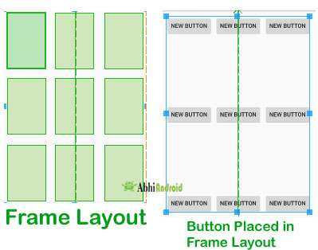

### 1. FrameLayout trong Android

**FrameLayout** là loại View cơ sở, nó là loại Layout đơn giản nhất. Mặc dù nó có thể chứa nhiều View con bên trong, nhưng mục đích chính thiết kế ra nó để chứa một View, từ đó nó trở thành cơ sở để tạo ra các View khác phức tạp hơn. Khi thiết kế Layout chứa nhiều View thì không nên sử dụng layout này, vì nó quá đơn giản việc bố cục các View con trong nó rất khó khăn (nó không có các tính năng điều khiển vị trí View con sao cho việc độc lập về màn hình được đảm bảo).

Nếu bạn vẫn sử dụng FrameLayout để thiết kế layout, thì cần **lưu ý:** Các View con đặt vào FrameLayout nằm chồng nên nhau theo thứ tự cái nào đưa vào sau thì hiện thị ở lớp trước, mỗi View con chỉ có thể điều chỉnh vị trí nó thông qua thuộc tính android:layout_gravity gán cho View con

### 2. Cú pháp

Để sử dụng **FrameLayout**, bạn cần định nghĩa nó trong tệp XML giao diện của mình như sau:

```xml
<?xml version="1.0" encoding="utf-8"?>
<FrameLayout xmlns:android="http://schemas.android.com/apk/res/android"
    android:layout_width="match_parent"
    android:layout_height="match_parent">

    <!-- Các view con được xếp chồng lên nhau ở đây -->


</FrameLayout>
```

### 3. Thuộc tính cơ bản

-   **android:layout_width:** Định nghĩa chiều rộng của FrameLayout. Giá trị có thể là wrap_content (ích thước vừa đủ để bao bọc nội dung), match_parent(mở rộng để khớp với kích thước của view cha chứa nó), hoặc một giá trị cụ thể (ví dụ: 200dp).

-   **android:layout_height:** Định nghĩa chiều cao của FrameLayout. Tương tự như layout_width.

- **android:src="path"**: Chèn ảnh

-   **android:scaleType**: xác định cách mà hình ảnh sẽ được thay đổi kích thước hoặc cắt xén để phù hợp với kích thước của ImageView

-   **android:foreground:** Định nghĩa một drawable sẽ được hiển thị trên tất cả các view con.

-   **android:foregroundGravity:** Định nghĩa cách sắp xếp drawable foreground.

-   **android:measureAllChildren:** Nếu được đặt thành true, tất cả các view con sẽ được đo lường, không chỉ các view visible.

```xml
<?xml version="1.0" encoding="utf-8"?>
<FrameLayout
    xmlns:android="http://schemas.android.com/apk/res/android"
    android:layout_width="match_parent"
    android:layout_height="match_parent">

    <!-- View nền -->
    <ImageView
        android:layout_width="match_parent"
        android:layout_height="match_parent"
        android:src="@drawable/ic_launcher_background"
        android:scaleType="fitXY"/>

    <!-- View tiêu đề -->
    <TextView
        android:layout_width="wrap_content"
        android:layout_height="wrap_content"
        android:text="Hello, FrameLayout!"
        android:textSize="30sp"
        android:textColor="#FFFFFF"
        android:layout_gravity="center"/>

    <!-- View nút bấm ở góc dưới cùng bên phải -->
    <Button
        android:layout_width="wrap_content"
        android:layout_height="wrap_content"
        android:text="Click me"
        android:layout_gravity="bottom|center"
        android:layout_margin="16dp"

</FrameLayout>

```

Trong ví dụ này, chúng ta có một FrameLayout chứa ba view con: một ImageView làm nền, một TextView hiển thị tiêu đề ở giữa màn hình, và một Button ở góc dưới cùng bên phải. Các view này sẽ được xếp chồng lên nhau theo thứ tự mà chúng được định nghĩa.

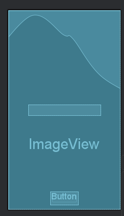


### 4. Thuộc tính android:layout_gravity trong các View con

Khi các View nằm trong **FrameLayout** thì khi gán thuộc tính **android:layout_gravity** gán các giá trị ở bảng sau vị trí của nó thay đổi tương ứng:

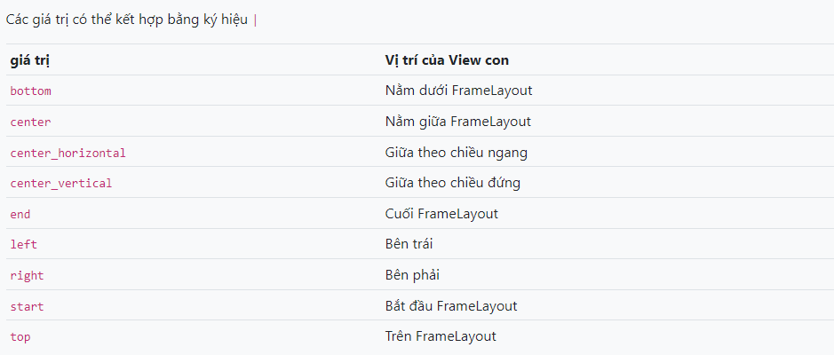

## II. RelativeLayout

>*Tài liệu tham khảo*:  [RelativeLayout](https://xuanthulab.net/su-dung-relativelayout-trong-android.html)


`RelativeLayout` là layout mà các View con được xác định vị trí bởi các mối liên hệ với View cha hoặc với View con như View con nằm dưới một View con khác, View con căn thẳng lề phải với View cha ...


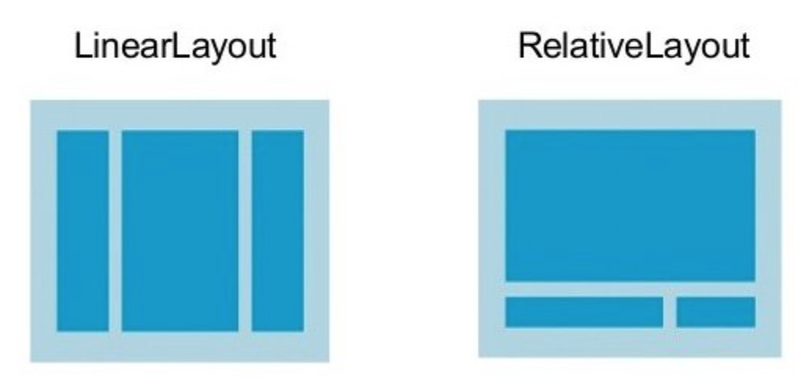

### 1. RelativeLayout

**RelativeLayout** là layout mà nó hiện thị các view con nó chứa ở các vị trí trong mối liên hệ của chúng với nhau (như View con này nằm dưới một View con khác, View con này nằm bên trái một View con khác ...), kể cả mối liên hệ của chúng với chính phần tử cha RelativeLayout (như căn thẳng theo cạnh đấy của phần tử cha, nằm giữa phần tử cha, nằm bên trái phần tử cha ...).

**RelativeLayout** là một layout hết sức mạnh mẽ về độ tiện lợi và hiệu quả, nếu giao diện không ở mức quá phức tạp việc chọn RelativeLayout mạng lại hiệu suất còn tốt hơn ConstraintLayout. RelativeLayout dùng khi đơn giản, ConstraintLayout khi giao diện phức tạp.

### 2. Định vị mặc định

Khi các View con đưa vào **RelativeLayout**  nếu chưa có thiết lập mối liên hệ qua lại nào với phần tử cha hay với phần tử View con khác thì nó sẽ được định vị ở góc trên - trái của **RelativeLayout**. Như trường hợp dưới đây cả 3 View con không có thiết lập mối liên hệ nào, nên nó đều định vị ở góc trên / trái và vẽ chồng nên nhau, View con nào xếp sẽ ở lớp trên của màn hình.

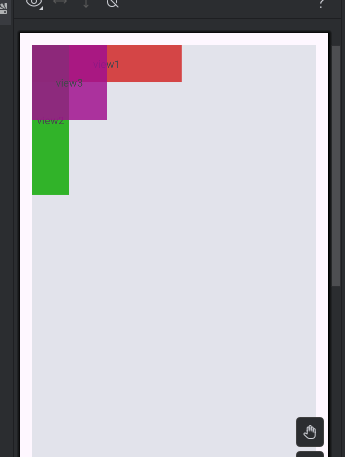

```xml
<?xml version="1.0" encoding="utf-8"?>
<RelativeLayout xmlns:android="http://schemas.android.com/apk/res/android"
    android:layout_width="match_parent"
    android:layout_height="match_parent"
    android:layout_margin="16dp"
    android:background="#e2e3eb"
    android:gravity="center|right">

    <TextView
        android:text="view1"
        android:gravity="center"
        android:layout_width="200dp"
        android:layout_height="50dp"
        android:background="#e8d33636" />

    <TextView
        android:text="view2"
        android:gravity="center"
        android:layout_width="50dp"
        android:layout_height="200dp"
        android:background="#e71faf15" />
    <TextView
        android:text="view3"
        android:gravity="center"
        android:layout_width="100dp"
        android:layout_height="100dp"
        android:background="#d4a00f8f" />

</RelativeLayout>
```

### 3.android:gravity và android:ignoreGravity của RelativeLayout

Các View con khi đã định vị xong trong RelativeLayout, giả sử coi như tất cả các View con nằm vừa trong một đường biên chữ nhật, thì cả khối các View con này có thể dịch chuyển tới những vị trí nhất định trong RelativeLayout bằng thuộc tính: **android:gravity,** nó nhận các giá trị (có thể tổ hợp lại với ký hiệu | giống với LinearLayout)

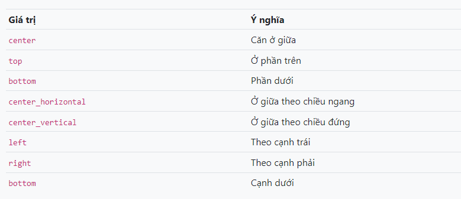

RelativeLayout có hỗ trợ chỉ ra một View con tách khỏi khối biên chữ nhật chứa các View con để phần tử đó không bị ảnh hưởng bởi **gravity** bằn thuộc tính **android:ignoreGravity="id-view-con**"

### 4. Định vị View con bằng liên hệ với View cha RelativeLayout

Vị trí của View con trong RelativeLayout có thể thiết lập bằng cách chỉ ra mối liên hệ vị trí với view cha như căn thẳng cạnh trái View cha với View con, căn thẳng cạnh phải View cha với View con ... Các thuộc tính thực hiện chức năng này như sau

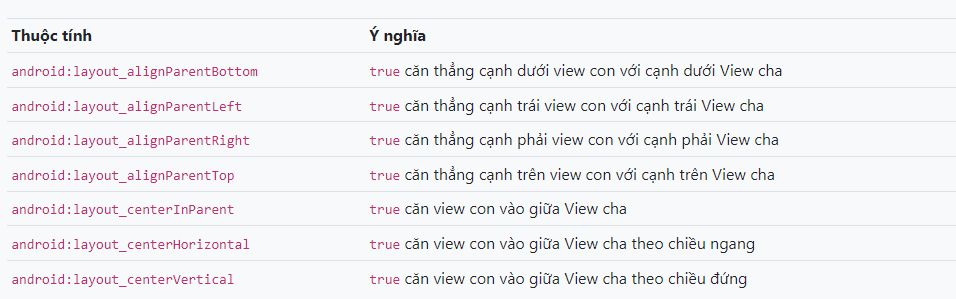

### 5. Định vị View con bằng liên hệ giữa chúng với nhau

View con trong RelativeLayout ngoài mối liên hệ với View cha như trên, chúng có có thể thiết lập liên hệ với nhau ví dụ như View con này nằm phía trên một View con khác, nằm phía dưới một view con khác ...

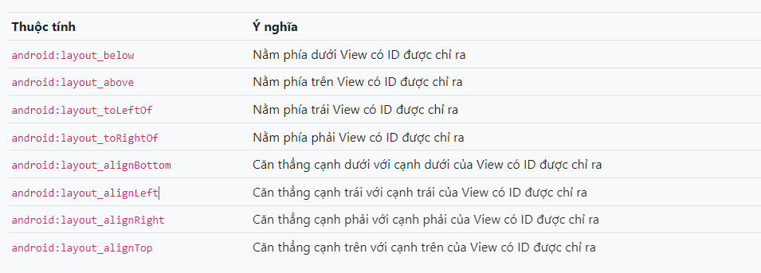

### 6. Các android:layout_margin ... của View con

Về phía các cạnh của View con (left, top, right, bottom) nếu có mối liên hệ với View cha hoặc View con thì theo phía đó có thể thiết lập thêm thuộc tính về margin như: android:layout_marginLeft, android:layout_marginTop, android:layout_marginRight, android:layout_marginBottom để thiết lập khoảng cách của mối liên hệ đó.

### 7. LinearLayout 

>*Tài liệu tham khảo*:  [LinearLayout ](https://xuanthulab.net/su-dung-relativelayout-trong-android.html)

## III. ConstraintLayout

>*Tài liệu tham khảo*:  [ConstraintLayout ](https://xuanthulab.net/su-dung-constraintlayout-trong-android.html)

Dùng ConstraintLayout để xây dựng các layout trong lập trình Android, với tính năng ràng buộc các phần tử, thiết lập các xích đa dạng

### 1. ConstraintLayout trong Android

**ConstraintLayout** là một layout mạnh, khuyến khích bạn dùng nếu có thể vì nó giúp tạo ra các giao diện phức tạp, mềm dẻo (hạn chế tối đa sử dụng các layout lồng nhau). Nó giúp định vị, sắp xếp các View con dựa trên sự ràng buộc liên hệ của các View con với View cha và sự liên hệ ràng buộc giữa các View con với nhau, với cơ chế tạo xích các View, gán trọng số hay sử dụng trợ giúp giao diện với Guideline.

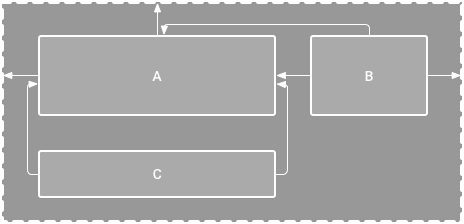

```xml
<?xml version="1.0" encoding="utf-8"?>
<androidx.constraintlayout.widget.ConstraintLayout xmlns:android="http://schemas.android.com/apk/res/android"
    xmlns:app="http://schemas.android.com/apk/res-auto"
    xmlns:tools="http://schemas.android.com/tools"
    android:id="@+id/main"
    android:layout_width="match_parent"
    android:layout_height="match_parent"
    android:layout_margin="10dp"
    android:background="#ddaaaa"
    tools:context=".MainActivity">

    <androidx.constraintlayout.widget.Guideline
        android:id="@+id/g1"
        android:layout_width="wrap_content"
        android:layout_height="wrap_content"
        android:orientation="horizontal"
        app:layout_constraintGuide_percent="0.5" />

    <Button
        android:id="@+id/b1"
        android:layout_width="wrap_content"
        android:layout_height="wrap_content"
        android:layout_marginLeft="10dp"
        android:layout_marginBottom="100dp"
        android:text="click me"
        app:layout_constraintBottom_toBottomOf="parent"
        app:layout_constraintLeft_toLeftOf="parent"
        app:layout_constraintRight_toRightOf="parent"
        app:layout_constraintTop_toTopOf="g1" />

    <Button
        android:id="@+id/b2"
        android:layout_width="wrap_content"
        android:layout_height="wrap_content"
        android:layout_marginTop="20dp"
        android:text="CLick you"
        app:layout_constraintLeft_toLeftOf="parent"
        app:layout_constraintRight_toRightOf="parent"
        app:layout_constraintTop_toBottomOf="@+id/b1"

        />


</androidx.constraintlayout.widget.ConstraintLayout>

```

### 2. Sự ràng buộc

> Mỗi view trong **ConstraintLayout** để định vị được chính xác cần tối thiếu 2 ràng buộc, một theo phương ngang (X) và một theo phương đứng (Y)

Khái niệm ràng buộc giữa các phần tử ở đây ám chỉ sự liên kết với nhau của các phần tử với nhau (kể cả với phần tử cha ConstraintLayout), sự căn chỉnh phần tử theo phần tử khác, hoặc với những đường thẳng ẩn thêm vào. Mỗi ràng buộc của phần tử View sẽ hoặc hưởng đến vị trí của nó theo trục X hoặc trục Y. Các View không có ràng buộc sẽ định vị ở góc trái - trên (tọa độ 0,0).

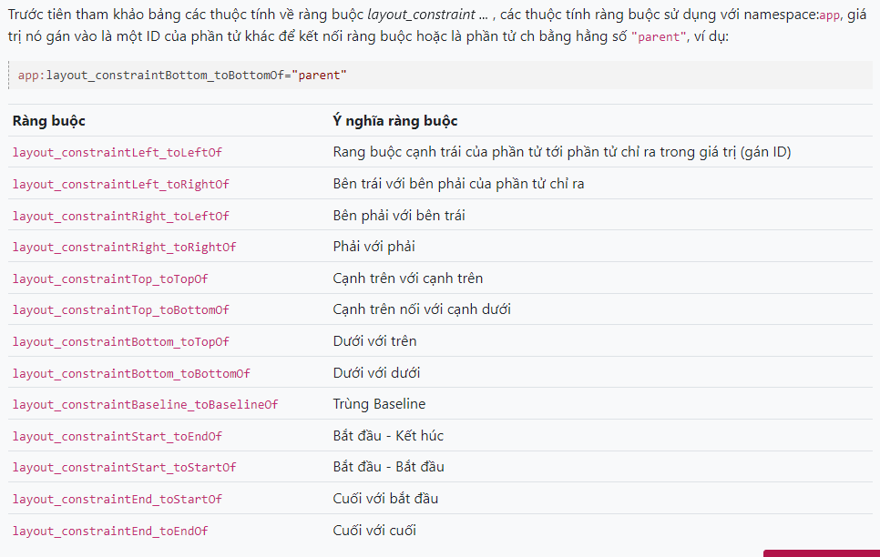

### 3.Thuộc tính Margin trong các phần tử con

Cạnh nào của View con có ràng buộc thì có thể thiết lập thêm thuộc tính Margin để điều chỉnh thêm khoảng cách các cạnh tới điểm nối ràng buộc.

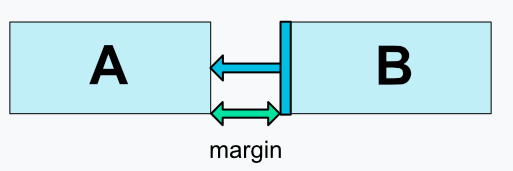

Các thuộc tính margin theo các cạnh: 


-   android:layout_marginStart
-   android:layout_marginEnd
-   android:layout_marginLeft
-   android:layout_marginTop
-   android:layout_marginRight
-   android:layout_marginBottom

Tương tự có 

-   layout_goneMarginStart
-   layout_goneMarginEnd
-   layout_goneMarginLeft
-   layout_goneMarginTop
-   layout_goneMarginRight
-   layout_goneMarginBottom

có hiệu lực khi đối tượng ràng buộc đến gone


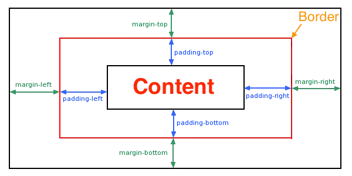

### 4. Phần tử Guideline

Ta có thể một đường kẻ ẩn trong ConstraintLayout nằm ngang hoặc đứng nó như là một View con để các View khác ràng buộc đến nếu muốn. Thêm vào bằng cách:

Thiết lập đó là được kẻ ngang bằng thuộc tính: `android:orientation="horizontal"` đường kể đứng `android:orientation="vertical"`

**Vị trí phân chia ContraintLayout của GuideLine**

-   Vị trị của Guideline có thể thiết lập nó cách cạnh trái (hoặc trên nếu là Guideline ngang) bằng thuộc tính `app:layout_constraintGuide_percent` giá trị là tỷ lệ phần trăm như 0.5 (50%), 0.2 (20%) độ rộng (cao) của ConstraintLayout. Ví dụ: `app:layout_constraintGuide_percent="0.1"`

2 Nếu không muốn sử dụng layout_constraintGuide_percent thì có thể sử dụng cách thiết lập Guideline cách cạnh bắt đầu (trên với Guidleline ngang) bao nhiêu bằng thuộc tính: app:layout_constraintGuide_begin ví dụ:

```
app:layout_constraintGuide_begin="100dp"
```
Hoặc thiết lập cách cạnh cuối bao nhiêu với layout_constraintGuide_end

### 5. Bias

Khi hai cạnh đối diện nhau của View có ràng buộc, thì hai dàng buộc này ứng xử như một liên kết lò xo mặc định nó có độ mềm (độ cứng) bằng nhau dẫn đến View sẽ nằm giữa 2 điểm neo của ràng buộc. Nếu muốn điều chỉnh độ cứng này thì sử dụng thuộc tính:

-   app:layout_constraintVertical_bias thiết lập độ mềm của ràng buộc đầu (ngang). Với tổng độ mềm là 1 thì khi app:layout_constraintVertical_bias="0.1" thì độ mềm ràng buộc thứ hai sẽ là 0.9
-   layout_constraintHorizontal_bias để thiết lập độ mềm hai ràng buộc theo phương đứng

## 6.Tỷ lệ các cạnh của View

Khi View con có thiết lập tối thiểu một kích thước là "0dp" thì kích thước đó có thể tự động điều chỉnh bằng cách lấy theo tỷ lệ với cạnh còn lại, thuộc tính app:layout_constraintDimensionRatio cho phép gán tỷ lệ giữa chiều rộng và chiều cao, ví dụ: app:layout_constraintDimensionRatio="2:1" chiều rộng gấp đôi chiều cao

```xml
<?xml version="1.0" encoding="utf-8"?>
<androidx.constraintlayout.widget.ConstraintLayout xmlns:android="http://schemas.android.com/apk/res/android"
    xmlns:app="http://schemas.android.com/apk/res-auto"
    xmlns:tools="http://schemas.android.com/tools"
    android:id="@+id/main"
    android:layout_width="match_parent"
    android:layout_height="match_parent"
    android:layout_margin="10dp"
    android:background="#ddaaaa"
    tools:context=".MainActivity">


    <Button
        android:id="@+id/b1"
        android:layout_width="wrap_content"
        android:layout_height="wrap_content"
        android:text="B1 - HEAD"
        app:layout_constraintBottom_toTopOf="@id/b5"
        app:layout_constraintHorizontal_chainStyle="spread"
        app:layout_constraintRight_toLeftOf="@id/b2"
        app:layout_constraintStart_toStartOf="parent"
        app:layout_constraintTop_toBottomOf="@id/b4" />

    <Button
        android:id="@+id/b2"
        android:text="B2"
        android:layout_width="wrap_content"
        android:layout_height="wrap_content"
        android:layout_marginBottom="8dp"
        android:layout_marginTop="8dp"
        app:layout_constraintBottom_toBottomOf="parent"
        app:layout_constraintLeft_toRightOf="@id/b1"
        app:layout_constraintRight_toLeftOf="@id/b3"
        app:layout_constraintTop_toTopOf="parent" />

    <Button
        android:id="@+id/b3"
        android:text="B3"
        android:layout_width="wrap_content"
        android:layout_height="wrap_content"
        android:layout_marginBottom="8dp"
        android:layout_marginTop="8dp"
        app:layout_constraintBottom_toBottomOf="parent"
        app:layout_constraintEnd_toEndOf="parent"
        app:layout_constraintLeft_toRightOf="@id/b2"
        app:layout_constraintTop_toTopOf="parent" />

    <Button
        android:id="@+id/b4"
        android:layout_width="wrap_content"
        android:layout_height="wrap_content"
        android:text="B4 - HEAD"
        app:layout_constraintBottom_toTopOf="@id/b1"
        app:layout_constraintLeft_toLeftOf="@id/b1"
        app:layout_constraintTop_toTopOf="parent" />

    <Button
        android:id="@+id/b5"
        android:text="B5"
        app:layout_constraintTop_toBottomOf="@id/b1"
        app:layout_constraintBottom_toBottomOf="parent"
        app:layout_constraintLeft_toLeftOf="@id/b1"
        android:layout_width="wrap_content"
        android:layout_height="wrap_content" />


</androidx.constraintlayout.widget.ConstraintLayout>
```