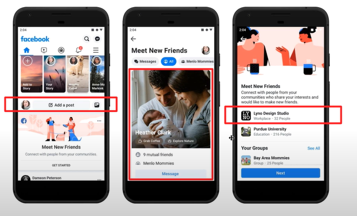
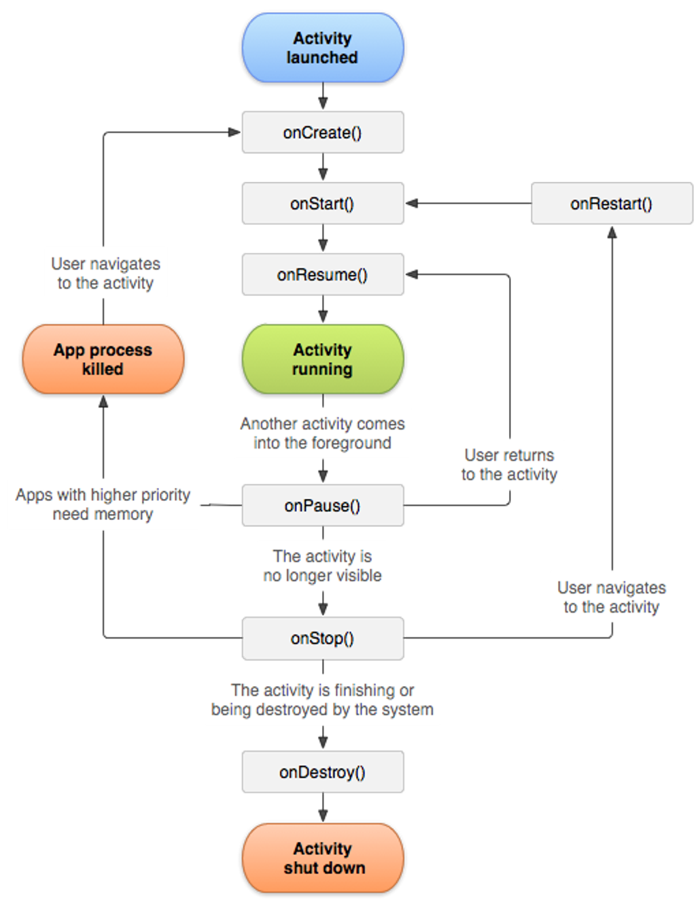
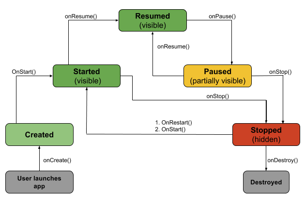
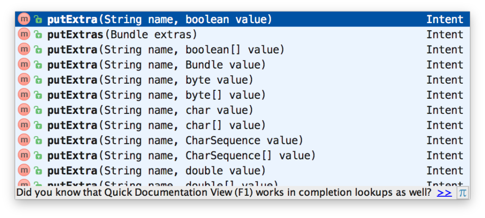
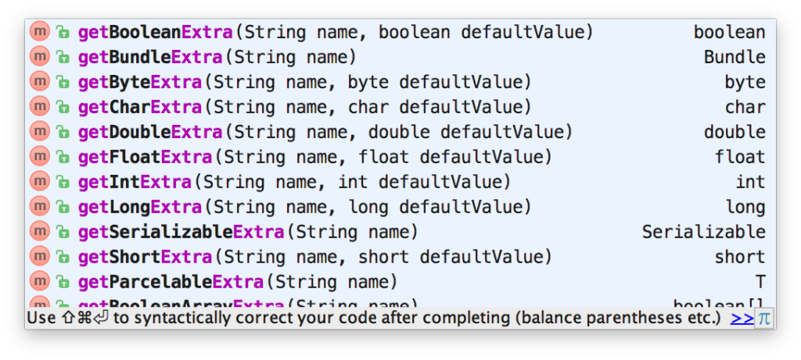
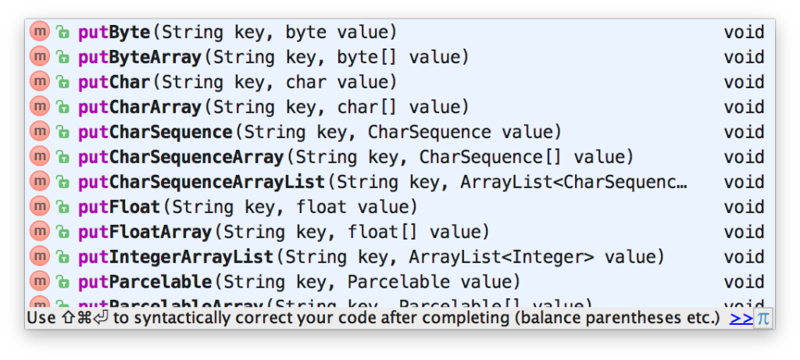
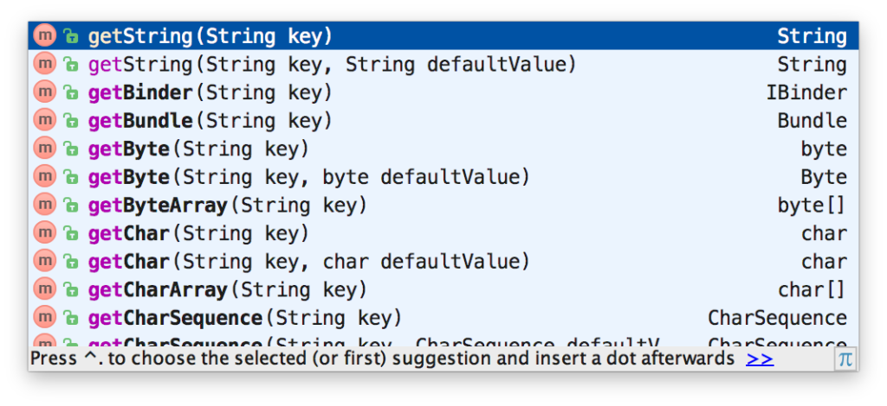
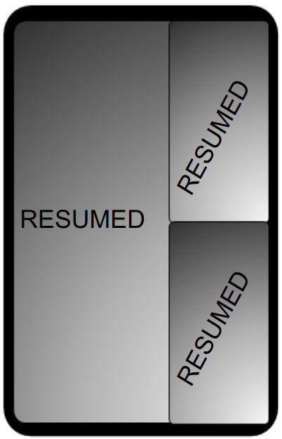

#  [ANDROID] BUỔI 8: Activit,Context,Intent

***

## I. Foreground, background application trong android

Trong Android, khái niệm foreground và background application liên quan đến trạng thái hoạt động của ứng dụng.

### 1. Khái niệm

**Foreground Application:** Ứng dụng đang hoạt động và tương tác trực tiếp với người dùng. Điều này có nghĩa là ứng dụng đang ở màn hình trước và người dùng có thể thấy và tương tác với nó.


**Background Application:*** Ứng dụng không hiển thị giao diện người dùng hoặc không tương tác trực tiếp với người dùng. Điều này có nghĩa là ứng dụng đang chạy các tác vụ nền mà người dùng không thấy, như đồng bộ dữ liệu hoặc nhận thông báo.

### 2. Cách xác định trạng thái foreground và background trong Android

**Sử dụng Lifecycle của Activity:**

Trong Activity, các phương thức `onStart()` và `onStop()` được gọi khi Activity vào và ra khỏi trạng thái foreground.


**Sử dụng ProcessLifecycleOwner**

`ProcessLifecycleOwner` giúp theo dõi trạng thái của toàn bộ ứng dụng.

***Thêm dependency vào `build.gradle` của module:***

```
dependencies {
    implementation "androidx.lifecycle:lifecycle-extensions:2.2.0"
}
```

## II. Activity

Activity đại diện cho một chức năng của app, là một giao diện màn hình, nơi user tương tác trực tiếp với app. Một ứng dụng có thể có một hoặc nhiều Activity. Một Activity từ khi được gọi đến khi kết thúc sẽ có những trạng thái (state) khác nhau.

-   Hầu hết các ứng dụng đều sử dụng nhiều màn hình khác nhau, có nghĩa nó sẽ phải có nhiều Activity khác nhau. Khi một Activity chỉ định là Activity chính, nó sẽ là màn hình đầu tiên khi chạy ứng dụng. 

-   Một Activity này có thể gọi và kích hoạt một Activity khác.



## III. Context

### 1. Context là gì ?

`Context` trong Android đại diện cho thông tin về môi trường của ứng dụng và hệ thống nơi ứng dụng đang chạy. Nó cung cấp các phương thức và tài nguyên cần thiết để các thành phần ứng dụng tương tác với hệ thống Android cũng như với các thành phần khác của ứng dụng.

*Ví dụ: Nếu bạn phải tạo một đối tượng có vòng đời được gắn với một activity, bạn có thể sử dụng activity context.*

### 2. Application Context

-   Là bối cảnh của toàn bộ ứng dụng.
-   Có thể truy cập thông qua phương thức getApplicationContext().
-   Được sử dụng khi cần một ngữ cảnh tồn tại lâu hơn bất kỳ Activity nào, hoặc khi cần một ngữ cảnh vượt ra ngoài phạm vi của một Activity.

** Các loại Context**

- 2 loại context thường gặp:

- **`Application Context`**
    - Nó là một thể hiện, là singleton và có thể được truy cập trong activity thông qua `getApplicationContext()`. Application Context đại diện cho môi trường của toàn bộ ứng dụng, tồn tại duy nhất trong suốt vòng đời của toàn bộ ứng dụng.
    - Có thể được sử dụng khi cần một context có vòng đời của nó tách biệt với context hiện tại hoặc khi đang chuyển 1 context vượt ra ngoài phạm vi của activity.
    - Nếu phải tạo một đối tượng singleton cho ứng dụng và đối tượng đó cần một context → sử dụng Application Context.
    
- **`Activity Context`**
    - Activity Context đại diện cho môi trường, trạng thái của một Activity duy nhất. Mỗi activity sẽ có context của riêng nó. Context này được gắn với vòng đời của activity.
    - Activity context nên được sử dụng khi: ở trong phạm vi của activity hoặc cần context có vòng đời được gắn với context hiện tại.

- Sử dụng context:
    - Trong trường hợp Singleton (vòng đời được gắn vào vòng đời ứng dụng) →luôn sử dụng Application Context.
    - Sử dụng Activity Context: Bất cứ khi nào đang ở trong activity, đối với bất kỳ tương tác giao diện người dùng nào như hiển thị dữ liệu, hộp thoại,..

⇒ Luôn cố gắng sử dụng context gần nhất có sẵn. Khi đang ở trong Activity, ngữ cảnh gần nhất là Activity context. Khi đang ở trong Application, ngữ cảnh gần nhất là Application Context. Nếu Singleton, hãy sử dụng Application Context.

## IV. Vòng đời của Activity

Để tạo một Activity thì phải tạo ra một lớp kế thừa lớp Activity, sau đó triển khai tối thiểu phương thức `onCreate(savedInstanceState: Bundle?)`, sau đó tùy ngữ cảnh mà khi Activity hoạt động vòng đời của nó diễn ra như mô tả ở hình sau:



### 1. Các phương thức trạng thái của Activity

Android cung cấp một số các phương thức để điều khiển quy trình làm việc trong vòng đời của Activity. Các phương thức quan trọng có thể kể đến là:

-   `onCreate(savedInstanceState: Bundle?)`: Được gọi khi hoạt động mới được tạo, tại đây khởi tạo các biến, nạp giao diện layout ..., phương thức này cũng nhận dữ liệu lưu lại trạng thái hoạt động trước đó (với mục đích để phục hồi - savedInstanceState). Sau sự kiện này bao giờ cũng gọi ngay lập tức `onStart()`.

-   `onStart()`: Được gọi ngay trước khi Activity hiển thị trên màn hình.

-   `onResume():` Được gọi ngay khi Activity bắt đầu có thể tương tác với người dùng, và Activity đó nằm trên cùng trong danh sách các Activity của hệ thống. Sau phương thức này là các chức năng của Activity hoạt động dựa trên tương tác của người dùng ..., cho đến khi có một nguyên nhân nào đó mà phương thức `OnPause()` được gọi.

-   `onPause():` Được gọi khi hệ thống sắp kích hoạt một Activity khác, nếu bạn override phương thức này, thường để lưu lại dự liệu thật nhanh để hệ thống còn kích hoạt Activity khác. Ngay sau phương thức này nó sẽ gọi `onResume()` nếu Activity được kích hoạt lại ngay, hoặc gọi `OnStop()` nếu Activity bị ẩn đi.

-   onStop(): Được gọi khi activity bị ẩn đi. Sau phương thức này, Activity có thể gọi `onRestart()` nếu nó được người dùng kích hoạt lại hoặc gọi `onDestroy()` để kết thúc.

-   `onDestroy()`: gọi khi Activity bị hủy hoàn toàn (ví dụ gọi finish(), hoặc người dùng kill Activity)



- Activity phải nạp chồng phương thức `onCreate()`, và để chèn giao diện vào Activity thì trong **`onCreate()`** gọi phương thức `setContentView(R.layout.tên_layout);`
- Khi xoay màn hình thì phải gọi đến method onDestroy() rồi lại quay trở về onCreate()
- Khi muốn hủy hoàn toàn một Activity thì gọi hàm finish()
- use case onStop: - tạm dừng video player, tạm dừng việc đọc ghi file, load ảnh

**Cấu hình Activity trong AndroidManifest.xml**

Để một Activity có thể mở ra được (chạy được) bằng phương thức `Context.startActivity()`; hoặc khởi chạy khi mở ứng dụng thì phải khai báo nó trong AndroidManifest.xml.

Mỗi Activity khai báo trong manifest đều nằm trong phần tử application với cú pháp:

```
<!-- .... --!>
    <activity android:name="lớp_Activity">
        <!-- các tham số con --!>
    </activity>
<!-- .... --!>
```

### 2. Cấu hình Activity trong AndroidManifest.xml

-   Để một Activity có thể mở ra được (chạy được) bằng phương thức Context.startActivity(); hoặc khởi chạy khi mở ứng dụng thì phải khai báo nó trong AndroidManifest.xml.
-   Mỗi Activity khai báo trong manifest đều nằm trong phần tử application với cú pháp:

```
<!-- .... --!>
    <activity android:name="lớp_Activity">
        <!-- các tham số con --!>
    </activity>
<!-- .... --!>
```

Ngoài thuộc tính `android:name` như trên, tùy thuộc mục đích còn có nhiều thuộc tính khác kế thừa từ Theme, hoặc được thiết lập trực tiếp như: `android:screenOrientation`, `android:label`, `android:icon`, `android:permission` ... 

Để thiết lập Activity là Activity mặc định (chạy đầu tiên khi mở ứng dụng thì thêm `intent-filter` như sau vào trong phần tử activity đó, ví dụ:

```
<!-- .... --!>
    <activity android:name="lớp_Activity">
        <intent-filter>
            <action android:name="android.intent.action.MAIN" />
            <category android:name="android.intent.category.LAUNCHER" />
        </intent-filter>
    </activity>
<!-- .... --!>
```

## V.Intent

### 1. Intent là gì

**Intent** là một đối tượng được sử dụng để gửi thông điệp giữa các thành phần của ứng dụng, chẳng hạn như giữa các Activity, Service, và BroadcastReceiver. Nó được sử dụng để khởi chạy một Activity mới, bắt đầu một Service, gửi một Broadcast, hoặc thực hiện nhiều hành động khác.

**Khởi chạy 1 Activity** 

```KOTLIN
val intent = Intent(this, BActivity::class.java)
startActivity(intent)
// Từ màn hình A qua màn hình B
```

**Khởi chạy 1 Service **
`

```KOTLIN
val intent = Intent(this, CService::class.java) 
startService(intent)
//Từ màn hình A khởi chạy service C
```

**Đăng ký 1 Broadcast Receiver**

```kotlin
val broadcast = Broadcast() // Tạo 1 lớp Broadcast kế thừa từ BroadcastReceiver
IntentFilter filter = IntentFilter("android.intent.action.AIRPLANE_MODE")
registerReceiver(broadcast, filter)
//Lắng nghe khi tắt bật chế độ máy bay
```

**Phân loại Intent**

-   Explicit Intent (Intent tường minh)
-   Implicit Intent (Intent ngầm định)

### 2. Explicit Intent

Explicit Intent được sử dụng để khởi chạy một Activity hoặc Service cụ thể. Bạn xác định đích đến bằng cách đặt tên lớp đích cụ thể.

***Ví dụ: Khởi chạy một Activity***

**Khai báo Activity trong Manifest:**

Bạn cần khai báo Activity mà bạn muốn khởi chạy trong file `AndroidManifest.xml`.

```xml
<activity android:name=".SecondActivity"></activity>
```

Điều này thông báo cho hệ thống Android rằng bạn có một Activity mới tên là SecondActivity.


**Khởi chạy Activity bằng Explicit Intent:**

Trong `MainActivity`, bạn có thể sử dụng Explicit Intent để khởi chạy `SecondActivity`.


```kotlin
// MainActivity.kt
import android.content.Intent
import android.os.Bundle
import androidx.appcompat.app.AppCompatActivity
import com.example.yourappname.R

class MainActivity : AppCompatActivity() {
    override fun onCreate(savedInstanceState: Bundle?) {
        super.onCreate(savedInstanceState)
        setContentView(R.layout.activity_main)

        // Tạo một Intent tường minh để khởi chạy SecondActivity
        val intent = Intent(this, SecondActivity::class.java)
        startActivity(intent)
    }
}
```
-   `Intent(this, SecondActivity::class.java)`: Tạo một Intent tường minh để khởi chạy `SecondActivity`. `this` là context hiện tại (MainActivity), và `SecondActivity::class.java` là lớp của Activity mà bạn muốn khởi chạy.

-   `startActivity(intent)`: Khởi chạy Activity mới bằng Intent đã tạo.

**SecondActivity:**

```kotlin
// SecondActivity.kt
import android.os.Bundle
import androidx.appcompat.app.AppCompatActivity
import com.example.yourappname.R

class SecondActivity : AppCompatActivity() {
    override fun onCreate(savedInstanceState: Bundle?) {
        super.onCreate(savedInstanceState)
        setContentView(R.layout.activity_second)
    }
}
```

`SecondActivity` là Activity mới mà bạn muốn khởi chạy từ `MainActivity`.

### 3. Implicit Intent (Intent ngầm định)

**Implicit Intent** không chỉ định đích đến cụ thể mà thay vào đó là một hành động cần thực hiện. Hệ thống sẽ xác định thành phần nào có thể xử lý hành động này.

***Ví dụ: Mở một trang web***

**Khai báo Intent Filter trong Manifest:**

Bạn có một Activity có thể xử lý hành động `VIEW` với một URL.

```xml
<activity android:name=".WebViewActivity">
    <intent-filter>
        <action android:name="android.intent.action.VIEW" />
        <category android:name="android.intent.category.DEFAULT" />
        <category android:name="android.intent.category.BROWSABLE" />
        <data android:scheme="http" />
    </intent-filter>
</activity>
```

-   **action android:name="android.intent.action.VIEW" **: Định nghĩa hành động mà Activity có thể xử lý là VIEW.

-   **category android:name="android.intent.category.DEFAULT" **: Định nghĩa rằng Activity này có thể được khởi chạy theo mặc định.
-   **category android:name="android.intent.category.BROWSABLE"**: Cho phép Activity này được khởi chạy từ trình duyệt web.
-   **data android:scheme="http"** : Định nghĩa rằng Activity này có thể xử lý các URL với giao thức http.

**Khởi chạy Activity bằng Implicit Intent:**

Trong `MainActivity`, bạn có thể sử dụng Implicit Intent để mở một URL.

```kotlin
// MainActivity.kt
import android.content.Intent
import android.net.Uri
import android.os.Bundle
import androidx.appcompat.app.AppCompatActivity
import com.example.yourappname.R

class MainActivity : AppCompatActivity() {
    override fun onCreate(savedInstanceState: Bundle?) {
        super.onCreate(savedInstanceState)
        setContentView(R.layout.activity_main)

        // Tạo một Intent ngầm định để mở một URL
        val intent = Intent(Intent.ACTION_VIEW)
        intent.data = Uri.parse("http://www.example.com")
        startActivity(intent)
    }
}
```
-   **Intent(Intent.ACTION_VIEW)**: Tạo một Intent ngầm định với hành động VIEW.

-   **intent.data = Uri.parse("http://www.example.com")**: Đặt URL cần mở.  

-   **startActivity(intent)**: Khởi chạy Activity có thể xử lý hành động VIEW với URL đã đặt.

**WebViewActivity**

```kotlin
// WebViewActivity.kt
import android.os.Bundle
import android.webkit.WebView
import androidx.appcompat.app.AppCompatActivity
import com.example.yourappname.R

class WebViewActivity : AppCompatActivity() {
    override fun onCreate(savedInstanceState: Bundle?) {
        super.onCreate(savedInstanceState)
        setContentView(R.layout.activity_webview)

        val webView: WebView = findViewById(R.id.webview)
        val url = intent.dataString
        if (url != null) {
            webView.loadUrl(url)
        }
    }
}
```
-   `WebViewActivity` là Activity sẽ mở URL trong một WebView.
-   **val url = intent.dataString:** Lấy URL từ Intent.
-   **webView.loadUrl(url)**: Tải URL vào WebView.

**So sánh Explicit và Implicit Intent**

| **Explicit Intent**                        | **Implicit Intent**                         |
|--------------------------------------------|---------------------------------------------|
| Xác định đích đến cụ thể bằng tên lớp.     | Không xác định đích đến cụ thể.             |
| Sử dụng để khởi chạy một Activity, Service | Sử dụng để thực hiện một hành động.         |
| Được sử dụng bên trong ứng dụng.           | Có thể được sử dụng giữa các ứng dụng khác. |


## VI. Truyền dữ liệu giữa hai Activity

>*Tài liệu tham khảo*:  [Link](https://yellowcodebooks.com/2017/10/24/android-bai-29-truyen-du-lieu-qua-lai-giua-cac-activity/)

- Chỉ có duy nhất một cách để truyền dữ liệu qua lại giữa các Activity. ***Đó là cách “nhét” dữ liệu vào Intent và nhờ thành phần này chuyển giúp***. Hệ thống sẽ đảm bảo dữ liệu được gửi qua *“nguyên vẹn”* và kịp thời ở Activity mới.
- ***Dữ liệu được “nhét” vào trong Intent và được lấy ra khỏi Intent theo các cặp dữ liệu dạng key/value***. `*Key*` ở đây là một chuỗi, giúp định danh cho dữ liệu `*value*`. Nếu để vào trong `*Intent*` cặp `*key/value*` nào, thì phải lấy ra bởi cặp `*key/value*` đó, phải đảm bảo khai báo đúng *key* và lấy ra đúng kiểu dữ liệu của *value* khi để vào.

### 1. Dùng Extra

*Có thể nói, truyền nhận dữ liệu bằng `Extra` là cách dễ nhất.*

**Gửi Dữ Liệu**

Đầu tiên, để gửi dữ liệu bằng Extra. Sau khi khai báo Intent và trước khi dùng nó để kích hoạt activity nào đó, có thể sử dụng các phương thức được nạp chồng của nó để gửi dữ liệu. Các phương thức đó có chung một tên là `putExtra()`.



Với mỗi `putExtra()` như vậy, tham số đầu tiên chính là `key`. Tham số thứ hai tương tự chính là `value`.
-   Phương thức này được nạp chồng làm nhiều bản để bạn dễ dàng sử dụng từng loại `value` mà bạn muốn

ví dụ cách để đặt dữ liệu vào Intent bằng Extra.

```kotlin
Intent intent = new Intent(this, ContactActivity.class);
intent.putExtra("Key_1", "Truyền một String");  // Truyền một String
intent.putExtra("Key_2", 5);                    // Truyền một Int
intent.putExtra("Key_3", true);                 // Truyền một Boolean
startActivity(intent);
```

**Nhận Dữ Liệu**

Theo như ví dụ trên thì `ContactActivity` sẽ được kích hoạt với dữ liệu là ba cặp key/value được truyền qua. Ở phương thức `onCreate()` hoặc bất cứ chỗ nào của `ContactActivity`, bạn đều có thể lấy bất cứ cặp key/value nào ra dùng. Bằng cách gọi đến `getXxxExtra()`.



-   Xxx này sẽ được bạn thay thế bằng kiểu dữ liệu phù hợp với key bên “đóng gói”, như getBooleanExtra(), getStringExtra(), getIntExtra(),…

-   Tham số name truyền vào phương thức này phải đúng là key bên đóng gói.

-   Một số phương thức cần phải có tham số thứ hai, tham số này chính là dữ liệu mặc định nếu như hệ thống không tìm thấy dữ liệu với `key` mà bạn cung cấp. Việc cung cấp tham số thứ hai này tránh một số lỗi xảy ra đối với chương trình của chúng ta.

Code sau minh họa cách lấy dữ liệu ra khỏi Intent bằng Extra ở onCreate() của Activity. 

```kotlin
@Override
protected void onCreate(Bundle savedInstanceState) {
    super.onCreate(savedInstanceState);
    setContentView(R.layout.activity_contact);
  
    // Các dòng code khác...
  
    Intent intent = getIntent();
    String value1 = intent.getStringExtra("Key_1");
    int value2 = intent.getIntExtra("Key_2", 0);
    boolean value3 = intent.getBooleanExtra("Key_3", false);
}
```

-   `onCreate` là phương thức vòng đời của Activity được gọi khi Activity được khởi tạo.
-   `super.onCreate(savedInstanceState)` gọi phương thức của lớp cha để thực hiện một số thao tác khởi tạo cần thiết.
-   `setContentView(R.layout.activity_contact)` đặt giao diện của Activity này bằng cách sử dụng tệp XML activity_contact.

-   `getIntent()` trả về Intent mà Activity này được khởi động. Intent này chứa dữ liệu được truyền từ Activity khác.


### 2. Dùng Bundle

Thực ra `Bundle` và `Extra` không khác gì nhau hết. 

-   Nếu như `Extra` sẽ “xé lẻ” dữ liệu ra và gửi theo từng dòng.     

-   Thì `Bundle` sẽ giúp “đóng gói” dữ liệu lại và gửi nguyên kiện.

`Bundle` sẽ tiện hơn trong trường hợp muốn gửi cùng một bộ dữ liệu đến nhiều Activity khác nhau.

**Gửi Dữ Liệu**

-   Đầu tiên là dòng tạo ra `Bundle`
-   Sau đó vẫn là các dòng đặt dữ liệu vào `Bundle`, các dòng này có hơi khác với các dòng đặt dữ liệu vào Extra một chút
    -   Nếu với `Extra` dùng các phương thức nạp chồng với cùng một tên putExtra() 
    -   Thì với `Bundle` phải dùng đúng phương thức **putXxx()** với **Xxx** là kiểu dữ liệu cần dùng.




Khi `Bundle` đã chứa đủ dữ liệu, cần phải đặt `Bundle` này vào trong `Intent` bằng một dòng code `putExtras()`

```kotlin
Intent intent = new Intent(this, ContactActivity.class);
Bundle bundle = new Bundle();
bundle.putString("Key_1", "Truyền một String"); // Truyền một String
bundle.putInt("Key_2", 5);                      // Truyền một Int
bundle.putBoolean("Key_3", true);               // Truyền một Boolean
intent.putExtras(bundle);
startActivity(intent);
```

**Nhận dữ liệu**

- Nếu đã gửi theo `Bundle`, thì bên nhận cũng sẽ nên nhận theo `Bundle` trước rồi mới lấy từng dữ liệu ra dùng. Để lấy `Bundle` ra khỏi `Intent` thì chúng ta có phương thức **`getExtras()`**.

- Sau khi lấy `Bundle` ra khỏi `Intent`, việc tiếp theo sẽ gọi đến các phương thức **`getXxx()`** của nó. Các phương thức này của *Bundle* cũng giống như các phương thức ***getXxxExtra()*** của *Extra* trên kia. Chỉ khác một chỗ ***getXxx()*** của *Bundle* thường có hai phương thức nạp chồng, linh động hơn. 
-   Thường thì ***nên dùng getXxx() với hai tham số***, như vậy có thể định nghĩa được giá trị mặc định cho từng phương thức khi mà nó không tìm thấy dữ liệu từ *key* cung cấp, giúp tránh một số lỗi không cần thiết.



Để chắc chắn thì khi nhận dữ liệu với `Bundle`, nên kiểm tra xem `Bundle` đó có tồn tại hay không (kiểm tra khác null) trước.

```kotlin
@Override
protected void onCreate(Bundle savedInstanceState) {
    super.onCreate(savedInstanceState);
    setContentView(R.layout.activity_contact);
  
    // Các dòng code khác...
  
    Intent intent = getIntent();
    Bundle bundle = intent.getExtras();
    if (bundle != null) {
        String value1 = bundle.getString("Key_1", "");
        int value2 = bundle.getInt("Key_2", 0);
        boolean value3 = bundle.getBoolean("Key_3", false);
    }
}
```

### 3. Ví dụ

**Truyền dữ liệu bằng Extra**

```kotlin
package com.example.myapplication

import android.content.Intent
import android.os.Bundle
import androidx.appcompat.app.AppCompatActivity
import com.example.myapplication.databinding.ActivityABinding

class ActivityA : AppCompatActivity() {
    private lateinit var binding: ActivityABinding

    override fun onCreate(savedInstanceState: Bundle?) {
        super.onCreate(savedInstanceState)
        binding = ActivityABinding.inflate(layoutInflater)
        setContentView(binding.root)

        binding.sendButton.setOnClickListener {
            val intent = Intent(this, ActivityB::class.java).apply {
                putExtra("KEY_NAME", "John Doe")
                putExtra("KEY_AGE", 25)
            }
            startActivity(intent)
        }
    }
}
```

```kotlin
package com.example.myapplication

import android.os.Bundle
import androidx.appcompat.app.AppCompatActivity
import com.example.myapplication.databinding.ActivityBBinding

class ActivityB : AppCompatActivity() {
    private lateinit var binding: ActivityBBinding

    override fun onCreate(savedInstanceState: Bundle?) {
        super.onCreate(savedInstanceState)
        binding = ActivityBBinding.inflate(layoutInflater)
        setContentView(binding.root)

        val name = intent.getStringExtra("KEY_NAME")
        val age = intent.getIntExtra("KEY_AGE", -1)

        binding.textView.text = "Name: $name, Age: $age"
    }
}
```

**Truyền dữ liệu bằng Bundle**

```kotlin
package com.example.myapplication

import android.content.Intent
import android.os.Bundle
import androidx.appcompat.app.AppCompatActivity
import com.example.myapplication.databinding.ActivityABinding

class ActivityA : AppCompatActivity() {
    private lateinit var binding: ActivityABinding

    override fun onCreate(savedInstanceState: Bundle?) {
        super.onCreate(savedInstanceState)
        binding = ActivityABinding.inflate(layoutInflater)
        setContentView(binding.root)

        binding.sendButton.setOnClickListener {
            val bundle = Bundle().apply {
                putString("KEY_NAME", "John Doe")
                putInt("KEY_AGE", 25)
            }

            val intent = Intent(this, ActivityB::class.java).apply {
                putExtras(bundle)
            }
            startActivity(intent)
        }
    }
}
```

```kotlin
package com.example.myapplication

import android.os.Bundle
import androidx.appcompat.app.AppCompatActivity
import com.example.myapplication.databinding.ActivityBBinding

class ActivityB : AppCompatActivity() {
    private lateinit var binding: ActivityBBinding

    override fun onCreate(savedInstanceState: Bundle?) {
        super.onCreate(savedInstanceState)
        binding = ActivityBBinding.inflate(layoutInflater)
        setContentView(binding.root)

        val bundle = intent.extras
        val name = bundle?.getString("KEY_NAME")
        val age = bundle?.getInt("KEY_AGE", -1)

        binding.textView.text = "Name: $name, Age: $age"
    }
}
```

## VII. Multi-resume, onTopResumedActivityChanged()


### 1. Multi-resume

`Multi-resume` là một tính năng được giới thiệu từ Android 10 (API level 29), cho phép nhiều hoạt động (activities) có thể ở trạng thái resumed cùng một lúc. 

Trước đó, chỉ một activity có thể ở trạng thái `resumed`, còn các activity khác chỉ có thể ở trạng thái `paused`. 

`Multi-resume` hữu ích khi bạn có các ứng dụng hoặc cửa sổ nhiều nhiệm, ví dụ như trên các thiết bị màn hình gập hoặc chế độ đa cửa sổ.

-   Cả hai hoạt động ở chế độ chia đôi màn hình đều được tiếp tục.
-   Tất cả các hoạt động hiển thị trên cùng ở chế độ cửa sổ dạng tự do sẽ được tiếp tục.
-   Các hoạt động trên nhiều màn hình có thể được tiếp tục cùng một lúc.




- Trong Android 9 (và các phiên bản thấp hơn), các ứng dụng được đưa vào trạng thái `PAUSED` khi:
    - Một activity mới được khởi chạy ở đầu ứng dụng, trong khi ứng dụng vẫn hiển thị (và do đó, không bị stopped).
    - Acitvity mất focus, nhưng không bị che khuất và người dùng có thể tương tác với hoạt động đó. Ví dụ: ở chế độ nhiều cửa sổ, một số hoạt động có thể hiển thị và nhận đầu vào cảm ứng cùng lúc.
- Với sự xuất hiện của tính năng `multi-resume`trong Android Q, nhiều `Activity` có thể ở trạng thái `Resumed`, cho phép chúng hoạt động và tương tác đầy đủ với người dùng.

### 2.onTopResumedActivityChanged

Phương thức `onTopResumedActivityChanged(boolean isTopResumed)` là một phần của lớp `Activity`. Phương thức này được gọi khi activity của bạn thay đổi trạng thái từ hoạt động trên cùng (top-resumed) hoặc không phải hoạt động trên cùng.

-   `isTopResumed` là true khi activity trở thành hoạt động trên cùng.
-   `isTopResumed` là `false` khi activity không còn là hoạt động trên cùng.

**Ví dụ minh họa**

Dưới đây là ví dụ về cách sử dụng `onTopResumedActivityChanged` trong một activity.

```kotlin
package com.example.multiresumetest

import android.os.Bundle
import android.util.Log
import androidx.appcompat.app.AppCompatActivity

class MainActivity : AppCompatActivity() {

    override fun onCreate(savedInstanceState: Bundle?) {
        super.onCreate(savedInstanceState)
        setContentView(R.layout.activity_main)
    }

    override fun onTopResumedActivityChanged(isTopResumed: Boolean) {
        super.onTopResumedActivityChanged(isTopResumed)
        if (isTopResumed) {
            Log.d("MainActivity", "This activity is now the top-resumed activity")
            // Thực hiện hành động khi activity là top-resumed
        } else {
            Log.d("MainActivity", "This activity is no longer the top-resumed activity")
            // Thực hiện hành động khi activity không còn là top-resumed
        }
    }
}
```

`onCreate`: Phương thức này được gọi khi activity được tạo ra. Chúng ta thiết lập layout cho activity ở đây.

`onTopResumedActivityChanged`: Phương thức này được override để bắt sự kiện khi trạng thái top-resumed của activity thay đổi. Sử dụng Log.d để ghi log, bạn có thể thấy khi nào activity của bạn trở thành top-resumed và khi nào không.

**Ứng dụng của Multi-resume và onTopResumedActivityChanged**

-   **Multi-resume:** Hữu ích cho các ứng dụng cần cập nhật thông tin hoặc giao diện người dùng liên tục, ngay cả khi chúng không ở trạng thái foreground.

-   **onTopResumedActivityChanged:** Bạn có thể sử dụng phương thức này để thực hiện các hành động khi activity trở thành hoạt động chính (ví dụ: cập nhật dữ liệu, bắt đầu lại phát video, v.v.) và dừng các hành động này khi activity không còn là hoạt động chính.


AnDroid 27-31