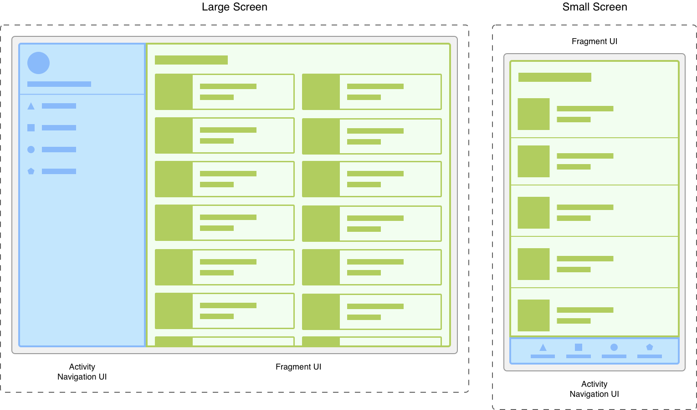
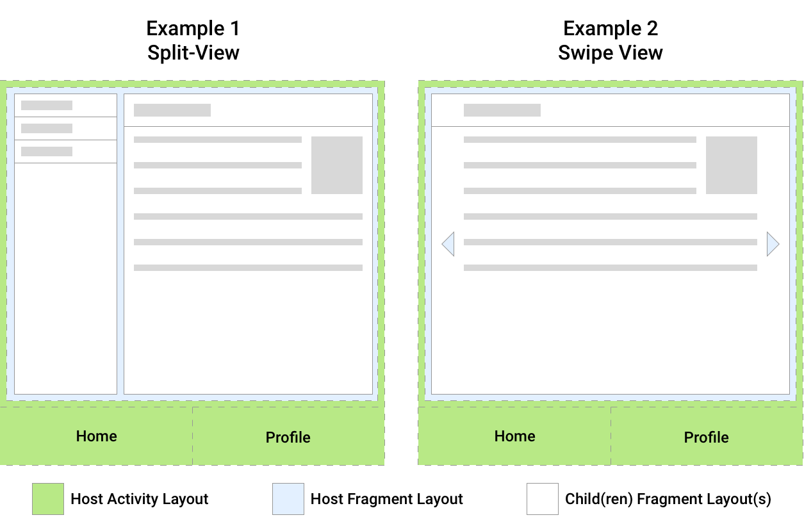
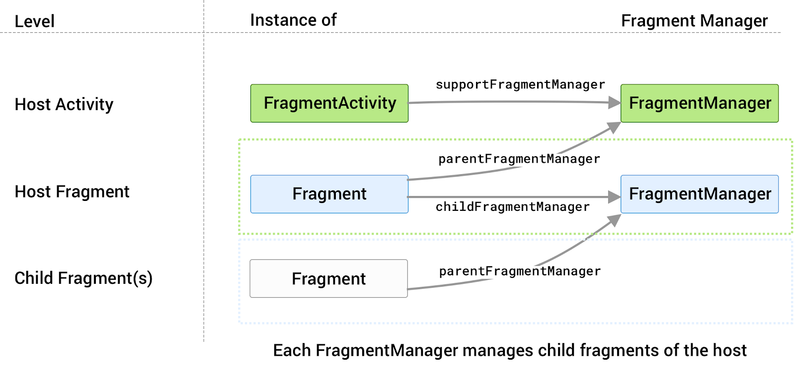
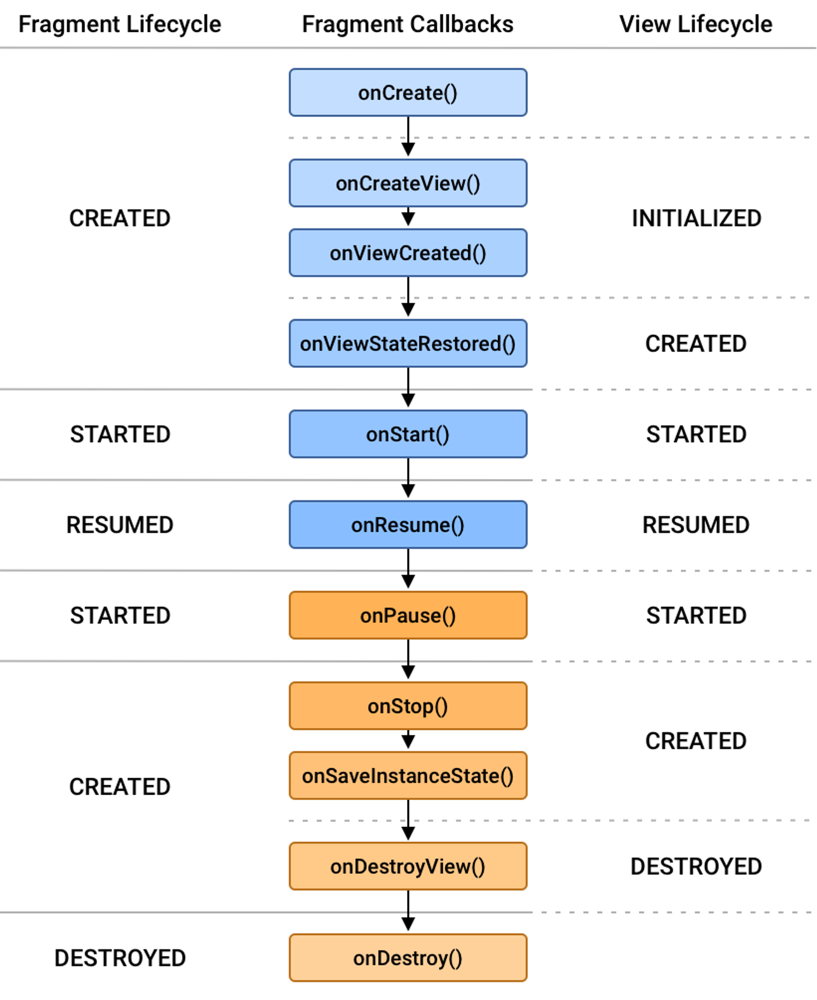
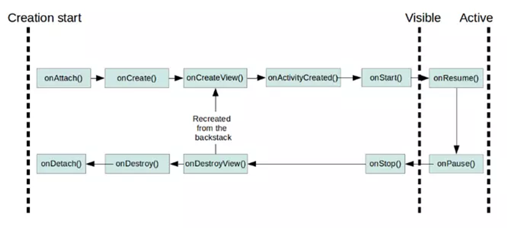
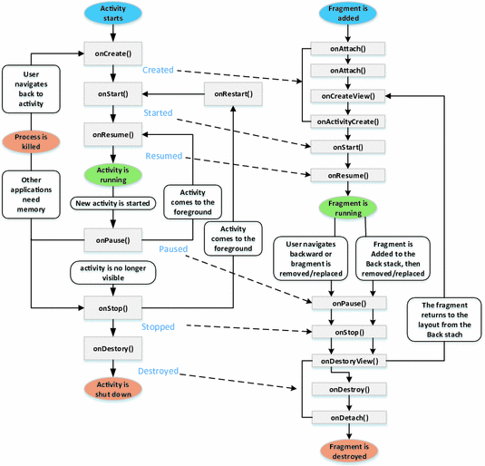
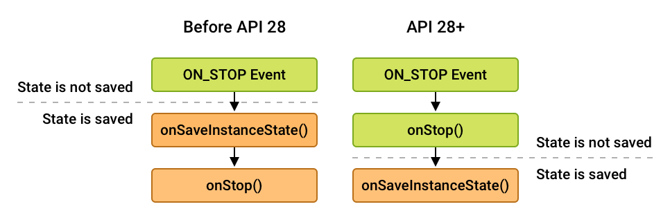

#  [ANDROID] BUỔI 9: Fragments

***

## I. Fragment
>*Tài liệu tham khảo*:  [Fragments](https://developer.android.com/guide/fragments)


-   Fragments là dạng nhiều act con lồng trong act mẹ

-   Một `Fragment(mảnh)` đại diện cho một phần tái sử dụng của giao diện người dùng trong ứng dụng. 

-   Một `fragment` định nghĩa và quản lý bố cục của riêng nó, có vòng đời riêng, và có thể xử lý các sự kiện đầu vào của riêng nó. 

-   Các `fragment` không thể tồn tại độc lập. Chúng phải được lưu trữ bởi một `activity` hoặc một `fragment` khác. 

-   Hệ phân cấp khung hiển thị của mảnh trở thành một phần hoặc đính kèm với hệ phân cấp khung hiển thị của máy chủ lưu trữ.

### 1. Module

Các `Fragment(mảnh)` cho phép ta chia giao diện người dùng thành các phần riêng biệt, từ đó giao diện được phân chia theo module và có thể tái sử dụng. Các Activity là vị trí lý tưởng để đặt các phần tử chung xung quanh giao diện người dùng, ví dụ như thanh điều hướng.



*Hai phiên bản của cùng một màn hình trên các kích thước màn hình khác nhau. **Ở bên trái**, màn hình lớn có ngăn điều hướng do activity kiểm soát và danh sách dạng lưới do fragment kiểm soát. **Ở bên phải**, màn hình nhỏ có thanh điều hướng dưới cùng do activity kiểm soát và danh sách dạng tuyến tính do fragment kiểm soát.*

>   `Activity` phụ trách hiện thị giao diện điều hướng, còn `fragment` để hiển thị bố cục phù hợp.

### 2. Tạo 1 fragement

- Chuột phải vào folder chứa mainActivity → chọn fragment.
- Ngoài ra thư viện còn có các lớp fragment đặc biệt như DialogFragment,…

### 3. Sự Khác Biệt Giữa Fragment và Activity

-   `Fragment` là một phần của `Activity` và không thể hoạt động độc lập. Nó cần một `Activity `để quản lý và hiển thị nó.

-   `Activity` là một đơn vị độc lập có thể chứa một hoặc nhiều Fragment.

## II. FragmentManager

`FragmentManager` là class chịu trách nhiệm thực hiện các hành động trên các mảnh của ứng dụng. Ví dụ như thêm, xóa hoặc thay thế chúng và thêm chúng vào ngăn xếp.

### 1. Truy cập FragmentManager

`FragmentActivity` và các lớp con của nó, chẳng hạn như `AppCompatActivity`, có quyền truy cập vào `FragmentManager` thông qua phương thức `getSupportFragmentManager()`.

Các mảnh có thể lưu trữ 1 hay nhiều mảnh con.  Mảnh con có thể được tham chiếu tới `FragmentManager` nhờ `getChildFragmentManager()`. Ngược lại, mảnh con có thể truy cập mảnh cha nhờ `getParentFragmentManager()`



*Hai ví dụ về bố cục UI cho thấy mối quan hệ giữa các mảnh và hoạt động lưu trữ của chúng*

*Fragment host trong **ảnh 1** chứa hai fragment con tạo nên màn hình chia đôi. Fragment host trong **ảnh 2** chứa một fragment con tạo nên fragment hiển thị của màn hình vuốt.*

Ta có thể thấy mỗi mảnh liên kết với 1 `FragmentManager` có chức năng quản lý các mảnh con. Điều này thể hiện trong ảnh dưới đây cùng các thuộc tính liên kết giữa `supportFragmentManager`, `parentFragmentManager`, `childFragmentManager`:



*Mỗi host có FragmentManager riêng liên kết với nó để quản lý các fragment con.*


**Host Activity:** 
    
-   `FragmentActivity`: Đây là một hoạt động chứa (host activity) có thể chứa các `Fragment`. Nó sử dụng `supportFragmentManager` để quản lý các `Fragment` của nó.

**Host Fragment:**

-   `Fragment`: Đây là một phân mảnh chứa (host fragment) có thể chứa các phân mảnh con (child fragments). Nó sử dụng `parentFragmentManager` để quản lý các phân mảnh của nó.

**Child Fragment(s):**

-   Các phân mảnh con (child fragments): Các phân mảnh này được chứa bên trong một phân mảnh khác (host fragment). Chúng được quản lý bởi `childFragmentManager` của phân mảnh chứa (host fragment).


**supportFragmentManager**: Quản lý các phân mảnh trực tiếp trong `FragmentActivity`.
**parentFragmentManager**: Quản lý các phân mảnh con của một phân mảnh chứa.
**childFragmentManager**: Quản lý các phân mảnh con bên trong một phân mảnh chứa.

### 2. Sử dụng FragmentManager

- `FragmentManager` quản lý backstack của mảnh. Trong thời gian chạy, `FragmentManager` có thể thực hiện các thao tác ngăn xếp lui như thêm hoặc xoá các mảnh để phản hồi tương tác của người dùng. Mỗi tập hợp thay đổi được xác nhận cùng nhau dưới dạng một đơn vị duy nhất gọi là `FragmentTransaction`.

- Ví dụ khi người dùng nhấn nút quay lại trên thiết bị, ta sẽ dùng `FragmentManager.popBackStack()` để có thể pop đi fragment hiện tại, quay lại fragment cũ. Ngược lại `addToBackStack()` để thêm 1 mảnh và Backstack

### 3.  Perform a transaction (Thực hiện 1 chuyển đổi)

- Để hiển thị một mảnh trong vùng chứa bố cục, hãy sử dụng `FragmentManager` để tạo một `FragmentTransaction`. Sau đó, trong giao dịch, bạn có thể thực hiện thao tác `add()` hoặc `replace()` trên vùng chứa:

```kotlin
supportFragmentManager.commit {
   replace<ExampleFragment>(R.id.fragment_container)
   setReorderingAllowed(true)
   addToBackStack("name") // Name can be null
}
```
## III. FragmentTransaction
#### Fragment Transactions
- `FragmentManager` có thể thêm, xóa, thay thế và thực hiện các hành động khác với fragments.
- Mỗi nhóm thay đổi fragment gọi là một transaction, và được quản lý bởi `FragmentTransaction` class.
- Gộp nhiều hành động thành một transaction có thể hữu ích khi có nhiều fragment anh em hiển thị cùng một màn hình.

#### Back Stack
- Lưu mỗi transaction vào back stack cho phép người dùng quay lại các thay đổi fragment, tương tự như quay lại các activity.

#### FragmentTransaction API
- Lấy một instance của `FragmentTransaction` bằng cách gọi `beginTransaction()` trên `FragmentManager`.
- Phải gọi `commit()` để hoàn tất transaction.
- `commit()` lên lịch transaction chạy trên UI thread, không chạy ngay lập tức.

#### Reordering
- Sử dụng `setReorderingAllowed(true)` để `FragmentManager` thực hiện transaction đúng cách, đặc biệt khi hoạt động trên back stack và chạy animations và transitions.

#### Adding, Removing, and Replacing Fragments
- Sử dụng `add()` để thêm một fragment vào `FragmentManager`.
- Sử dụng `remove()` để xóa một fragment.
- Sử dụng `replace()` để thay thế một fragment hiện có bằng một fragment mới.

```kotlin
// Add Fragment
val fm = supportFragmentManager
val ft_add = fm.beginTransaction()
ft_add.add(R.id.your_placeholder, YourFragment())
ft_add.commit()

// Replace Fragment
val ft_rep = fm.beginTransaction()
ft_rep.replace(R.id.your_placeholder, YourFragment())
ft_rep.commit()

// Remove Fragment
val fragment = fm.findFragmentById(R.id.your_placeholder)
fragment?.let {
    val ft_remo = fm.beginTransaction()
    ft_remo.remove(it)
    ft_remo.commit()
}
```

#### Add to Back Stack
- Để lưu transaction vào back stack, sử dụng `addToBackStack()`.

#### Commit Asynchronous
- `commit()` không thực hiện transaction ngay lập tức, chỉ lên lịch để chạy.
- `commitNow()` thực hiện ngay lập tức nhưng không tương thích với `addToBackStack`.

#### Operation Ordering
- Thứ tự các thao tác trong một `FragmentTransaction` rất quan trọng, đặc biệt khi sử dụng `setCustomAnimations()`.

#### Showing and Hiding Fragments
- Sử dụng `show()` và `hide()` để thay đổi trạng thái hiển thị của fragment mà không ảnh hưởng đến lifecycle của fragment.


## IV. Fragment Lifecycle

Mỗi phiên bản `Fragment` đều có vòng đời riêng. Khi một người dùng điều hướng và tương tác với ứng dụng, các phân mảnh sẽ dịch chuyển qua các trạng thái khác nhau của vòng đời khi chúng được thêm, xoá, xuất hiện hoặc thoát khỏi màn hình.

Để quản lý vòng đời, `Fragment` triển khai `LifecycleOwner`, cung cấp một đối tượng Lifecycle mà bạn có thể truy cập thông qua phương thức `getLifecycle()`.

- Các trạng thái `Lifecycle` được biểu thị trong enum `Lifecycle.State`:
    - `INITIALIZED`
    - `CREATED`
    - `STARTED`
    - `RESUMED`
    - `DESTROYED`




**Khi fragment được tạo và chạy, `FragmentLifecycle` sẽ chạy theo thứ tự như sau:**

- **`onAttach()`**: `Fragment`  được đính kèm vào `activity`. Mỗi Fragment muốn chạy được thì nó phải thuộc vào một activity nào đó.
- **`onCreate()`**: Khi một fragment mới được khởi tạo (hàm này luôn được gọi sau khi fragment được attach vào Activity)
- **`onCreateView()`**: thực hiện tạo giao diện(view), trả về view là giao diện file xml tương ứng fragment. Không nên tương tác với activity trong hàm này bởi vì activity chưa được khởi tạo đầy đủ. Không cần thực hiện hàm này với các fragment không có header
- **`onActivityCreated()`**: thực hiện hoàn thành nốt việc khởi tạo activity và fragment. Trong bước này chúng ta có thể gọi *findViewById()*
- **`onStart()`**: Được gọi khi fragment hiển thị. Một fragment chỉ start sau khi Activity start và thường là nó start ngay lập tức khi Activity start xong
- **`onResume()`**: Được gọi khi fragment hiển thị và có thể tương tác

**Các sự kiện khi chủ thể hoặc hệ thống destroy một fragment:**

- **`onPause()`**: Khi fragment không còn tương tác(nhưng vẫn hiển thị cho người dùng nhìn thấy).
- **`onStop()`**: Khi fragment không còn hiển thị. Điều này xảy ra ngay sau khi fragment bị gỡ bỏ hoặc thay thế, hoặc là khi activity của fragment bị tạm dừng.
- **`onDestroyView()`**: Khi các `view` hay `resource` được tạo trong `onCreateView` bị remove khỏi activity và destroy. Nếu nó được gọi quay lại, nó sẽ quay trở lại thực hiện hàm onCreateView()
- **`onDestroy()`**: Khi fragment bị hủy bỏ
- **`onDetach()`**: Khi fragment bị tách khỏi Activity của nó.

**Liên hệ giữa Activity Lifecycle và Fragment Lifecycle: **



**Sự khác biệt trong thứ tự gọi onStop() và onSaveInstanceState()**



*minh họa sự khác biệt trong thứ tự gọi của onStop() và onSaveInstanceState() ở các cấp độ API khác nhau:*

-   Trước API 28: `onSaveInstanceState()` được gọi trước `onStop()`.
-   API 28 và cao hơn: `onStop()` được gọi trước `onSaveInstanceState()`.

## V. Giao tiếp Fragment với Fragment, Activity với Fragment

>**Sử dụng ViewModel**: Chia sẻ dữ liệu giữa các Fragment hoặc giữa Fragment và Activity một cách ổn định, dễ bảo trì.

>**Sử dụng Fragment Result API**: Truyền dữ liệu một lần giữa các Fragment hoặc giữa Fragment và Activity một cách dễ dàng, phù hợp cho việc truyền dữ liệu đơn giản, không liên quan đến vòng đời.

- `Fragment` có cung cấp cho lập trình viên 2 tùy chọn để thiết lập giao tiếp là **`Shared ViewModel`** và **`Fragment Result API`**. Để chia sẻ dữ liệu với các Fragment khác mà không chung FragmentManager nên sử dụng `Shared ViewModel`, còn các Fragment có chung FragmentManager mà muốn gửi và nhận dữ liệu 1 lần thông qua `"Bundle"` thì nên sử dụng `Fragment Result API`.

### 1. Sử dụng ViewModel


`ViewModel` giúp chia sẻ dữ liệu giữa các Fragment hoặc giữa Fragment và Activity mà không phụ thuộc vào vòng đời của chúng. Dưới đây là ví dụ cụ thể:

**Tạo ViewModel để chia sẻ dữ liệu**

Đầu tiên, ta cần tạo một ViewModel để lưu trữ và quản lý dữ liệu.

```kotlin
import androidx.lifecycle.ViewModel
import androidx.lifecycle.MutableLiveData
import androidx.lifecycle.LiveData

class SharedViewModel : ViewModel() {
    private val mutableSelectedItem = MutableLiveData<String>()
    val selectedItem: LiveData<String> get() = mutableSelectedItem

    fun selectItem(item: String) {
        mutableSelectedItem.value = item
    }
}
```

-   `SharedViewModel` là lớp kế thừa từ `ViewModel`.
-   `mutableSelectedItem` là một biến `MutableLiveData` giữ dữ liệu có thể thay đổi.
-   `selectedItem` là một `LiveData` để chỉ đọc dữ liệu từ `mutableSelectedItem`.
-   `selectItem(item: String)` là hàm để cập nhật giá trị của `mutableSelectedItem`.

**Sử dụng ViewModel trong Activity**

Trong Activity, chúng ta có thể truy cập `ViewModel` và xem các thay đổi từ nó.

```kotlin
import android.os.Bundle
import androidx.activity.viewModels
import androidx.appcompat.app.AppCompatActivity

class MainActivity : AppCompatActivity() {
    private val viewModel: SharedViewModel by viewModels()

    override fun onCreate(savedInstanceState: Bundle?) {
        super.onCreate(savedInstanceState)
        setContentView(R.layout.activity_main)

        viewModel.selectedItem.observe(this, { item ->
            // Xử lý dữ liệu từ ViewModel
            println("Received item from ViewModel: $item")
        })
    }
}
```

-   `private val viewModel: SharedViewModel by viewModels()` khởi tạo `SharedViewModel` trong phạm vi của Activity.

-   `viewModel.selectedItem.observe(this, { item -> ... })` lắng nghe các thay đổi của `selectedItem` và thực hiện hành động khi giá trị thay đổi.

**Sử dụng ViewModel trong Fragment A**

Trong Fragment A, chúng ta có thể cập nhật giá trị của ViewModel.

```kotlin
import android.os.Bundle
import android.view.View
import androidx.fragment.app.Fragment
import androidx.fragment.app.activityViewModels

class FragmentA : Fragment(R.layout.fragment_a) {
    private val viewModel: SharedViewModel by activityViewModels()

    override fun onViewCreated(view: View, savedInstanceState: Bundle?) {
        super.onViewCreated(view, savedInstanceState)

        // Gửi dữ liệu đến ViewModel
        viewModel.selectItem("Hello from Fragment A")
    }
}
```


-   `private val viewModel: SharedViewModel by activityViewModels()` khởi tạo `SharedViewModel` trong phạm vi của Activity để chia sẻ giữa các Fragment.

-   `viewModel.selectItem("Hello from Fragment A")` cập nhật giá trị của `selectedItem` trong `ViewModel`.

### 2. Sử dụng Fragment Result API để truyền dữ liệu

Fragment Result API giúp truyền dữ liệu một lần giữa các Fragment hoặc giữa Fragment và Activity thông qua `FragmentManager`.

**Chuyển đổi giữa các Fragment**

Để chuyển dữ liệu từ Fragment B trở về Fragment A, trước tiên, hãy đặt trình  xử lý kết quả trên Fragment A (mảnh nhận kết quả).


***Fragment A (nhận kết quả)***

```kotlin
import android.os.Bundle
import androidx.fragment.app.Fragment
import androidx.fragment.app.setFragmentResultListener

class FragmentA : Fragment(R.layout.fragment_a) {

    override fun onCreate(savedInstanceState: Bundle?) {
        super.onCreate(savedInstanceState)

        setFragmentResultListener("requestKey") { requestKey, bundle ->
            val result = bundle.getString("bundleKey")
            // Xử lý kết quả nhận được
            println("Received result: $result")
        }
    }
}
```

-   `setFragmentResultListener("requestKey") { requestKey, bundle -> ... }` thiết lập trình nghe kết quả cho `FragmentA` với `requestKey` để nhận kết quả.

-   `val result = bundle.getString("bundleKey")` lấy giá trị từ `Bundle`.

**Fragment B (gửi kết quả)**

```kotlin
import android.os.Bundle
import android.view.View
import android.widget.Button
import androidx.core.os.bundleOf
import androidx.fragment.app.Fragment
import androidx.fragment.app.setFragmentResult

class FragmentB : Fragment(R.layout.fragment_b) {

    override fun onViewCreated(view: View, savedInstanceState: Bundle?) {
        super.onViewCreated(view, savedInstanceState)

        view.findViewById<Button>(R.id.button).setOnClickListener {
            val result = "Hello from Fragment B"
            setFragmentResult("requestKey", bundleOf("bundleKey" to result))
        }
    }
}
```

-   `setFragmentResult("requestKey", bundleOf("bundleKey" to result))` đặt kết quả với `requestKey` và `Bundle` chứa dữ liệu.

**Nhận kết quả trong Activity**

```kotlin
import android.os.Bundle
import androidx.appcompat.app.AppCompatActivity
import androidx.fragment.app.setFragmentResultListener

class MainActivity : AppCompatActivity() {

    override fun onCreate(savedInstanceState: Bundle?) {
        super.onCreate(savedInstanceState)
        setContentView(R.layout.activity_main)

        supportFragmentManager.setFragmentResultListener("requestKey", this) { requestKey, bundle ->
            val result = bundle.getString("bundleKey")
            // Xử lý kết quả nhận được
            println("Received result in Activity: $result")
        }
    }
}
```

-   `supportFragmentManager.setFragmentResultListener("requestKey", this) { requestKey, bundle -> ... }` thiết lập trình nghe kết quả cho `MainActivity` với `requestKey`.


**Chuyển kết quả giữa mảnh mẹ và mảnh con**

***Fragment mẹ (nhận kết quả)***

```kotlin
import android.os.Bundle
import androidx.fragment.app.Fragment

class ParentFragment : Fragment(R.layout.fragment_parent) {

    override fun onCreate(savedInstanceState: Bundle?) {
        super.onCreate(savedInstanceState)

        childFragmentManager.setFragmentResultListener("requestKey") { key, bundle ->
            val result = bundle.getString("bundleKey")
            // Xử lý kết quả nhận được từ Fragment con
            println("Received result from Child Fragment: $result")
        }
    }
}
```

-   `childFragmentManager.setFragmentResultListener("requestKey") { key, bundle -> ... }` thiết lập trình nghe kết quả cho Fragment mẹ để nhận kết quả từ Fragment con.

***Fragment con (gửi kết quả)***

```kotlin
import android.os.Bundle
import android.view.View
import androidx.fragment.app.Fragment
import androidx.core.os.bundleOf

class ChildFragment : Fragment(R.layout.fragment_child) {

    override fun onViewCreated(view: View, savedInstanceState: Bundle?) {
        super.onViewCreated(view, savedInstanceState)

        view.findViewById<Button>(R.id.button).setOnClickListener {
            val result = "Hello from Child Fragment"
            setFragmentResult("requestKey", bundleOf("bundleKey" to result))
        }
    }
}
```

`setFragmentResult("requestKey", bundleOf("bundleKey" to result))` đặt kết quả với `requestKey` và `Bundle` chứa dữ liệu.

